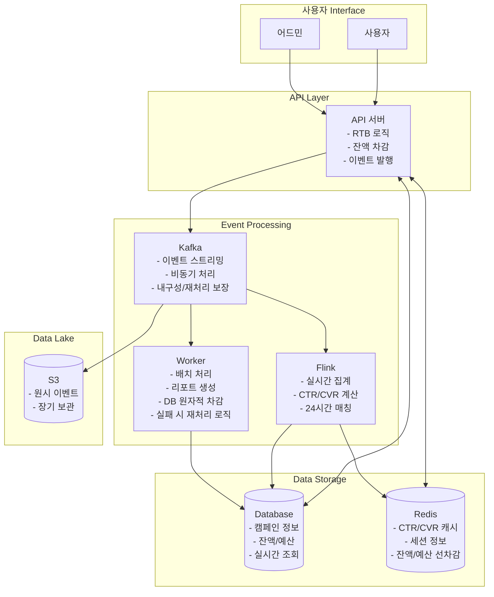
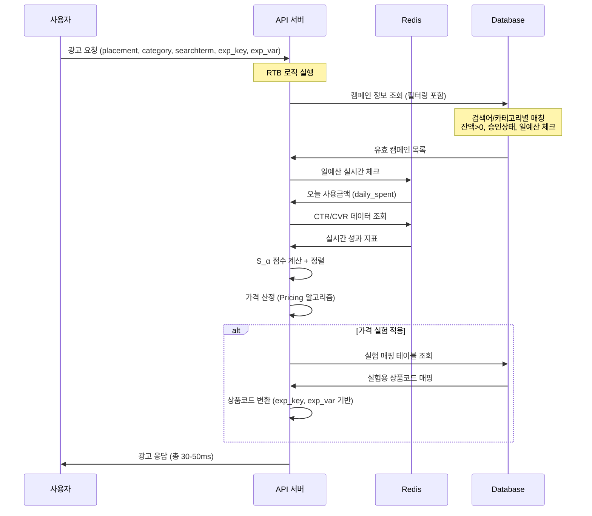
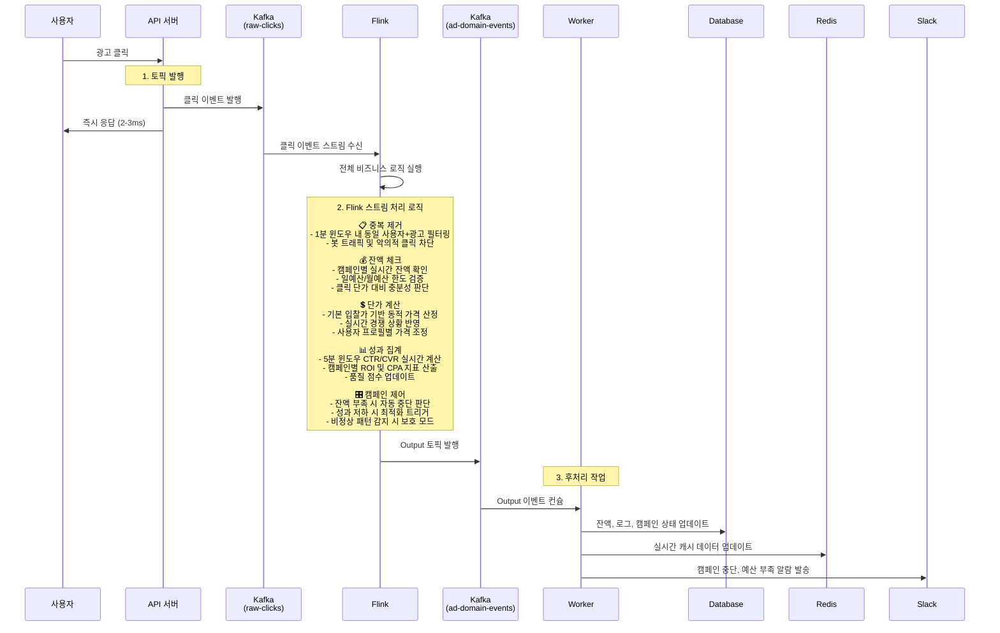
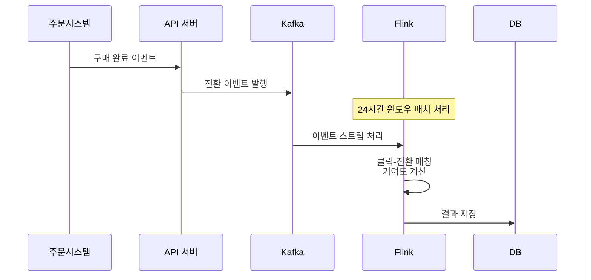
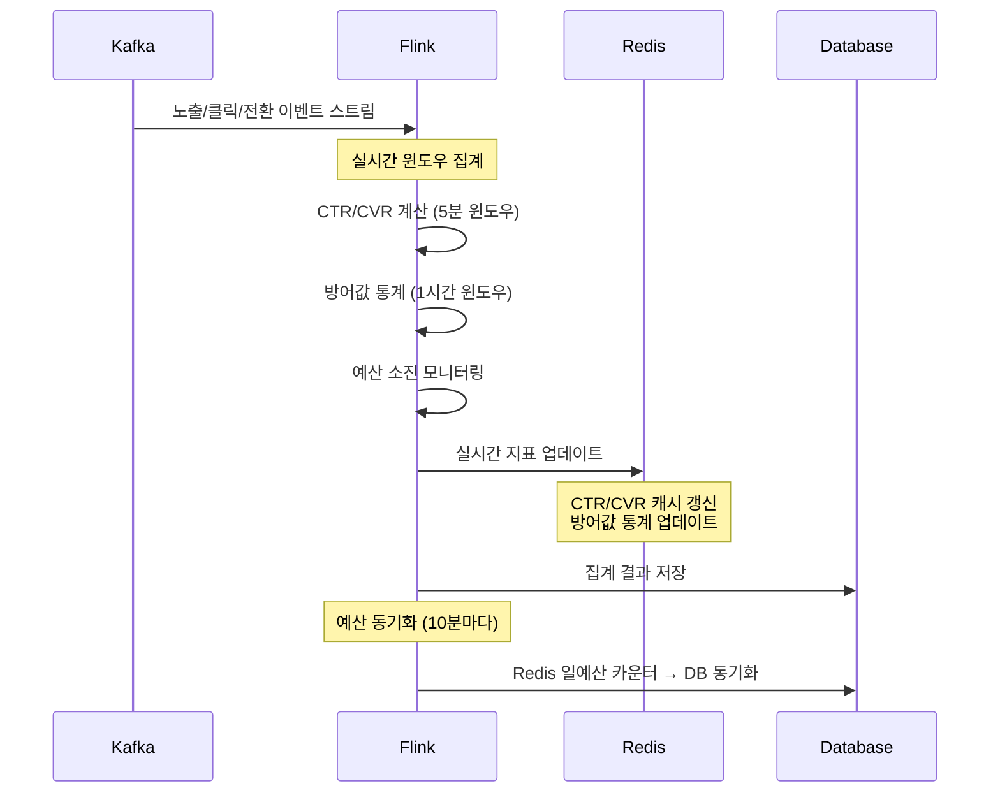
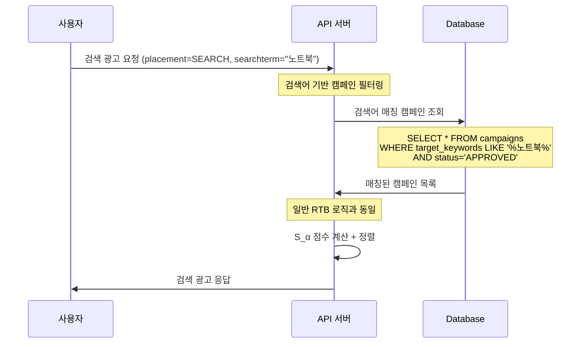
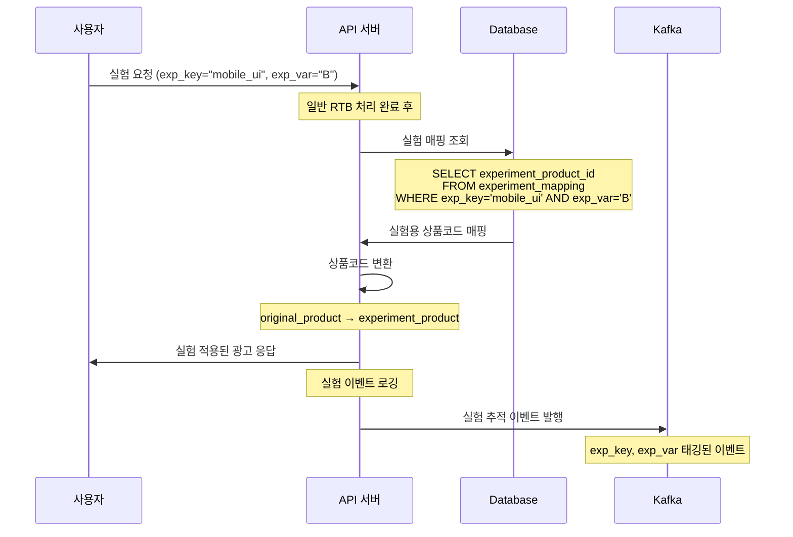
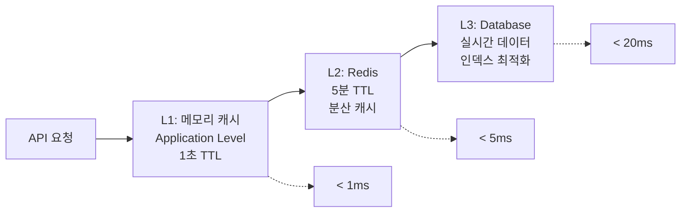

# CPC RTB 시스템 아키텍처

## 📋 시스템 개요

**최적화 목표**: Citrus Ad 수준의 응답 성능 + 내재화의 확장성
- **API 응답**: < 50ms 광고 요청 처리
- **처리량**: 기존 대비 5배 증가
- **정확성**: 정확한 잔액 차감 및 24시간 클릭-전환 매칭

RTB(Real-Time Bidding) 시스템을 4개의 주요 컴포넌트로 구성:
- **API 서버**: 광고 요청 처리, RTB 로직, 잔액 차감
- **Database/Redis**: 실시간 데이터 조회 및 캐싱
- **Kafka**: 이벤트 스트리밍, 비동기 처리
- **Flink/Worker**: 실시간 집계 및 배치 처리

---

## 🏗️ 전체 시스템 아키텍처

---

## 🔄 핵심 데이터 플로우

### 1. 광고 요청 플로우 (실시간 처리)

### 2. 클릭 처리 플로우 (Flink 로직 집중 + 단일 통합 토픽)

**처리 단계**:

1. **API 서버**: 클릭 이벤트를 Kafka 토픽에 발행 후 즉시 응답
2. **Flink**: 이벤트 스트림을 수집하여 모든 비즈니스 로직 실행 후 결과를 단일 Output 토픽에 발행
3. **Worker**: Output 토픽을 컨슘하여 DB/Redis 업데이트 및 Slack 알람 처리

### 3. 전환 처리 플로우

### 4. 실시간 집계 플로우 (스트림 처리)

### 5. 검색어 광고 매칭 플로우

### 6. 가격 실험 A/B 테스트 플로우 - 맞는지 확인 필요;;;

---

## 📊 컴포넌트별 역할 정의

### 🎯 API 서버
**주요 역할**:
- RTB 로직 실행 (S_α 점수 계산, 할당, 가격 산정)
- 잔액/예산 실시간 체크 및 차감
- 이벤트 발행 (Kafka)
- 어드민 인터페이스 제공

**성능 요구사항**:
- 광고 요청: < 50ms 응답
- 클릭 처리: < 20ms 응답
- 동시 처리: 1000 RPS

### 💾 Database
**저장 데이터**:
- 광고주, 캠페인, 상품 정보
- 잔액, 예산 정보 (실시간 업데이트)
- 집계된 성과 데이터
- 사용자 로그 (노출, 클릭, 전환)

**특징**:
- 트랜잭션 보장 (잔액 차감)
- 읽기 최적화 인덱싱

### ⚡ Redis
**캐시 데이터**:
- CTR/CVR 실시간 지표
- 세션 정보
- 방어값 통계

**TTL 설정**:
- CTR/CVR: 5분
- 방어값: 1시간
- 세션: 24시간

### 📡 Kafka
**토픽 구성**:
- `ad-events`: 노출, 클릭, 전환 이벤트
- `balance-updates`: 잔액 변경 이벤트
- `performance-metrics`: 성과 지표 업데이트

**특징**:
- 이벤트 순서 보장 (파티션별)
- 내구성 보장 (replication)

### 🔄 Flink
**처리 로직**:
- 실시간 CTR/CVR 계산 (5분 윈도우)
- 24시간 클릭-전환 매칭
- 방어값 통계 계산 (1시간 윈도우)
- 예산 소진 모니터링

**출력**:
- Redis 캐시 업데이트
- Database 집계 테이블 업데이트

### 🔧 Worker
**배치 작업**:
- 일별/월별 성과 리포트 생성
- 데이터 정합성 검증
- 장기 데이터 S3 이관
- 시스템 헬스체크

---

## ⚡ 성능 최적화 전략

### 1. 3레벨 조회 최적화

### 2. 데이터베이스 최적화

**파티셔닝**:
- 로그 테이블: 날짜별 파티셔닝
- 성과 테이블: 월별 파티셔닝

## 2. 🚨 **CDC 동시성 문제 - 맞습니다!**

**문제 시나리오**: