# 광고 엔진 테이블 설계

## 📋 목차
1. [데이터베이스 아키텍처 개요](#-데이터베이스-아키텍처-개요)
2. [테이블 분류 및 구성](#-테이블-분류-및-구성)
3. [마스터 데이터 테이블](#-마스터-데이터-테이블)
4. [잔액 관리 테이블](#-잔액-관리-테이블)
5. [운영 관리 테이블](#-운영-관리-테이블)
6. [성과 분석 테이블](#-성과-분석-테이블)
7. [시스템 설정 테이블](#-시스템-설정-테이블)
8. [파티셔닝 및 성능 최적화](#-파티셔닝-및-성능-최적화)

---

## 🏗️ 데이터베이스 아키텍처 개요

### ERD (Entity Relationship Diagram)

```mermaid
erDiagram
    %% 마스터 데이터
    ad_advertisers ||--o{ ad_campaigns : "광고주가 여러 캠페인 소유"
    ad_campaigns ||--o{ ad_placement_bids : "캠페인이 여러 입찰 설정 보유"
    ad_campaigns ||--o{ ad_daily_budget_trackings : "캠페인별 일일 예산 추적"
    ad_campaigns ||--o{ ad_performance_metrics_realtime : "캠페인별 실시간 성과"
    ad_campaigns ||--o{ ad_event_summaries_daily : "캠페인별 일일 요약"
    
    %% 상품 관련
    ad_products_meta ||--o{ ad_placement_bids : "상품별 입찰 설정"
    ad_products_meta ||--o{ ad_product_status_caches : "상품별 성과 캐시"
    ad_products_meta ||--o{ ad_impression_pricings : "상품별 노출 가격"
    ad_products_meta ||--o{ ad_performance_metrics_realtime : "상품별 실시간 성과"
    ad_products_meta ||--o{ ad_event_summaries_daily : "상품별 일일 요약"
    
    %% 잔액 관리
    ad_advertisers ||--|| ad_balances : "광고주별 잔액 정보"
    ad_advertisers ||--o{ ad_balance_histories : "광고주별 잔액 이력"
    
    %% 카테고리 관리
    ad_category_hierarchies ||--o{ ad_category_hierarchies : "상위-하위 카테고리"
    
    %% 시스템 설정
    ad_engine_parameters ||--o{ ad_engine_parameter_histories : "파라미터 변경 이력"
    
    %% 테이블 정의
    ad_advertisers {
        bigint id PK "광고주 ID"
        varchar advertiser_name "광고주명"
        varchar business_type "사업 유형"
        varchar status "상태"
        decimal credit_limit "신용 한도"
        decimal daily_budget "일일 예산"
        timestamp created_at "생성일시"
        timestamp updated_at "수정일시"
    }
    
    ad_campaigns {
        bigint id PK "캠페인 ID"
        bigint advertiser_id FK "광고주 ID"
        varchar campaign_name "캠페인명"
        varchar campaign_type "과금 방식"
        varchar status "캠페인 상태"
        date start_date "시작일"
        date end_date "종료일"
        decimal daily_budget "일일 예산"
        decimal total_budget "총 예산"
        json target_regions "타겟 지역"
        timestamp created_at "생성일시"
        timestamp updated_at "수정일시"
    }
    
    ad_products_meta {
        bigint product_id PK "상품 ID"
        decimal quality_score "품질 점수"
        varchar ad_status "광고 상태"
        varchar category_path "카테고리 경로"
        timestamp updated_at "최종 수정일시"
    }
    
    ad_placement_bids {
        bigint id PK "입찰 ID"
        bigint campaign_id FK "캠페인 ID"
        bigint product_id FK "상품 ID"
        varchar placement "광고 영역"
        decimal bid_price "입찰가"
        decimal max_daily_spend "일일 최대 소진"
        varchar status "입찰 상태"
        timestamp created_at "생성일시"
        timestamp updated_at "수정일시"
    }
    
    ad_balances {
        bigint advertiser_id PK,FK "광고주 ID"
        decimal current_balance "현재 잔액"
        decimal reserved_balance "예약 잔액"
        decimal daily_spent "일일 사용"
        decimal monthly_spent "월 사용"
        date last_spent_date "최종 사용일"
        decimal alert_threshold "알림 임계값"
        boolean auto_charge_enabled "자동 충전"
        decimal auto_charge_amount "자동 충전 금액"
        timestamp created_at "생성일시"
        timestamp updated_at "수정일시"
    }
    
    ad_balance_histories {
        bigint id PK "이력 ID"
        bigint advertiser_id FK "광고주 ID"
        varchar transaction_type "거래 유형"
        decimal amount "거래 금액"
        decimal balance_before "거래 전 잔액"
        decimal balance_after "거래 후 잔액"
        varchar reference_id "참조 ID"
        varchar reference_type "참조 유형"
        text description "거래 설명"
        timestamp created_at "거래 일시"
    }
    
    ad_daily_budget_trackings {
        bigint id PK "추적 ID"
        bigint campaign_id FK "캠페인 ID"
        date track_date "추적 일자"
        decimal daily_budget "일일 예산"
        decimal spent_amount "사용 금액"
        bigint impression_count "노출 수"
        bigint click_count "클릭 수"
        bigint conversion_count "전환 수"
        timestamp updated_at "최종 업데이트"
    }
    
    ad_product_status_caches {
        bigint product_id PK,FK "상품 ID"
        decimal ctr_score "CTR 점수"
        decimal cvr_score "CVR 점수"
        decimal popularity_score "인기도 점수"
        timestamp last_impression "최종 노출"
        timestamp last_click "최종 클릭"
        timestamp last_conversion "최종 전환"
        bigint impression_count_1h "1시간 노출"
        bigint click_count_1h "1시간 클릭"
        bigint impression_count_24h "24시간 노출"
        bigint click_count_24h "24시간 클릭"
        bigint conversion_count_24h "24시간 전환"
        timestamp updated_at "캐시 업데이트"
    }
    
    ad_impression_pricings {
        varchar impression_id PK "노출 고유 식별자"
        varchar device_id "디바이스 식별자"
        varchar session_id "세션 식별자"
        bigint campaign_id FK "캠페인 ID"
        bigint product_id FK "상품 ID"
        varchar placement "광고 영역"
        decimal bid_price "입찰가"
        decimal calculated_price "산정된 적용가"
        int ad_rank "광고 순위"
        decimal algorithm_score "알고리즘 점수"
        varchar experiment_key "실험 키"
        varchar experiment_var "실험 변수"
        timestamp impression_time "노출 시간"
        timestamp expires_at "만료 시간"
        timestamp created_at "생성 시간"
    }
    
    ad_performance_metrics_realtime {
        bigint id PK "메트릭 ID"
        bigint campaign_id FK "캠페인 ID"
        bigint product_id FK "상품 ID"
        varchar placement "광고 영역"
        timestamp metric_hour "메트릭 시간"
        bigint impression_count "노출 수"
        bigint click_count "클릭 수"
        bigint conversion_count "전환 수"
        decimal total_spend "총 소진"
        decimal total_revenue "총 매출"
        decimal avg_cpc "평균 CPC"
        decimal ctr "클릭률"
        decimal cvr "전환율"
        decimal roas "광고 수익률"
        timestamp updated_at "업데이트 시간"
    }
    
    ad_event_summaries_daily {
        bigint id PK "요약 ID"
        date summary_date "요약 날짜"
        bigint campaign_id FK "캠페인 ID"
        bigint product_id FK "상품 ID"
        varchar placement "광고 영역"
        bigint impression_count "노출 수"
        bigint click_count "클릭 수"
        bigint conversion_count "전환 수"
        decimal total_spend "총 소진"
        decimal total_revenue "총 매출"
        bigint unique_users "순 사용자"
        varchar s3_path "S3 경로"
        timestamp created_at "생성일시"
    }
    
    ad_category_defense_stats {
        bigint id PK "통계 ID"
        varchar category_path "카테고리 경로"
        tinyint category_level "카테고리 레벨"
        decimal avg_ctr "평균 CTR"
        decimal min_ctr "최소 CTR"
        decimal avg_cvr "평균 CVR"
        decimal min_cvr "최소 CVR"
        bigint sample_count "샘플 수"
        varchar calculation_period "계산 기간"
        timestamp last_calculated "마지막 계산"
        timestamp created_at "생성일시"
        timestamp updated_at "수정일시"
    }
    
    ad_category_hierarchies {
        bigint id PK "카테고리 ID"
        varchar category_name "카테고리명"
        tinyint category_level "카테고리 레벨"
        bigint parent_id FK "상위 카테고리"
        varchar category_path "카테고리 경로"
        int display_order "표시 순서"
        boolean is_active "활성화 상태"
        timestamp created_at "생성일시"
        timestamp updated_at "수정일시"
    }
    
    ad_engine_parameters {
        bigint id PK "파라미터 ID"
        varchar parameter_name "파라미터명"
        decimal parameter_value "파라미터 값"
        text description "설명"
        varchar placement "적용 영역"
        boolean is_active "활성화 상태"
        timestamp effective_from "적용 시작"
        timestamp effective_until "적용 종료"
        varchar created_by "생성자"
        timestamp created_at "생성일시"
    }
    
    ad_engine_parameter_histories {
        bigint id PK "이력 ID"
        bigint parameter_id FK "파라미터 ID"
        decimal old_value "변경 전 값"
        decimal new_value "변경 후 값"
        text change_reason "변경 사유"
        varchar changed_by "변경자"
        timestamp effective_from "적용 시작"
        timestamp created_at "기록 시간"
    }
```



---

## 📊 테이블 분류 및 구성

> **🎯 설계 철학**: 데이터 무결성, 성능 최적화, 확장성, 유지보수성
> 
> **핵심 개선**: 실시간 비즈니스 로직은 DB, 분석용 원시 데이터는 S3

| 분류 | 테이블 수 | 테이블명 | 주요 목적 |
|------|-----------|----------|-----------|
| **마스터 데이터** | 4개 | `ad_advertisers`, `ad_campaigns`, `ad_products_meta`, `ad_placement_bids` | 광고주, 캠페인, 상품, 입찰 기본 정보 |
| **잔액 관리** | 2개 | `ad_balances`, `ad_balance_histories` | 실시간 잔액 추적 및 이력 관리 |
| **운영 관리** | 3개 | `ad_daily_budget_trackings`, `ad_product_status_caches`, `ad_impression_pricings` | 예산 추적, 성과 캐시, 노출 가격 매핑 |
| **성과 분석** | 2개 | `ad_performance_metrics_realtime`, `ad_event_summaries_daily` | 실시간 성과 지표 및 일별 요약 |
| **시스템 설정** | 4개 | `ad_category_defense_stats`, `ad_category_hierarchies`, `ad_engine_parameters`, `ad_engine_parameter_histories` | 방어값 통계, 카테고리 계층, 엔진 파라미터 |

**총 15개 테이블**로 구성된 효율적인 데이터 아키텍처

---

## 🎯 마스터 데이터 테이블

### 1. 광고주 관리 (ad_advertisers) -> **거래처 테이블에서 써야 됨**
> **목적**: 광고주 정보 및 상태 관리
> **비즈니스 요구사항**: 광고주 승인/중단, 연락처 관리, 과금 타입 설정

```sql
CREATE TABLE ad_advertisers (
    id              BIGINT                                         PRIMARY KEY AUTO_INCREMENT COMMENT '광고주 고유 식별자',
    advertiser_name VARCHAR(255)                                   NOT NULL                    COMMENT '광고주 회사명/브랜드명',
    business_type   VARCHAR(20)                                    NOT NULL                    COMMENT '사업 유형 (BRAND/COMMERCE/SERVICE)',
    status          VARCHAR(20)                                    DEFAULT 'ACTIVE'            COMMENT '광고주 상태 (ACTIVE/INACTIVE/SUSPENDED)',
    credit_limit    DECIMAL(15,2)                                  DEFAULT 0.00                COMMENT '신용 한도 (원)',
    daily_budget    DECIMAL(15,2)                                  DEFAULT 0.00                COMMENT '일일 예산 한도 (원)',
    created_at      TIMESTAMP                                      DEFAULT CURRENT_TIMESTAMP  COMMENT '계정 생성일시',
    updated_at      TIMESTAMP                                      DEFAULT CURRENT_TIMESTAMP ON UPDATE CURRENT_TIMESTAMP COMMENT '최종 수정일시',
    
    INDEX idx_status_type (status, business_type),
    INDEX idx_updated_at (updated_at)
) ENGINE=InnoDB COMMENT='광고주 마스터 정보 - 광고 계정 기본 정보 관리';
```

### 2. 캠페인 관리 (ad_campaigns)
> **목적**: 광고 캠페인 설정 및 상태 관리
> **비즈니스 요구사항**: 캠페인 기간, 예산, 타겟팅 설정

```sql
CREATE TABLE ad_campaigns (
    id               BIGINT                                         PRIMARY KEY AUTO_INCREMENT COMMENT '캠페인 고유 식별자',
    advertiser_id    BIGINT                                         NOT NULL                    COMMENT '광고주 식별자 (FK)',
    campaign_name    VARCHAR(100)                                   NOT NULL                    COMMENT '캠페인명',
    campaign_type    VARCHAR(20)                                    DEFAULT 'CPC'               COMMENT '과금 방식 (CPC/CPM/CPA)',
    status           VARCHAR(20)                                    DEFAULT 'PENDING'           COMMENT '캠페인 상태 (ACTIVE/PAUSED/ENDED/PENDING)',
    start_date       DATE                                           NOT NULL                    COMMENT '캠페인 시작일',
    end_date         DATE                                                                       COMMENT '캠페인 종료일 (NULL=무제한)',
    daily_budget     DECIMAL(15,2)                                  NOT NULL                    COMMENT '일일 예산 (원)',
    total_budget     DECIMAL(15,2)                                                              COMMENT '총 예산 (원, NULL=무제한)',
    target_gender    VARCHAR(20)                                    DEFAULT 'ALL'               COMMENT '타겟 성별 (ALL/MALE/FEMALE)',
    target_age_min   INT                                            DEFAULT 0                   COMMENT '타겟 최소 연령',
    target_age_max   INT                                            DEFAULT 100                 COMMENT '타겟 최대 연령',
    target_regions   JSON                                                                       COMMENT '타겟 지역 목록 (JSON 배열)',
    created_at       TIMESTAMP                                      DEFAULT CURRENT_TIMESTAMP  COMMENT '캠페인 생성일시',
    updated_at       TIMESTAMP                                      DEFAULT CURRENT_TIMESTAMP ON UPDATE CURRENT_TIMESTAMP COMMENT '최종 수정일시',
    
    FOREIGN KEY (advertiser_id) REFERENCES ad_advertisers(id),
    INDEX idx_advertiser_status (advertiser_id, status),
    INDEX idx_status_dates (status, start_date, end_date),
    INDEX idx_updated_at (updated_at)
) ENGINE=InnoDB COMMENT='광고 캠페인 정보';
```

### 3. 상품 메타데이터 (ad_products_meta)
> **목적**: 광고 상품의 메타 정보 및 카테고리 관리
> **비즈니스 요구사항**: 상품 분류, 검색 최적화, 성과 분석

```sql
CREATE TABLE ad_products_meta (
    product_id      BIGINT                                         PRIMARY KEY                 COMMENT '상품 식별자 (기존 상품 테이블 참조)',
    quality_score   DECIMAL(3,2)                                   DEFAULT 1.00                COMMENT '광고 품질 점수 (0.00~5.00)',
    ad_status       VARCHAR(20)                                    DEFAULT 'ACTIVE'            COMMENT '광고 가능 상태 (ACTIVE/PAUSED/BLOCKED)',
    category_path   VARCHAR(200)                                                               COMMENT '카테고리 경로 캐시 (성능 최적화용)',
    updated_at      TIMESTAMP                                      DEFAULT CURRENT_TIMESTAMP ON UPDATE CURRENT_TIMESTAMP COMMENT '최종 수정일시',
    
    INDEX idx_quality_score (quality_score DESC),
    INDEX idx_ad_status (ad_status),
    INDEX idx_category_path (category_path),
    CHECK (quality_score >= 0.00 AND quality_score <= 5.00)
) ENGINE=InnoDB COMMENT='광고 상품 메타정보';
```

### 4. 배치 입찰가 (ad_placement_bids)
> **목적**: 광고 영역별 입찰가 설정 관리
> **비즈니스 요구사항**: 영역별 차등 입찰, 시간대별 조정

```sql
CREATE TABLE ad_placement_bids (
    id              BIGINT                                         PRIMARY KEY AUTO_INCREMENT COMMENT '입찰 설정 고유 식별자',
    campaign_id     BIGINT                                         NOT NULL                    COMMENT '캠페인 식별자 (FK)',
    product_id      BIGINT                                         NOT NULL                    COMMENT '상품 식별자 (기존 상품 테이블 참조)',
    placement       VARCHAR(20)                                    NOT NULL                    COMMENT '광고 영역 (HOME/CATEGORY/PRODUCT_DETAIL/SEARCH)',
    bid_price       DECIMAL(10,2)                                  NOT NULL                    COMMENT '입찰가 (원) - 광고 알고리즘의 B(a,i)',
    max_daily_spend DECIMAL(15,2)                                                              COMMENT '일일 최대 소진 금액 (원)',
    status          VARCHAR(20)                                    DEFAULT 'ACTIVE'            COMMENT '입찰 상태 (ACTIVE/PAUSED)',
    created_at      TIMESTAMP                                      DEFAULT CURRENT_TIMESTAMP  COMMENT '입찰 설정 생성일시',
    updated_at      TIMESTAMP                                      DEFAULT CURRENT_TIMESTAMP ON UPDATE CURRENT_TIMESTAMP COMMENT '최종 수정일시',
    
    FOREIGN KEY (campaign_id) REFERENCES ad_campaigns(id),
    UNIQUE KEY uk_campaign_product_placement (campaign_id, product_id, placement),
    INDEX idx_placement_status (placement, status),
    INDEX idx_bid_price (bid_price DESC),
    INDEX idx_updated_at (updated_at)
) ENGINE=InnoDB COMMENT='영역별 상품 입찰가 설정';
```

### 5. 잔액 관리 (ad_balances)
> **목적**: 실시간 잔액 체크 및 차감
> **비즈니스 요구사항**: 잔액 부족 시 광고 중단, 실시간 차감 처리

```sql
CREATE TABLE ad_balances (
    advertiser_id     BIGINT                                        PRIMARY KEY                 COMMENT '광고주 식별자 (FK)',
    current_balance   DECIMAL(15,2)                                 NOT NULL DEFAULT 0.00       COMMENT '현재 사용 가능 잔액 (원)',
    reserved_balance  DECIMAL(15,2)                                 NOT NULL DEFAULT 0.00       COMMENT '진행중 광고 예약 금액 (원)',
    daily_spent       DECIMAL(15,2)                                 NOT NULL DEFAULT 0.00       COMMENT '금일 사용 금액 (원)',
    monthly_spent     DECIMAL(15,2)                                 NOT NULL DEFAULT 0.00       COMMENT '당월 사용 금액 (원)',
    last_spent_date   DATE                                                                       COMMENT '최종 사용일',
    alert_threshold   DECIMAL(15,2)                                 DEFAULT 10000.00             COMMENT '잔액 부족 알림 임계값 (원)',
    auto_charge_enabled BOOLEAN                                     DEFAULT FALSE                COMMENT '자동 충전 활성화 여부',
    auto_charge_amount DECIMAL(15,2)                                DEFAULT 0.00                 COMMENT '자동 충전 금액 (원)',
    created_at        TIMESTAMP                                     DEFAULT CURRENT_TIMESTAMP   COMMENT '계정 생성일시',
    updated_at        TIMESTAMP                                     DEFAULT CURRENT_TIMESTAMP ON UPDATE CURRENT_TIMESTAMP COMMENT '최종 수정일시',
    
    FOREIGN KEY (advertiser_id) REFERENCES ad_advertisers(id),
    INDEX idx_balance_threshold (current_balance, alert_threshold),
    INDEX idx_last_spent_date (last_spent_date),
    CHECK (current_balance >= 0),
    CHECK (reserved_balance >= 0)
) ENGINE=InnoDB COMMENT='광고주 잔액 관리';
```

### 6. 잔액 이력 (ad_balance_histories)
> **목적**: 잔액 변동 이력 추적 및 감사
> **비즈니스 요구사항**: 충전/차감 내역 추적, 회계 감사

```sql
CREATE TABLE ad_balance_histories (
    id               BIGINT                                         PRIMARY KEY AUTO_INCREMENT COMMENT '잔액 변경 이력 고유 식별자',
    advertiser_id    BIGINT                                         NOT NULL                    COMMENT '광고주 식별자 (FK)',
    transaction_type VARCHAR(20)                                    NOT NULL                    COMMENT '거래 유형 (CHARGE/SPEND/REFUND/ADJUSTMENT)',
    amount           DECIMAL(15,2)                                  NOT NULL                    COMMENT '거래 금액 (원)',
    balance_before   DECIMAL(15,2)                                  NOT NULL                    COMMENT '거래 전 잔액 (원)',
    balance_after    DECIMAL(15,2)                                  NOT NULL                    COMMENT '거래 후 잔액 (원)',
    reference_id     VARCHAR(50)                                                                COMMENT '참조 ID (주문ID, 캠페인ID 등)',
    reference_type   VARCHAR(20)                                                                COMMENT '참조 유형 (CAMPAIGN/ORDER/MANUAL/AUTO_CHARGE)',
    description      TEXT                                                                       COMMENT '거래 상세 설명',
    created_at       TIMESTAMP                                      DEFAULT CURRENT_TIMESTAMP  COMMENT '거래 발생일시',
    
    FOREIGN KEY (advertiser_id) REFERENCES ad_advertisers(id),
    INDEX idx_advertiser_created (advertiser_id, created_at),
    INDEX idx_transaction_type (transaction_type),
    INDEX idx_reference (reference_type, reference_id)
) ENGINE=InnoDB COMMENT='광고주 잔액 변경 이력';
```

---

## 💰 잔액 관리 테이블

### 5. 잔액 관리 (ad_balances)
> **목적**: 실시간 잔액 체크 및 차감
> **비즈니스 요구사항**: 잔액 부족 시 광고 중단, 실시간 차감 처리

```sql
CREATE TABLE ad_balances (
    advertiser_id     BIGINT                                        PRIMARY KEY                 COMMENT '광고주 식별자 (FK)',
    current_balance   DECIMAL(15,2)                                 NOT NULL DEFAULT 0.00       COMMENT '현재 사용 가능 잔액 (원)',
    reserved_balance  DECIMAL(15,2)                                 NOT NULL DEFAULT 0.00       COMMENT '진행중 광고 예약 금액 (원)',
    daily_spent       DECIMAL(15,2)                                 NOT NULL DEFAULT 0.00       COMMENT '금일 사용 금액 (원)',
    monthly_spent     DECIMAL(15,2)                                 NOT NULL DEFAULT 0.00       COMMENT '당월 사용 금액 (원)',
    last_spent_date   DATE                                                                       COMMENT '최종 사용일',
    alert_threshold   DECIMAL(15,2)                                 DEFAULT 10000.00             COMMENT '잔액 부족 알림 임계값 (원)',
    auto_charge_enabled BOOLEAN                                     DEFAULT FALSE                COMMENT '자동 충전 활성화 여부',
    auto_charge_amount DECIMAL(15,2)                                DEFAULT 0.00                 COMMENT '자동 충전 금액 (원)',
    created_at        TIMESTAMP                                     DEFAULT CURRENT_TIMESTAMP   COMMENT '계정 생성일시',
    updated_at        TIMESTAMP                                     DEFAULT CURRENT_TIMESTAMP ON UPDATE CURRENT_TIMESTAMP COMMENT '최종 수정일시',
    
    FOREIGN KEY (advertiser_id) REFERENCES ad_advertisers(id),
    INDEX idx_balance_threshold (current_balance, alert_threshold),
    INDEX idx_last_spent_date (last_spent_date),
    CHECK (current_balance >= 0),
    CHECK (reserved_balance >= 0)
) ENGINE=InnoDB COMMENT='광고주 잔액 관리';
```

### 6. 잔액 이력 (ad_balance_histories)
> **목적**: 잔액 변동 이력 추적 및 감사
> **비즈니스 요구사항**: 충전/차감 내역 추적, 회계 감사

```sql
CREATE TABLE ad_balance_histories (
    id               BIGINT                                         PRIMARY KEY AUTO_INCREMENT COMMENT '잔액 변경 이력 고유 식별자',
    advertiser_id    BIGINT                                         NOT NULL                    COMMENT '광고주 식별자 (FK)',
    transaction_type VARCHAR(20)                                    NOT NULL                    COMMENT '거래 유형 (CHARGE/SPEND/REFUND/ADJUSTMENT)',
    amount           DECIMAL(15,2)                                  NOT NULL                    COMMENT '거래 금액 (원)',
    balance_before   DECIMAL(15,2)                                  NOT NULL                    COMMENT '거래 전 잔액 (원)',
    balance_after    DECIMAL(15,2)                                  NOT NULL                    COMMENT '거래 후 잔액 (원)',
    reference_id     VARCHAR(50)                                                                COMMENT '참조 ID (주문ID, 캠페인ID 등)',
    reference_type   VARCHAR(20)                                                                COMMENT '참조 유형 (CAMPAIGN/ORDER/MANUAL/AUTO_CHARGE)',
    description      TEXT                                                                       COMMENT '거래 상세 설명',
    created_at       TIMESTAMP                                      DEFAULT CURRENT_TIMESTAMP  COMMENT '거래 발생일시',
    
    FOREIGN KEY (advertiser_id) REFERENCES ad_advertisers(id),
    INDEX idx_advertiser_created (advertiser_id, created_at),
    INDEX idx_transaction_type (transaction_type),
    INDEX idx_reference (reference_type, reference_id)
) ENGINE=InnoDB COMMENT='광고주 잔액 변경 이력';
```

---

## ⚙️ 운영 관리 테이블

### 7. 일일 예산 추적 (ad_daily_budget_trackings)
```sql
CREATE TABLE ad_daily_budget_trackings (
    id              BIGINT                                         PRIMARY KEY AUTO_INCREMENT COMMENT '예산 추적 고유 식별자',
    campaign_id     BIGINT                                         NOT NULL                    COMMENT '캠페인 식별자 (FK)',
    track_date      DATE                                           NOT NULL                    COMMENT '추적 일자',
    daily_budget    DECIMAL(15,2)                                  NOT NULL                    COMMENT '설정된 일일 예산 (원)',
    spent_amount    DECIMAL(15,2)                                  NOT NULL DEFAULT 0.00       COMMENT '당일 사용 금액 (원)',
    impression_count BIGINT                                        NOT NULL DEFAULT 0          COMMENT '당일 노출 수',
    click_count     BIGINT                                         NOT NULL DEFAULT 0          COMMENT '당일 클릭 수',
    conversion_count BIGINT                                        NOT NULL DEFAULT 0          COMMENT '당일 전환 수',
    updated_at      TIMESTAMP                                      DEFAULT CURRENT_TIMESTAMP ON UPDATE CURRENT_TIMESTAMP COMMENT '최종 업데이트 시간',
    
    FOREIGN KEY (campaign_id) REFERENCES ad_campaigns(id),
    UNIQUE KEY uk_campaign_date (campaign_id, track_date),
    INDEX idx_track_date (track_date),
    INDEX idx_spent_budget (spent_amount, daily_budget)
) ENGINE=InnoDB COMMENT='캠페인별 일일 예산 사용량 추적';
```

### 8. 상품 상태 캐시 (ad_product_status_caches)
```sql
CREATE TABLE ad_product_status_caches (
    product_id       BIGINT                                         PRIMARY KEY                 COMMENT '상품 식별자 (FK)',
    ctr_score        DECIMAL(6,4)                                   DEFAULT 0.0000              COMMENT '클릭률 점수 (0.0000~1.0000)',
    cvr_score        DECIMAL(6,4)                                   DEFAULT 0.0000              COMMENT '전환율 점수 (0.0000~1.0000)',
    popularity_score DECIMAL(6,4)                                   DEFAULT 0.0000              COMMENT '인기도 점수 (0.0000~1.0000)',
    last_impression  TIMESTAMP                                                                  COMMENT '최종 노출 시간',
    last_click       TIMESTAMP                                                                  COMMENT '최종 클릭 시간',
    last_conversion  TIMESTAMP                                                                  COMMENT '최종 전환 시간',
    impression_count_1h  BIGINT                                     DEFAULT 0                   COMMENT '1시간 노출 수 (ω1 임계값 체크용)',
    click_count_1h   BIGINT                                         DEFAULT 0                   COMMENT '1시간 클릭 수 (ω2 임계값 체크용)',
    impression_count_24h BIGINT                                     DEFAULT 0                   COMMENT '24시간 노출 수',
    click_count_24h  BIGINT                                         DEFAULT 0                   COMMENT '24시간 클릭 수',
    conversion_count_24h BIGINT                                     DEFAULT 0                   COMMENT '24시간 전환 수',
    last_threshold_check TIMESTAMP                                                              COMMENT '마지막 임계값 체크 시간',
    updated_at       TIMESTAMP                                      DEFAULT CURRENT_TIMESTAMP ON UPDATE CURRENT_TIMESTAMP COMMENT '캐시 업데이트 시간',
    
    FOREIGN KEY (product_id) REFERENCES products(id),
    INDEX idx_ctr_score (ctr_score DESC),
    INDEX idx_cvr_score (cvr_score DESC),
    INDEX idx_popularity_score (popularity_score DESC),
    INDEX idx_threshold_check (last_threshold_check),
    INDEX idx_cache_updated (updated_at)
) ENGINE=InnoDB COMMENT='상품 성과 지표 캐시';
```

### 9. 노출별 가격 매핑 (ad_impression_pricings)
```sql
CREATE TABLE ad_impression_pricings (
    impression_id    VARCHAR(50)                                    PRIMARY KEY                 COMMENT '노출 고유 식별자 (UUID)',
    device_id        VARCHAR(100)                                   NOT NULL                    COMMENT '디바이스 식별자',
    session_id       VARCHAR(100)                                   NOT NULL                    COMMENT '세션 식별자',
    campaign_id      BIGINT                                         NOT NULL                    COMMENT '캠페인 식별자 (FK)',
    product_id       BIGINT                                         NOT NULL                    COMMENT '상품 식별자 (FK)',
    placement        VARCHAR(20)                                    NOT NULL                    COMMENT '광고 영역',
    bid_price        DECIMAL(10,2)                                  NOT NULL                    COMMENT '입찰가 (원)',
    calculated_price DECIMAL(10,2)                                  NOT NULL                    COMMENT '산정된 적용가 (원) - 클릭 시 차감될 금액',
    ad_rank          INT                                            NOT NULL                    COMMENT '광고 순위 (1등, 2등, 3등...)',
    algorithm_score  DECIMAL(10,4)                                  NOT NULL                    COMMENT '알고리즘 점수 S_α(a,i)',
    experiment_key   VARCHAR(50)                                                                COMMENT '실험 키',
    experiment_var   VARCHAR(50)                                                                COMMENT '실험 변수',
    impression_time  TIMESTAMP(3)                                   NOT NULL                    COMMENT '노출 시간 (밀리초 포함)',
    expires_at       TIMESTAMP                                      NOT NULL                    COMMENT '만료 시간 (24시간 후)',
    created_at       TIMESTAMP                                      DEFAULT CURRENT_TIMESTAMP  COMMENT '생성 시간',
    
    FOREIGN KEY (campaign_id) REFERENCES ad_campaigns(id),
    FOREIGN KEY (product_id) REFERENCES ad_products_meta(product_id),
    INDEX idx_device_session (device_id, session_id),
    INDEX idx_product_placement (product_id, placement),
    INDEX idx_expires_at (expires_at),
    INDEX idx_impression_time (impression_time)
) ENGINE=InnoDB COMMENT='노출별 가격 매핑';
```

---

## 📊 성과 분석 테이블

### 10. 실시간 성과 메트릭 (ad_performance_metrics_realtime)
```sql
CREATE TABLE ad_performance_metrics_realtime (
    id               BIGINT                                         PRIMARY KEY AUTO_INCREMENT COMMENT '실시간 메트릭 고유 식별자',
    campaign_id      BIGINT                                         NOT NULL                    COMMENT '캠페인 식별자 (FK)',
    product_id       BIGINT                                         NOT NULL                    COMMENT '상품 식별자 (FK)',
    placement        VARCHAR(20)                                    NOT NULL                    COMMENT '광고 영역',
    metric_hour      TIMESTAMP                                      NOT NULL                    COMMENT '시간별 메트릭 (시간 단위로 절삭)',
    impression_count BIGINT                                         DEFAULT 0                   COMMENT '노출 수',
    click_count      BIGINT                                         DEFAULT 0                   COMMENT '클릭 수',
    conversion_count BIGINT                                         DEFAULT 0                   COMMENT '전환 수',
    total_spend      DECIMAL(15,2)                                  DEFAULT 0.00                COMMENT '총 소진 금액 (원)',
    total_revenue    DECIMAL(15,2)                                  DEFAULT 0.00                COMMENT '총 기여 매출 (원)',
    avg_cpc          DECIMAL(10,2)                                  DEFAULT 0.00                COMMENT '평균 클릭당 비용 (원)',
    ctr              DECIMAL(6,4)                                   DEFAULT 0.0000              COMMENT '클릭률 (Click Through Rate)',
    cvr              DECIMAL(6,4)                                   DEFAULT 0.0000              COMMENT '전환율 (Conversion Rate)',
    roas             DECIMAL(8,2)                                   DEFAULT 0.00                COMMENT '광고 수익률 (Return on Ad Spend)',
    updated_at       TIMESTAMP                                      DEFAULT CURRENT_TIMESTAMP ON UPDATE CURRENT_TIMESTAMP COMMENT '최종 업데이트 시간',
    
    FOREIGN KEY (campaign_id) REFERENCES ad_campaigns(id),
    FOREIGN KEY (product_id) REFERENCES ad_products_meta(product_id),
    UNIQUE KEY uk_campaign_product_placement_hour (campaign_id, product_id, placement, metric_hour),
    INDEX idx_metric_hour (metric_hour),
    INDEX idx_placement_hour (placement, metric_hour),
    INDEX idx_roas (roas DESC),
    INDEX idx_last_updated (updated_at)
) ENGINE=InnoDB COMMENT='실시간 성과 메트릭';
```

### 11. 이벤트 요약 (ad_event_summaries_daily)
```sql
CREATE TABLE ad_event_summaries_daily (
    id               BIGINT                                         PRIMARY KEY AUTO_INCREMENT COMMENT '일별 요약 고유 식별자',
    summary_date     DATE                                           NOT NULL                    COMMENT '요약 날짜',
    campaign_id      BIGINT                                         NOT NULL                    COMMENT '캠페인 식별자 (FK)',
    product_id       BIGINT                                         NOT NULL                    COMMENT '상품 식별자 (FK)',
    placement        VARCHAR(20)                                    NOT NULL                    COMMENT '광고 영역',
    impression_count BIGINT                                         DEFAULT 0                   COMMENT '노출 수',
    click_count      BIGINT                                         DEFAULT 0                   COMMENT '클릭 수',
    conversion_count BIGINT                                         DEFAULT 0                   COMMENT '전환 수',
    total_spend      DECIMAL(15,2)                                  DEFAULT 0.00                COMMENT '총 소진 금액 (원)',
    total_revenue    DECIMAL(15,2)                                  DEFAULT 0.00                COMMENT '총 기여 매출 (원)',
    unique_users     BIGINT                                         DEFAULT 0                   COMMENT '순 사용자 수',
    s3_path          VARCHAR(500)                                                               COMMENT '해당 날짜 S3 원시 데이터 경로',
    created_at       TIMESTAMP                                      DEFAULT CURRENT_TIMESTAMP  COMMENT '요약 생성일시',
    
    FOREIGN KEY (campaign_id) REFERENCES ad_campaigns(id),
    UNIQUE KEY uk_daily_summary (summary_date, campaign_id, product_id, placement),
    INDEX idx_summary_date (summary_date),
    INDEX idx_campaign_date (campaign_id, summary_date),
    INDEX idx_placement_date (placement, summary_date)
) ENGINE=InnoDB COMMENT='일별 이벤트 요약';
```

---

## 🔧 시스템 설정 테이블

### 12. 카테고리별 방어값 통계 (ad_category_defense_stats)
```sql
CREATE TABLE ad_category_defense_stats (
    id               BIGINT                                         PRIMARY KEY AUTO_INCREMENT COMMENT '통계 고유 식별자',
    category_path    VARCHAR(400)                                   UNIQUE NOT NULL             COMMENT '카테고리 경로 (1차>2차>3차>4차)',
    category_level   TINYINT                                        NOT NULL                    COMMENT '카테고리 레벨 (1/2/3/4)',
    avg_ctr          DECIMAL(6,4)                                   DEFAULT 0.0000              COMMENT '카테고리 평균 CTR (방어값 계산용)',
    min_ctr          DECIMAL(6,4)                                   DEFAULT 0.0000              COMMENT '카테고리 최소 CTR (방어값 계산용)',
    avg_cvr          DECIMAL(6,4)                                   DEFAULT 0.0000              COMMENT '카테고리 평균 CVR (방어값 계산용)',
    min_cvr          DECIMAL(6,4)                                   DEFAULT 0.0000              COMMENT '카테고리 최소 CVR (방어값 계산용)',
    sample_count     BIGINT                                         DEFAULT 0                   COMMENT '통계 계산용 샘플 데이터 개수',
    calculation_period VARCHAR(20)                                  DEFAULT '30DAYS'            COMMENT '통계 계산 기간 (7DAYS/30DAYS/90DAYS)',
    last_calculated  TIMESTAMP                                                                  COMMENT '마지막 통계 계산 시간',
    created_at       TIMESTAMP                                      DEFAULT CURRENT_TIMESTAMP  COMMENT '통계 생성일시',
    updated_at       TIMESTAMP                                      DEFAULT CURRENT_TIMESTAMP ON UPDATE CURRENT_TIMESTAMP COMMENT '최종 수정일시',
    
    INDEX idx_category_level (category_level),
    INDEX idx_path_level (category_path, category_level),
    INDEX idx_last_calculated (last_calculated),
    CHECK (category_level BETWEEN 1 AND 4),
    CHECK (avg_ctr >= 0.0000 AND avg_ctr <= 1.0000),
    CHECK (min_ctr >= 0.0000 AND min_ctr <= 1.0000),
    CHECK (avg_cvr >= 0.0000 AND avg_cvr <= 1.0000),
    CHECK (min_cvr >= 0.0000 AND min_cvr <= 1.0000)
) ENGINE=InnoDB COMMENT='카테고리별 방어값 통계 - RTB 알고리즘 데이터 부족 시 대체값 제공';
```

### 13. 카테고리 계층 (ad_category_hierarchies)
```sql
CREATE TABLE ad_category_hierarchies (
    id              BIGINT                                         PRIMARY KEY AUTO_INCREMENT COMMENT '카테고리 고유 식별자',
    category_name   VARCHAR(100)                                   NOT NULL                    COMMENT '카테고리명',
    category_level  TINYINT                                        NOT NULL                    COMMENT '카테고리 레벨 (1/2/3/4)',
    parent_id       BIGINT                                                                     COMMENT '상위 카테고리 ID (1차는 NULL)',
    category_path   VARCHAR(400)                                                               COMMENT '카테고리 전체 경로 (1차>2차>3차>4차)',
    display_order   INT                                            DEFAULT 0                   COMMENT '표시 순서',
    is_active       BOOLEAN                                        DEFAULT TRUE                COMMENT '활성화 상태',
    created_at      TIMESTAMP                                      DEFAULT CURRENT_TIMESTAMP  COMMENT '카테고리 생성일시',
    updated_at      TIMESTAMP                                      DEFAULT CURRENT_TIMESTAMP ON UPDATE CURRENT_TIMESTAMP COMMENT '최종 수정일시',
    
    FOREIGN KEY (parent_id) REFERENCES ad_category_hierarchies(id),
    INDEX idx_level_parent (category_level, parent_id),
    INDEX idx_path (category_path),
    INDEX idx_active_order (is_active, display_order),
    CHECK (category_level BETWEEN 1 AND 4)
) ENGINE=InnoDB COMMENT='상품 카테고리 계층 구조 - 4단계 분류 체계';
```

### 14. 엔진 파라미터 (ad_engine_parameters)
```sql
CREATE TABLE ad_engine_parameters (
    id              BIGINT                                         PRIMARY KEY AUTO_INCREMENT COMMENT '파라미터 고유 식별자',
    parameter_name  VARCHAR(100)                                   UNIQUE NOT NULL             COMMENT '파라미터명 (alpha/pi/omega1/omega2/delta)',
    parameter_value DECIMAL(10,4)                                  NOT NULL                    COMMENT '파라미터 값',
    description     TEXT                                                                       COMMENT '파라미터 설명',
    placement       VARCHAR(20)                                                                COMMENT '적용 영역 (NULL=전체 적용)',
    is_active       BOOLEAN                                        DEFAULT TRUE                COMMENT '활성화 상태',
    effective_from  TIMESTAMP                                      DEFAULT CURRENT_TIMESTAMP  COMMENT '적용 시작 시간',
    effective_until TIMESTAMP                                                                  COMMENT '적용 종료 시간 (NULL=무제한)',
    created_by      VARCHAR(100)                                   NOT NULL                    COMMENT '생성자',
    created_at      TIMESTAMP                                      DEFAULT CURRENT_TIMESTAMP  COMMENT '파라미터 생성일시',
    
    INDEX idx_name_active (parameter_name, is_active),
    INDEX idx_placement (placement),
    INDEX idx_effective_period (effective_from, effective_until)
) ENGINE=InnoDB COMMENT='광고 엔진 파라미터 관리 - 알고리즘 설정값 중앙 관리';
```

### 15. 엔진 파라미터 변경 이력 (ad_engine_parameter_histories)
```sql
CREATE TABLE ad_engine_parameter_histories (
    id               BIGINT                                         PRIMARY KEY AUTO_INCREMENT COMMENT '파라미터 변경 이력 고유 식별자',
    parameter_id     BIGINT                                         NOT NULL                    COMMENT '파라미터 식별자 (FK)',
    old_value        DECIMAL(10,4)                                                              COMMENT '변경 전 값',
    new_value        DECIMAL(10,4)                                  NOT NULL                    COMMENT '변경 후 값',
    change_reason    TEXT                                                                       COMMENT '변경 사유',
    changed_by       VARCHAR(100)                                   NOT NULL                    COMMENT '변경자',
    effective_from   TIMESTAMP                                      DEFAULT CURRENT_TIMESTAMP  COMMENT '적용 시작 시간',
    created_at       TIMESTAMP                                      DEFAULT CURRENT_TIMESTAMP  COMMENT '변경 기록 시간',
    
    FOREIGN KEY (parameter_id) REFERENCES ad_engine_parameters(id),
    INDEX idx_parameter_created (parameter_id, created_at),
    INDEX idx_changed_by (changed_by),
    INDEX idx_effective_from (effective_from)
) ENGINE=InnoDB COMMENT='엔진 파라미터 변경 이력 - 파라미터 조정 추적 및 롤백 지원';
```

---

## 📊 데이터 처리 전략

### **실시간 vs 배치 처리 구분**

| 처리 방식 | 데이터 저장소 | 목적 | 보관 기간 |
|-----------|---------------|------|-----------|
| **실시간 처리** | MariaDB | 비즈니스 로직, 잔액 차감, 실시간 지표 | 3-7일 |
| **배치 처리** | S3 (Parquet) | 상세 분석, 리포트, 장기 보관 | 2년+ |

### **S3 이벤트 저장 구조**
```
s3://cpc-ad-events/
├── year=2024/
│   ├── month=01/
│   │   ├── day=15/
│   │   │   ├── hour=14/
│   │   │   │   ├── impression_events.parquet
│   │   │   │   ├── click_events.parquet
│   │   │   │   └── conversion_events.parquet
│   │   │   └── hour=15/
│   │   └── day=16/
│   └── month=02/
└── processed/
    ├── daily_reports/
    └── monthly_aggregates/
```

### **이벤트 처리 흐름**
```
실시간: Kafka → Flink → {Redis 지표, DB 집계}
배치:   Kafka → S3 → Athena/Spark → {리포트, 분석}
```

---

## ⚡ 파티셔닝 및 성능 최적화

### 1. 대용량 테이블 파티셔닝

**대용량 테이블별 파티셔닝 전략**

| 테이블 | 파티셔닝 방식 | 보관 기간 | 자동 정리 |
|--------|---------------|-----------|-----------|
| `ad_event_summaries_daily` | 월별 | 13개월 | 스케줄러 |
| `ad_performance_metrics_realtime` | 일별 | 7일 | TTL |
| `ad_impression_pricings` | 일별 | 24시간 | TTL |
| `ad_balance_histories` | 월별 | 2년 | 보관 |

```sql
-- 1. 실시간 메트릭 (일별 파티셔닝 + TTL)
ALTER TABLE ad_performance_metrics_realtime 
PARTITION BY RANGE (TO_DAYS(metric_hour)) (
    PARTITION p_today VALUES LESS THAN (TO_DAYS(CURDATE() + INTERVAL 1 DAY)),
    PARTITION p_future VALUES LESS THAN MAXVALUE
);

-- 2. 노출 가격 매핑 (자동 만료)
CREATE EVENT cleanup_expired_impressions
ON SCHEDULE EVERY 1 HOUR
DO DELETE FROM ad_impression_pricings WHERE expires_at < NOW();

-- 3. 일별 요약 (월별 파티셔닝)
ALTER TABLE ad_event_summaries_daily 
PARTITION BY RANGE (YEAR(summary_date) * 100 + MONTH(summary_date)) (
    PARTITION p202401 VALUES LESS THAN (202402),
    PARTITION p_future VALUES LESS THAN MAXVALUE
);
```

### 2. 핵심 인덱스 전략

**성능 중요도별 인덱스 구성**

| 우선순위 | 인덱스 용도 | 테이블 | 예상 QPS |
|----------|-------------|--------|----------|
| **P0** | RTB 입찰가 조회 | `ad_placement_bids` | 1000+ |
| **P0** | 잔액 실시간 체크 | `ad_balances` | 1000+ |
| **P0** | 클릭 가격 매핑 | `ad_impression_pricings` | 500+ |
| **P1** | 방어값 통계 조회 | `ad_category_defense_stats` | 100+ |
| **P1** | 성과 지표 조회 | `ad_performance_metrics_realtime` | 50+ |

```sql
-- P0: RTB 알고리즘 핵심 인덱스
CREATE INDEX idx_rtb_lookup ON ad_placement_bids 
(placement, status, product_id) INCLUDE (bid_price, max_daily_spend);

CREATE INDEX idx_balance_check ON ad_balances (advertiser_id) 
INCLUDE (current_balance, daily_spent, alert_threshold);

CREATE INDEX idx_pricing_lookup ON ad_impression_pricings 
(device_id, product_id, placement, impression_time DESC);

-- P1: 보조 성능 인덱스
CREATE INDEX idx_defense_stats ON ad_category_defense_stats 
(category_path, category_level) INCLUDE (avg_ctr, min_ctr, avg_cvr, min_cvr);

CREATE INDEX idx_metrics_hour ON ad_performance_metrics_realtime 
(campaign_id, placement, metric_hour DESC);

-- P2: 관리/분석용 인덱스
CREATE INDEX idx_parameter_active ON ad_engine_parameters 
(parameter_name, is_active, effective_from, effective_until);
```

---

## 📋 테이블 관계 요약

### **핵심 관계도**
```
ad_advertisers (1) ←→ (N) ad_campaigns
ad_campaigns (1) ←→ (N) ad_placement_bids
ad_placement_bids (N) ←→ (1) ad_products_meta
ad_advertisers (1) ←→ (1) ad_balances
```

### **데이터 흐름**
1. **광고 요청** → `ad_placement_bids`, `ad_products_meta` 조회
2. **클릭 발생** → `ad_impression_pricings`에서 가격 확인 → `ad_balances` 차감
3. **성과 집계** → `ad_performance_metrics_realtime` 업데이트
4. **일별 정산** → `ad_event_summaries_daily` 생성
