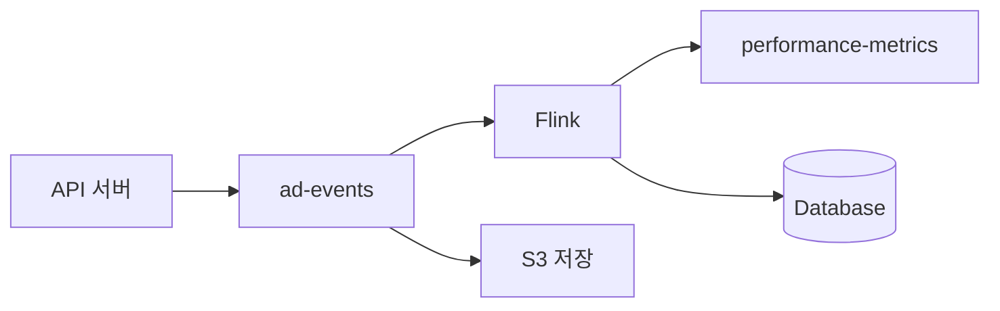
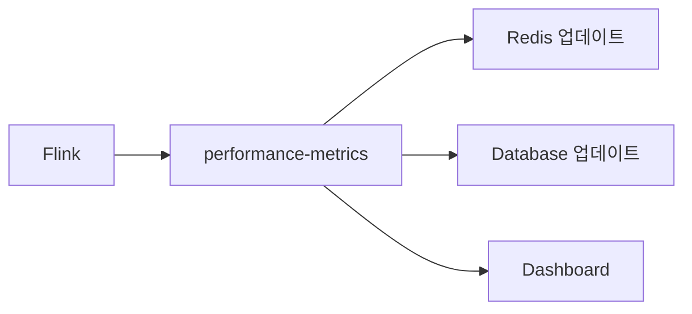
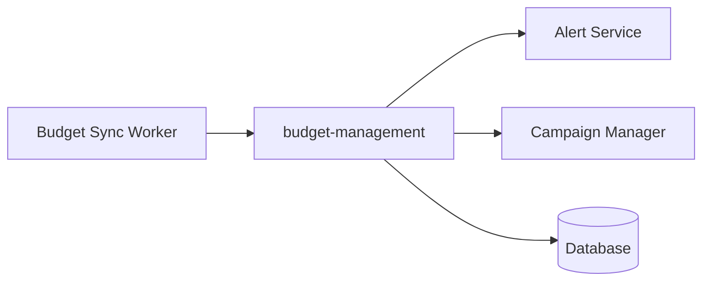

# CPC RTB 시스템 Kafka 토픽 설계

## 📋 목차
1. [아키텍처 기반 토픽 분석](#-아키텍처-기반-토픽-분석)
2. [필수 토픽 설계](#-필수-토픽-설계)
3. [토픽별 발행 정보](#-토픽별-발행-정보)
4. [최종 토픽 구성](#-최종-토픽-구성)
5. [토픽별 처리 플로우](#-토픽별-처리-플로우)
6. [성능 최적화 전략](#-성능-최적화-전략)
7. [신뢰성 및 복구 전략](#-신뢰성-및-복구-전략)
8. [구현 우선순위](#-구현-우선순위)
9. [기대 효과](#-기대-효과)

---

## 📋 아키텍처 기반 토픽 분석

### 🎯 핵심 데이터 플로우 분석

업데이트된 아키텍처 문서를 바탕으로 식별된 핵심 데이터 플로우:

#### **1. 광고 이벤트 스트림**
```
API 서버 → Kafka → Flink → Redis/DB 업데이트
- 노출/클릭/전환 이벤트 통합 처리
- 24시간 클릭-전환 매칭
- 실시간 CTR/CVR 계산
```

#### **2. 성과 지표 집계**
```
Flink 집계 결과 → Redis/DB 업데이트
- CTR/CVR 실시간 계산 (5분 윈도우)
- 방어값 통계 계산 (1시간 윈도우)
- 캐시 데이터 갱신
```

#### **3. 예산 관리**
```
Redis 일예산 카운터 → DB 동기화 (10분마다)
- 예산 초과 알림
- 잔액 부족 알림
- 캠페인 자동 중단
```

#### **4. 품질 점수 관리**
```
외부 시스템 → 품질점수 업데이트 → RTB 반영
- 상품별 품질점수 실시간 반영
- 입찰가 역전 케이스 처리
```

---

## 🎯 필수 토픽 설계

### **1. `ad-events` (P0 - 핵심 이벤트 스트림)**

**목적**: 모든 광고 관련 이벤트 통합 수집 및 스트림 처리

**이벤트 타입**: 
- `IMPRESSION`: 광고 노출
- `CLICK`: 광고 클릭  
- `CONVERSION`: 구매 전환

**스키마**:
```json
{
  "event_type": "IMPRESSION|CLICK|CONVERSION",
  "timestamp": "2024-01-15T10:30:00Z",
  "device_id": "device_12345",
  "session_id": "session_67890",
  "ad_id": "ad_001",
  "campaign_id": "campaign_100",
  "advertiser_id": "advertiser_50",
  "product_id": "product_200",
  "placement": "HOME|CATEGORY|PRODUCT_DETAIL|SEARCH",
  "bid_price": 1500,
  "actual_price": 1200,
  "experiment_key": "mobile_ui",
  "experiment_var": "B",
  "search_term": "노트북",
  "category": "전자제품/컴퓨터",
  "revenue_amount": 50000,
  "order_id": "order_789"
}
```

**파티셔닝**: `device_id` 기준 (24시간 매칭 최적화)

**소비자**:
- Flink: 실시간 집계, 24시간 매칭
- S3 Connector: 원시 데이터 저장
- Analytics Worker: 배치 리포트 생성

---

### **2. `performance-metrics` (P0 - 실시간 성과 지표)**

**목적**: Flink에서 계산된 실시간 성과 지표를 Redis/DB에 반영

**스키마**:
```json
{
  "metric_type": "CTR|CVR|DEFENSE_VALUE",
  "timestamp": "2024-01-15T10:35:00Z",
  "campaign_id": "campaign_100",
  "placement": "HOME",
  "category": "전자제품",
  "window_start": "2024-01-15T10:30:00Z",
  "window_end": "2024-01-15T10:35:00Z",
  "impressions": 1000,
  "clicks": 25,
  "conversions": 3,
  "ctr": 0.025,
  "cvr": 0.12,
  "defense_ctr": 0.015,
  "defense_cvr": 0.08,
  "sample_size": "SUFFICIENT|INSUFFICIENT"
}
```

**파티셔닝**: `campaign_id` 기준

**소비자**:
- Redis Updater: 캐시 데이터 갱신
- DB Updater: 집계 테이블 업데이트
- Dashboard Service: 실시간 모니터링

---

### **3. `budget-management` (P1 - 예산 관리)**

**목적**: 예산 관련 이벤트 및 알림 처리

**이벤트 타입**:
- `BUDGET_SYNC`: Redis → DB 예산 동기화
- `BUDGET_ALERT`: 예산 임계값 알림
- `CAMPAIGN_PAUSE`: 예산 소진으로 인한 캠페인 중단

**스키마**:
```json
{
  "event_type": "BUDGET_SYNC|BUDGET_ALERT|CAMPAIGN_PAUSE",
  "timestamp": "2024-01-15T10:40:00Z",
  "advertiser_id": "advertiser_50",
  "campaign_id": "campaign_100",
  "daily_budget": 100000,
  "spent_amount": 95000,
  "remaining_budget": 5000,
  "alert_type": "90_PERCENT|95_PERCENT|EXHAUSTED",
  "sync_source": "REDIS_COUNTER",
  "action": "NOTIFY|PAUSE_CAMPAIGN"
}
```

**파티셔닝**: `advertiser_id` 기준

**소비자**:
- Budget Sync Worker: 10분마다 Redis → DB 동기화
- Alert Service: 광고주 알림 발송
- Campaign Manager: 자동 캠페인 중단

---

### **4. `quality-score-updates` (P2 - 품질 점수 관리)**

**목적**: 상품별 품질점수 실시간 업데이트

**스키마**:
```json
{
  "timestamp": "2024-01-15T10:45:00Z",
  "product_id": "product_200",
  "category": "전자제품",
  "quality_score": 8.5,
  "previous_score": 7.2,
  "score_factors": {
    "click_rate": 8.0,
    "conversion_rate": 9.0,
    "user_satisfaction": 8.5
  },
  "update_reason": "PERFORMANCE_IMPROVEMENT|MANUAL_ADJUSTMENT",
  "effective_from": "2024-01-15T11:00:00Z"
}
```

**파티셔닝**: `product_id` 기준

**소비자**:
- RTB Cache Updater: Redis 품질점수 캐시 갱신
- DB Updater: 상품 테이블 업데이트

---

## 🎯 토픽별 발행 정보

### **1. `ad-events` 토픽 발행**

**발행 주체**: API 서버 *(참조: 아키텍처 분석 - 광고 이벤트 스트림)*
**발행 시점**:
- **IMPRESSION**: 광고가 사용자에게 노출될 때 즉시
- **CLICK**: 사용자가 광고를 클릭할 때 즉시  
- **CONVERSION**: 구매 전환이 발생할 때 즉시 *(24시간 클릭-전환 매칭)*

**발행 조건**: 실시간 사용자 행동 이벤트 발생 시
**예상 TPS**: 1000

---

### **2. `performance-metrics` 토픽 발행**

**발행 주체**: Flink 스트림 처리 엔진 *(참조: 아키텍처 분석 - 성과 지표 집계)*
**발행 시점**:
- **CTR/CVR 지표**: 5분 윈도우마다
- **방어값 통계**: 1시간 윈도우마다

**발행 조건**: 
- Flink에서 `ad-events` 토픽을 소비하여 집계 완료 시
- 윈도우 기간 종료 시점
**예상 TPS**: 100

---

### **3. `budget-management` 토픽 발행**

**발행 주체**: Budget Sync Worker *(참조: 아키텍처 분석 - 예산 관리)*
**발행 시점**:
- **BUDGET_SYNC**: 10분마다 정기적으로
- **BUDGET_ALERT**: 예산 임계값(90%, 95%) 도달 시 즉시
- **CAMPAIGN_PAUSE**: 예산 소진 시 즉시

**발행 조건**:
- Redis 일예산 카운터와 DB 동기화 주기
- 예산 소진률 모니터링 결과
**예상 TPS**: 50

---

### **4. `quality-score-updates` 토픽 발행**

**발행 주체**: 외부 품질점수 시스템 *(참조: 아키텍처 분석 - 품질 점수 관리)*
**발행 시점**: 
- 품질점수 재계산 완료 시
- 수동 조정 시

**발행 조건**:
- 상품 성과 데이터 변화
- 관리자 수동 품질점수 조정
- 입찰가 역전 케이스 감지 시
**예상 TPS**: 10

---

## 📊 최종 토픽 구성

| 토픽명 | 우선순위 | TPS 예상 | 보관기간 | 파티션 수 | 주요 소비자 |
|--------|----------|----------|----------|-----------|-------------|
| `ad-events` | **P0** | 1000 | 7일 | 12 | Flink, S3, Analytics |
| `performance-metrics` | **P0** | 100 | 3일 | 6 | Redis, DB, Dashboard |
| `budget-management` | **P1** | 50 | 30일 | 3 | Sync Worker, Alert Service |
| `quality-score-updates` | **P2** | 10 | 7일 | 3 | Cache Updater, DB |

### **발행 주체별 매핑**

| 발행 주체 | 토픽 | 발행 방식 | 배치 크기 |
|-----------|------|-----------|-----------|
| **API 서버** | `ad-events` | 실시간 개별 이벤트 | 단일 이벤트 |
| **Flink 엔진** | `performance-metrics` | 윈도우 집계 완료 시 | 윈도우당 단일 메트릭 |
| **Budget Sync Worker** | `budget-management` | 스케줄러 + 이벤트 기반 | 광고주별 단일 이벤트 |
| **외부 시스템** | `quality-score-updates` | REST API 호출 시 | 상품별 단일 이벤트 |

---

## 🔄 토픽별 처리 플로우

### **ad-events 처리 플로우**


### **performance-metrics 처리 플로우**


### **budget-management 처리 플로우**


---

## ⚡ 성능 최적화 전략

### **1. 파티셔닝 전략**
- **ad-events**: `device_id` 해시 - 24시간 매칭 최적화
- **performance-metrics**: `campaign_id` 해시 - 캠페인별 집계 최적화
- **budget-management**: `advertiser_id` 해시 - 광고주별 처리 최적화

### **2. 배치 크기 최적화**
- **ad-events**: 5초 마이크로배치 (실시간성)
- **performance-metrics**: 1분 배치 (안정성)
- **budget-management**: 10분 배치 (정확성)

### **3. 압축 및 직렬화**
- **압축**: LZ4 (낮은 CPU, 빠른 처리)
- **직렬화**: JSON (디버깅 용이성, 스키마 진화)

---

## 🛡️ 신뢰성 및 복구 전략

### **1. 이벤트 순서 보장**
- 파티션 내 순서 보장
- `device_id` 기준 파티셔닝으로 세션 일관성 유지

### **2. 중복 처리**
- Exactly-once 처리 (Flink checkpointing)
- 멱등성 보장 (unique key 기반)

### **3. 장애 복구**
- **토픽 손실**: Replication Factor 3
- **소비자 장애**: Consumer Group 자동 리밸런싱
- **데이터 복구**: S3 백업에서 재처리

---

## 🚀 구현 우선순위

### **Phase 1 (MVP)**
1. ✅ `ad-events` 토픽 + Flink 기본 집계
2. ✅ `performance-metrics` 토픽 + Redis 업데이트

### **Phase 2 (운영 안정화)**
3. ✅ `budget-management` 토픽 + 예산 동기화
4. ✅ S3 커넥터 + 데이터 레이크

### **Phase 3 (고도화)**
5. ✅ `quality-score-updates` 토픽
6. ✅ 실시간 대시보드 연동

---

## 📈 기대 효과

**단순화된 아키텍처**:
- 토픽 수: 8개 → 4개 (50% 감소)
- 운영 복잡도 대폭 감소
- 장애 포인트 최소화

**성능 향상**:
- 불필요한 토픽 제거로 Kafka 부하 감소
- DB 직접 처리로 지연시간 단축
- 캐시 일관성 향상

**개발 효율성**:
- 명확한 데이터 플로우
- 디버깅 용이성 증대
- 확장성 확보