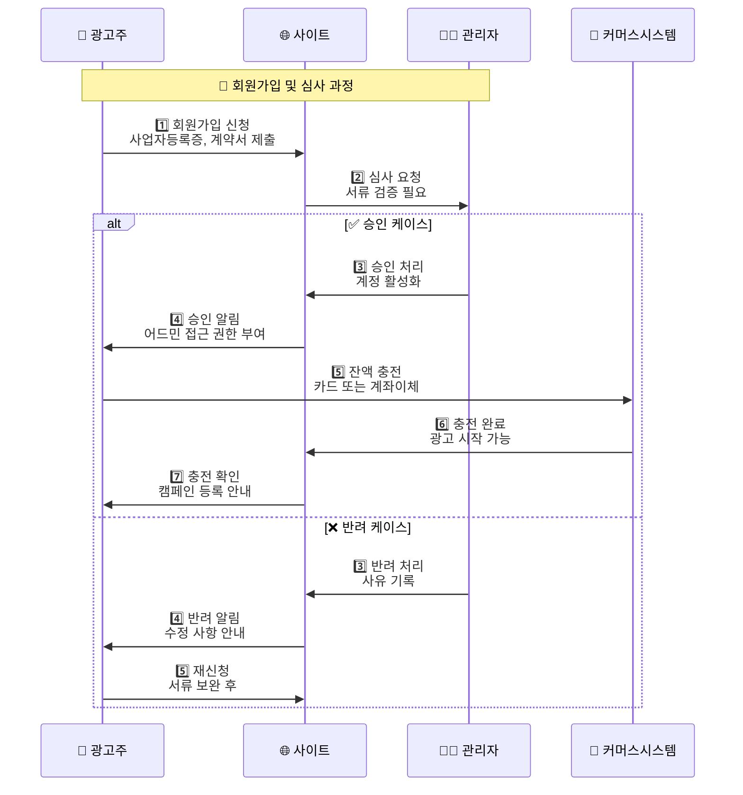
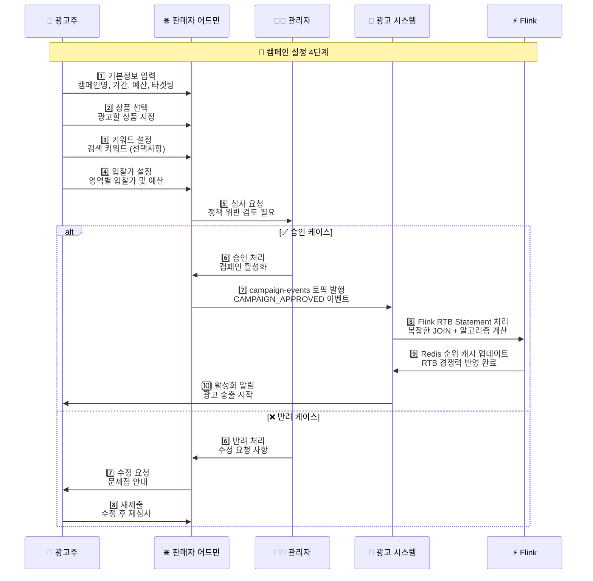
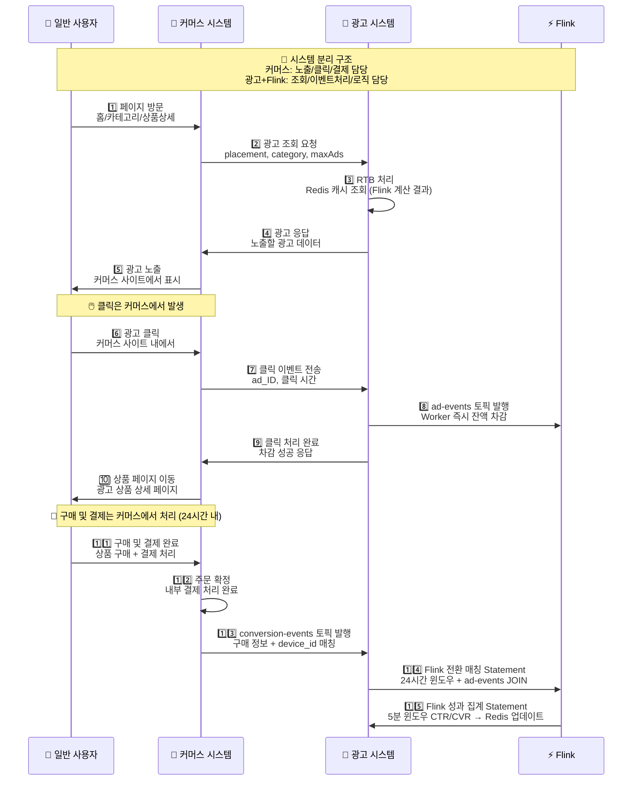
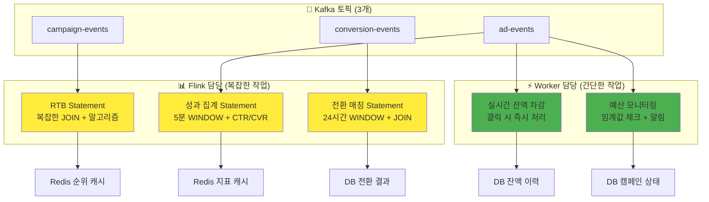

# CPC RTB 시스템 - 업무 플로우

## 🚀 광고 서비스 전체 업무 플로우

### 🔄 시스템 분리 구조
- **커머스 시스템**: 사용자 인터페이스, 광고 노출, 클릭 이벤트 발생, 구매 및 결제 처리
- **판매자 어드민**: 캠페인 관리, 거래처 관리, 승인 처리
- **광고 시스템 + Flink**: 광고 조회 요청 처리, 클릭이벤트 처리, RTB 로직 처리

### 📋 비즈니스 프로세스 개요
1. **광고주 온보딩**: 회원가입 → 승인 → 잔액충전
2. **캠페인 설정**: 등록 → 심사 → 활성화
3. **광고 서비스**: 노출 → 클릭 → 전환 → 정산
4. **성과 관리**: 모니터링 → 최적화 → 리포트

---

## 🔄 전체 업무 플로우

```mermaid
graph TD
    subgraph "1️⃣ 광고주 온보딩"
        A1[📝 광고주 회원가입<br/>- 사업자 정보 입력<br/>- 계약서 업로드]
        A2[👨‍💼 관리자 심사<br/>- 사업자 검증<br/>- 계약 검토]
        A3{승인 여부}
        A4[✅ 계정 활성화<br/>- 어드민 접근 권한<br/>- 초기 설정]
        A5[❌ 반려<br/>- 사유 통보<br/>- 재신청 안내]
        A6[💰 잔액 충전<br/>- 카드/계좌이체<br/>- 충전 내역 기록]
    end
    
    subgraph "2️⃣ 캠페인 설정"
        B1[📊 캠페인 기본정보<br/>- 캠페인명, 기간<br/>- 타겟팅, 예산]
        B2[🛍️ 상품 선택<br/>- 광고할 상품 지정<br/>- 카테고리별 그룹핑]
        B3[🔍 키워드 설정<br/>- 검색 키워드<br/>- 수동 심사 대상]
        B4[💸 입찰가/예산 설정<br/>- 영역별 입찰가<br/>- 일일/총 예산]
        B5[👨‍💼 관리자 승인<br/>- 정책 위반 검토<br/>- 키워드 심사]
        B6{승인 여부}
        B7[🚀 캠페인 활성화<br/>- campaign-events 토픽 발행<br/>- Flink RTB Statement 처리<br/>- Redis 순위 캐시 업데이트]
        B8[❌ 반려<br/>- 수정 요청<br/>- 재심사 안내]
    end
    
    subgraph "3️⃣ 광고 서비스 운영"
        C1[👤 사용자 커머스 방문<br/>- 홈/카테고리/상품상세<br/>- 검색 등]
        C2[🛒 커머스 → 광고 조회<br/>- placement, category<br/>- maxAds 요청]
        C3[🎯 광고시스템 RTB 처리<br/>- Redis 캐시 조회<br/>- Fallback DB 조회]
        C4[📱 커머스에서 광고 노출<br/>- 상위 순위 광고<br/>- 사용자에게 표시]
        C5[🖱️ 커머스에서 클릭 발생<br/>- ad-events 토픽 발행<br/>- Worker 즉시 잔액 차감]
        C6[🛒 커머스에서 구매 발생<br/>- conversion-events 토픽 발행<br/>- Flink 24시간 윈도우 매칭]
        C7[📊 광고시스템 성과 집계<br/>- Flink 5분 윈도우 집계<br/>- Redis 지표 캐시 업데이트]
    end
    
    subgraph "4️⃣ 정산 및 관리"
        D1[📈 성과 모니터링<br/>- 실시간 대시보드<br/>- 예산 소진 알림]
        D2[⚙️ 캠페인 최적화<br/>- 입찰가 조정<br/>- 예산 재배분]
        D3[📋 정산 처리<br/>- 일별/월별 정산<br/>- 세금계산서 발행]
        D4[📊 리포트 제공<br/>- 성과 분석<br/>- CSV 다운로드]
        D5[💳 추가 충전<br/>- 잔액 부족시<br/>- 자동 충전 설정]
    end
    
    %% 온보딩 플로우
    A1 --> A2
    A2 --> A3
    A3 -->|승인| A4
    A3 -->|반려| A5
    A4 --> A6
    A5 --> A1
    
    %% 캠페인 설정 플로우
    A6 --> B1
    B1 --> B2
    B2 --> B3
    B3 --> B4
    B4 --> B5
    B5 --> B6
    B6 -->|승인| B7
    B6 -->|반려| B8
    B8 --> B1
    
    %% 광고 서비스 플로우
    B7 --> C1
    C1 --> C2
    C2 --> C3
    C3 --> C4
    C4 --> C5
    C5 --> C6
    C6 --> C7
    
    %% 순환 플로우
    C7 --> D1
    D1 --> D2
    D2 --> D3
    D3 --> D4
    D4 --> D5
    D5 --> D1
    
    %% 피드백 루프
    D2 -.-> B4
    D1 -.-> A6
    
    style A1 fill:#e3f2fd
    style A4 fill:#e8f5e8
    style B7 fill:#e8f5e8
    style C3 fill:#fff3e0
    style C4 fill:#ffeb3b
    style C5 fill:#e1f5fe
    style D3 fill:#f1f8e9
```

---

## 📊 세부 업무 플로우

### 1️⃣ **광고주 온보딩 프로세스**

### 2️⃣ **캠페인 등록 및 승인 프로세스**

### 3️⃣ **실제 광고 서비스 플로우**

---

### 🎯 **최적화된 아키텍처 핵심 구조**

**🔄 역할 분담 원칙**: 복잡한 작업은 Flink, 간단한 작업은 Worker

**💡 핵심 최적화 효과**:
- **지연 시간 단축**: Worker 즉시 처리
- **비용 효율**: Flink Statement 4개 → 3개 (25% 절감)
- **운영 단순화**: 명확한 역할 분담

---

### 🔄 **순환 업무 사이클**
- **일간**: 성과 모니터링, 예산 조정
- **주간**: 캠페인 최적화, 입찰가 조정  
- **월간**: 정산 처리, 성과 리포트
- **분기**: 전략 수립, 파라미터 튜닝 