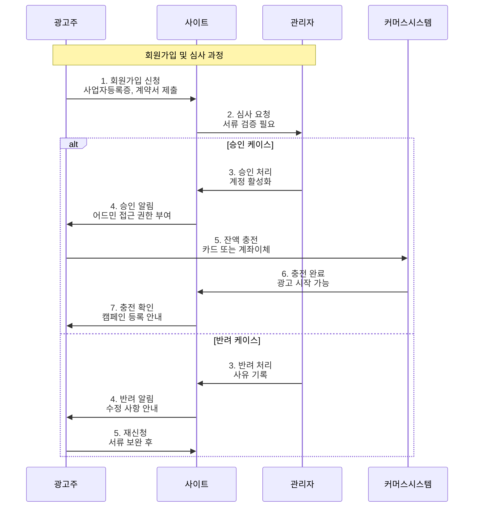
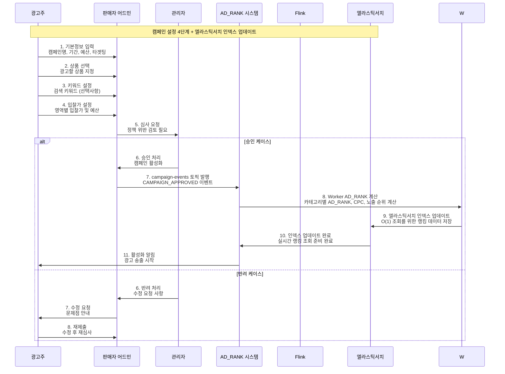
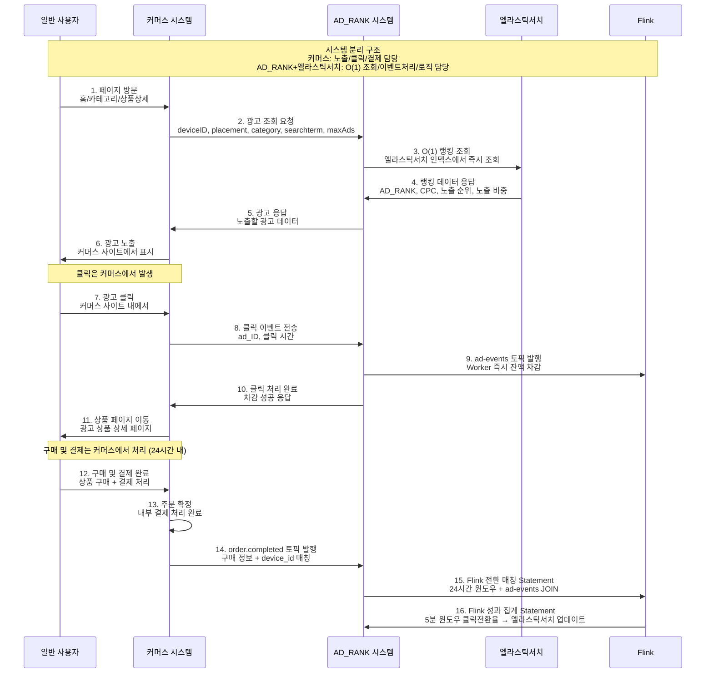
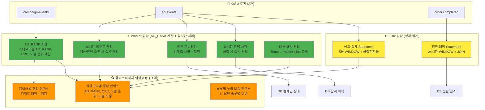
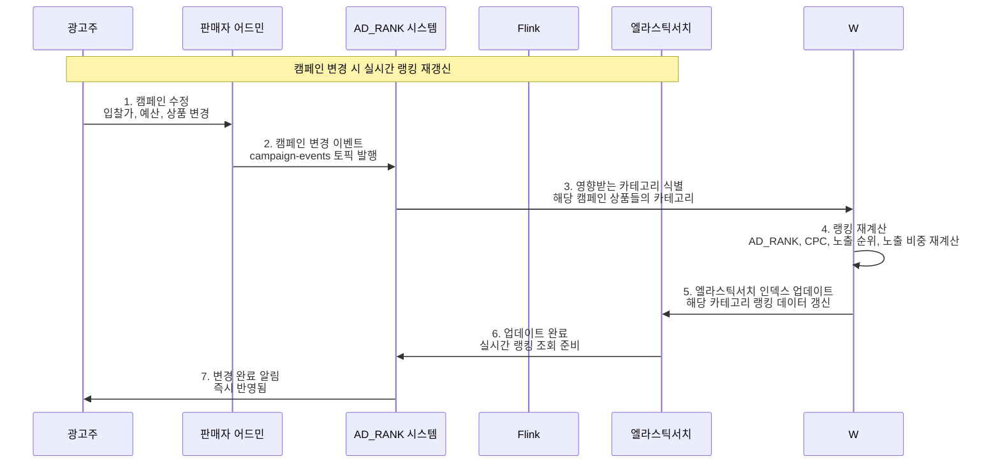
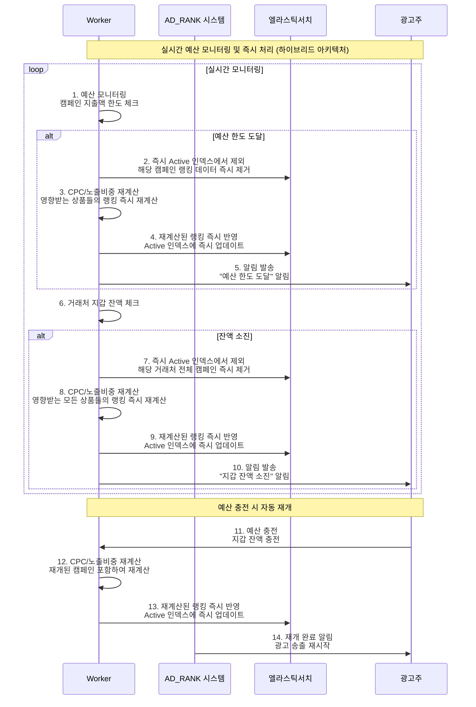
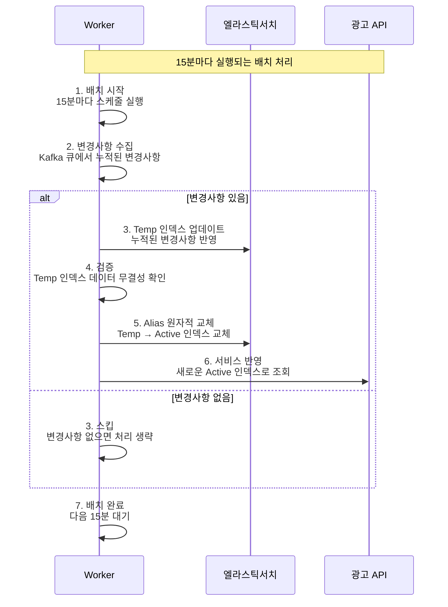

# AD_RANK 광고 시스템 - 업무 플로우

## 🚀 광고 서비스 전체 업무 플로우

### 🔄 시스템 분리 구조
- **커머스 시스템**: 사용자 인터페이스, 광고 노출, 클릭 이벤트 발생, 구매 및 결제 처리
- **판매자 어드민**: 캠페인 관리, 거래처 관리, 승인 처리
- **AD_RANK 시스템 + Worker**: 광고 조회 요청 처리, 클릭이벤트 처리, AD_RANK 로직 처리
- **엘라스틱서치**: O(1) 랭킹 조회, 병렬 처리 지원, 하이브리드 아키텍처 (15분 배치 + 실시간 이벤트)

### 📋 비즈니스 프로세스 개요
1. **광고주 온보딩**: 회원가입 → 승인 → 잔액충전
2. **캠페인 설정**: 등록 → 심사 → 활성화 → 엘라스틱서치 인덱스 업데이트
3. **광고 서비스**: O(1) 랭킹 조회 → 노출 → 클릭 → 전환 → 정산
4. **성과 관리**: 모니터링 → 최적화 → 리포트

---

## 🔄 전체 업무 플로우

```mermaid
graph TD
    subgraph "1 광고주 온보딩"
        A1["광고주 회원가입<br/>- 사업자 정보 입력<br/>- 계약서 업로드"]
        A2["관리자 심사<br/>- 사업자 검증<br/>- 계약 검토"]
        A3{승인 여부}
        A4["계정 활성화<br/>- 어드민 접근 권한<br/>- 초기 설정"]
        A5["반려<br/>- 사유 통보<br/>- 재신청 안내"]
        A6["잔액 충전<br/>- 카드/계좌이체<br/>- 충전 내역 기록"]
    end
    
    subgraph "2 캠페인 설정"
        B1["캠페인 기본정보<br/>- 캠페인명, 기간<br/>- 타겟팅, 예산"]
        B2["상품 선택<br/>- 광고할 상품 지정<br/>- 카테고리별 그룹핑"]
        B3["키워드 설정<br/>- 검색 키워드<br/>- 수동 심사 대상"]
        B4["입찰가/예산 설정<br/>- 영역별 입찰가<br/>- 일일/총 예산"]
        B5["관리자 승인<br/>- 정책 위반 검토<br/>- 키워드 심사"]
        B6{승인 여부}
        B7["캠페인 활성화<br/>- campaign-events 토픽 발행<br/>- Worker AD_RANK 계산<br/>- 엘라스틱서치 인덱스 업데이트"]
        B8["반려<br/>- 수정 요청<br/>- 재심사 안내"]
    end
    
    subgraph "3 광고 서비스 운영"
        C1["사용자 커머스 방문<br/>- 홈/카테고리/상품상세<br/>- 검색 등"]
        C2["커머스 → 광고 조회<br/>- deviceID, placement, category<br/>- searchterm, maxAds 요청"]
        C3["AD_RANK 시스템 O(1) 조회<br/>- 엘라스틱서치 인덱스 조회<br/>- 병렬 처리로 동시 요청 처리"]
        C4["커머스에서 광고 노출<br/>- 상위 순위 광고<br/>- 사용자에게 표시"]
        C5["커머스에서 클릭 발생<br/>- ad-events 토픽 발행<br/>- Worker 즉시 잔액 차감"]
        C6["커머스에서 구매 발생<br/>- order.completed 토픽 발행<br/>- Flink 24시간 윈도우 매칭"]
        C7["AD_RANK 시스템 성과 집계<br/>- Flink 5분 윈도우 집계<br/>- 클릭전환율 업데이트"]
    end
    
    subgraph "4 정산 및 관리"
        D1["성과 모니터링<br/>- 실시간 대시보드<br/>- 예산 소진 알림"]
        D2["캠페인 최적화<br/>- 입찰가 조정<br/>- 예산 재배분"]
        D3["정산 처리<br/>- 일별/월별 정산<br/>- 세금계산서 발행"]
        D4["리포트 제공<br/>- 성과 분석<br/>- CSV 다운로드"]
        D5["추가 충전<br/>- 잔액 부족시<br/>- 자동 충전 설정"]
    end
    
    %% 온보딩 플로우
    A1 --> A2
    A2 --> A3
    A3 -->|승인| A4
    A3 -->|반려| A5
    A4 --> A6
    A5 --> A1
    
    %% 캠페인 설정 플로우
    A6 --> B1
    B1 --> B2
    B2 --> B3
    B3 --> B4
    B4 --> B5
    B5 --> B6
    B6 -->|승인| B7
    B6 -->|반려| B8
    B8 --> B1
    
    %% 광고 서비스 플로우
    B7 --> C1
    C1 --> C2
    C2 --> C3
    C3 --> C4
    C4 --> C5
    C5 --> C6
    C6 --> C7
    
    %% 순환 플로우
    C7 --> D1
    D1 --> D2
    D2 --> D3
    D3 --> D4
    D4 --> D5
    D5 --> D1
    
    %% 피드백 루프
    D2 -.-> B4
    D1 -.-> A6
    
    style A1 fill:#e3f2fd
    style A4 fill:#e8f5e8
    style B7 fill:#e8f5e8
    style C3 fill:#fff3e0
    style C4 fill:#ffeb3b
    style C5 fill:#e1f5fe
    style D3 fill:#f1f8e9
```

---

## 📊 세부 업무 플로우

### 1️⃣ **광고주 온보딩 프로세스**

```mermaid
sequenceDiagram
    participant A as 광고주
    participant S as 사이트
    participant M as 관리자
    participant B as 커머스시스템
    
    Note over A,M: 회원가입 및 심사 과정
    
    A->>S: 1. 회원가입 신청<br/>사업자등록증, 계약서 제출
    S->>M: 2. 심사 요청<br/>서류 검증 필요
    
    alt 승인 케이스
        M->>S: 3. 승인 처리<br/>계정 활성화
        S->>A: 4. 승인 알림<br/>어드민 접근 권한 부여
        A->>B: 5. 잔액 충전<br/>카드 또는 계좌이체
        B->>S: 6. 충전 완료<br/>광고 시작 가능
        S->>A: 7. 충전 확인<br/>캠페인 등록 안내
    else 반려 케이스
        M->>S: 3. 반려 처리<br/>사유 기록
        S->>A: 4. 반려 알림<br/>수정 사항 안내
        A->>S: 5. 재신청<br/>서류 보완 후
    end
```

### 2️⃣ **캠페인 등록 및 승인 프로세스**

```mermaid
sequenceDiagram
    participant A as 광고주
    participant S as 판매자 어드민
    participant M as 관리자
    participant AS as AD_RANK 시스템
    participant F as Flink
    participant ES as 엘라스틱서치
    
    Note over A,ES: 캠페인 설정 4단계 + 엘라스틱서치 인덱스 업데이트
    
    A->>S: 1. 기본정보 입력<br/>캠페인명, 기간, 예산, 타겟팅
    A->>S: 2. 상품 선택<br/>광고할 상품 지정
    A->>S: 3. 키워드 설정<br/>검색 키워드 (선택사항)
    A->>S: 4. 입찰가 설정<br/>영역별 입찰가 및 예산
    
    S->>M: 5. 심사 요청<br/>정책 위반 검토 필요
    
    alt 승인 케이스
        M->>S: 6. 승인 처리<br/>캠페인 활성화
        S->>AS: 7. campaign-events 토픽 발행<br/>CAMPAIGN_APPROVED 이벤트
        AS->>W: 8. Worker AD_RANK 계산<br/>카테고리별 AD_RANK, CPC, 노출 순위 계산
        W->>ES: 9. 엘라스틱서치 인덱스 업데이트<br/>O(1) 조회를 위한 랭킹 데이터 저장
        ES->>AS: 10. 인덱스 업데이트 완료<br/>실시간 랭킹 조회 준비 완료
        AS->>A: 11. 활성화 알림<br/>광고 송출 시작
    else 반려 케이스
        M->>S: 6. 반려 처리<br/>수정 요청 사항
        S->>A: 7. 수정 요청<br/>문제점 안내
        A->>S: 8. 재제출<br/>수정 후 재심사
    end
```

### 3️⃣ **실제 광고 서비스 플로우 (O(1) 조회)**

```mermaid
sequenceDiagram
    participant U as 일반 사용자
    participant C as 커머스 시스템
    participant A as AD_RANK 시스템
    participant ES as 엘라스틱서치
    participant F as Flink
    
    Note over U,F: 시스템 분리 구조<br/>커머스: 노출/클릭/결제 담당<br/>AD_RANK+엘라스틱서치: O(1) 조회/이벤트처리/로직 담당
    
    U->>C: 1. 페이지 방문<br/>홈/카테고리/상품상세
    C->>A: 2. 광고 조회 요청<br/>deviceID, placement, category, searchterm, maxAds
    A->>ES: 3. O(1) 랭킹 조회<br/>엘라스틱서치 인덱스에서 즉시 조회
    ES->>A: 4. 랭킹 데이터 응답<br/>AD_RANK, CPC, 노출 순위, 노출 비중
    A->>C: 5. 광고 응답<br/>노출할 광고 데이터
    C->>U: 6. 광고 노출<br/>커머스 사이트에서 표시
    
    Note over U,C: 클릭은 커머스에서 발생
    
    U->>C: 7. 광고 클릭<br/>커머스 사이트 내에서
    C->>A: 8. 클릭 이벤트 전송<br/>ad_ID, 클릭 시간
    A->>F: 9. ad-events 토픽 발행<br/>Worker 즉시 잔액 차감
    A->>C: 10. 클릭 처리 완료<br/>차감 성공 응답
    C->>U: 11. 상품 페이지 이동<br/>광고 상품 상세 페이지
    
    Note over U,C: 구매 및 결제는 커머스에서 처리 (24시간 내)
    
    U->>C: 12. 구매 및 결제 완료<br/>상품 구매 + 결제 처리
    C->>C: 13. 주문 확정<br/>내부 결제 처리 완료
    C->>A: 14. order.completed 토픽 발행<br/>구매 정보 + device_id 매칭
    A->>F: 15. Flink 전환 매칭 Statement<br/>24시간 윈도우 + ad-events JOIN
    F->>A: 16. Flink 성과 집계 Statement<br/>5분 윈도우 클릭전환율 → 엘라스틱서치 업데이트
```

---

### 🎯 **최적화된 아키텍처 핵심 구조**

**🔄 역할 분담 원칙**: AD_RANK 계산은 Worker, 성과 집계는 Flink, O(1) 조회는 엘라스틱서치

```mermaid
graph TB
    subgraph "📊 Flink 담당 (성과 집계)"
        F1[성과 집계 Statement<br/>5분 WINDOW + 클릭전환율]  
        F2[전환 매칭 Statement<br/>24시간 WINDOW + JOIN]
    end
    
    subgraph "⚡ Worker 담당 (AD_RANK 계산 + 실시간 처리)"
        W1[AD_RANK 계산<br/>카테고리별 AD_RANK, CPC, 노출 순위 계산]
        W2[실시간 잔액 차감<br/>클릭 시 즉시 처리]
        W3[예산 모니터링<br/>임계값 체크 + 알림]
        W4[실시간 이벤트 처리<br/>예산/잔액 소진 시 즉시 처리]
        W5[15분 배치 처리<br/>Temp → Active alias 교체]
    end
    
    subgraph "🔍 엘라스틱서치 담당 (O(1) 조회)"
        ES1[카테고리별 랭킹 인덱스<br/>AD_RANK, CPC, 노출 순위, 노출 비중]
        ES2[검색어별 랭킹 인덱스<br/>키워드 매칭 + 랭킹]
        ES3[슬롯별 노출 비중 인덱스<br/>1~10번 슬롯별 비중]
    end
    
    subgraph "📡 Kafka 토픽 (3개)"
        K1[campaign-events]
        K2[ad-events]
        K3[order.completed]
    end
    
    K1 --> W1
    K2 --> F1
    K2 --> W2
    K2 --> W3
    K2 --> W4
    K3 --> F2
    
    F1 --> ES1
    F2 --> DB[DB 전환 결과]
    W1 --> ES1
    W1 --> ES2
    W2 --> DB2[DB 잔액 이력]
    W3 --> DB3[DB 캠페인 상태]
    W4 --> ES1
    W5 --> ES1
    
    style F1 fill:#ffeb3b
    style F2 fill:#ffeb3b
    style W1 fill:#4caf50
    style W2 fill:#4caf50
    style W3 fill:#4caf50
    style W4 fill:#4caf50
    style W5 fill:#4caf50
    style ES1 fill:#ff9800
    style ES2 fill:#ff9800
    style ES3 fill:#ff9800
```

**💡 핵심 최적화 효과**:
- **O(1) 조회**: 엘라스틱서치 인덱스로 즉시 랭킹 조회
- **병렬 처리**: 여러 광고 요청을 동시에 처리
- **지연 시간 단축**: Worker 즉시 처리 + 엘라스틱서치 O(1) 조회
- **비용 효율**: Flink Statement 3개로 최적화
- **운영 단순화**: 명확한 역할 분담

---

### 🔄 **실시간 랭킹 관리 플로우**

```mermaid
sequenceDiagram
    participant A as 광고주
    participant S as 판매자 어드민
    participant AS as AD_RANK 시스템
    participant F as Flink
    participant ES as 엘라스틱서치
    
    Note over A,ES: 캠페인 변경 시 실시간 랭킹 재갱신
    
    A->>S: 1. 캠페인 수정<br/>입찰가, 예산, 상품 변경
    S->>AS: 2. 캠페인 변경 이벤트<br/>campaign-events 토픽 발행
    AS->>W: 3. 영향받는 카테고리 식별<br/>해당 캠페인 상품들의 카테고리
    W->>W: 4. 랭킹 재계산<br/>AD_RANK, CPC, 노출 순위, 노출 비중 재계산
    W->>ES: 5. 엘라스틱서치 인덱스 업데이트<br/>해당 카테고리 랭킹 데이터 갱신
    ES->>AS: 6. 업데이트 완료<br/>실시간 랭킹 조회 준비
    AS->>A: 7. 변경 완료 알림<br/>즉시 반영됨
```

### 💰 **예산 소진 시 자동 관리 플로우 (실시간 처리)**

```mermaid
sequenceDiagram
    participant W as Worker
    participant AS as AD_RANK 시스템
    participant ES as 엘라스틱서치
    participant A as 광고주
    
    Note over W,A: 실시간 예산 모니터링 및 즉시 처리 (하이브리드 아키텍처)
    
    loop 실시간 모니터링
        W->>W: 1. 예산 모니터링<br/>캠페인 지출액 한도 체크
        alt 예산 한도 도달
            W->>ES: 2. 즉시 Active 인덱스에서 제외<br/>해당 캠페인 랭킹 데이터 즉시 제거
            W->>W: 3. CPC/노출비중 재계산<br/>영향받는 상품들의 랭킹 즉시 재계산
            W->>ES: 4. 재계산된 랭킹 즉시 반영<br/>Active 인덱스에 즉시 업데이트
            W->>A: 5. 알림 발송<br/>"예산 한도 도달" 알림
        end
        
        W->>W: 6. 거래처 지갑 잔액 체크
        alt 잔액 소진
            W->>ES: 7. 즉시 Active 인덱스에서 제외<br/>해당 거래처 전체 캠페인 즉시 제거
            W->>W: 8. CPC/노출비중 재계산<br/>영향받는 모든 상품들의 랭킹 즉시 재계산
            W->>ES: 9. 재계산된 랭킹 즉시 반영<br/>Active 인덱스에 즉시 업데이트
            W->>A: 10. 알림 발송<br/>"지갑 잔액 소진" 알림
        end
    end
    
    Note over W,A: 예산 충전 시 자동 재개
    A->>W: 11. 예산 충전<br/>지갑 잔액 충전
    W->>W: 12. CPC/노출비중 재계산<br/>재개된 캠페인 포함하여 재계산
    W->>ES: 13. 재계산된 랭킹 즉시 반영<br/>Active 인덱스에 즉시 업데이트
    AS->>A: 14. 재개 완료 알림<br/>광고 송출 재시작
```

---

### 🔄 **하이브리드 아키텍처 플로우 (Worker 중심 + 15분 배치)**

```mermaid
graph TD
    subgraph "일반 변경사항 (15분 배치)"
        A1[캠페인 생성/수정/삭제]
        A2[Kafka: campaign-events]
        A3[Worker: AD_RANK 계산]
        A4[Temp 인덱스 업데이트]
        A5[15분 배치: Alias 교체]
    end
    
    subgraph "실시간 이벤트 (즉시 처리)"
        B1[예산/잔액 소진 감지]
        B2[Worker: 즉시 Active 인덱스 처리]
        B3[Worker: Temp 인덱스도 동기화]
        B4[CPC/노출비중 재계산]
        B5[즉시 서비스 반영]
    end
    
    subgraph "서비스 레이어"
        C1[Active 인덱스 (Alias)]
        C2[O(1) 조회]
        C3[광고 노출]
    end
    
    A1 --> A2 --> A3 --> A4 --> A5 --> C1
    B1 --> B2 --> B3 --> B4 --> B5 --> C1
    C1 --> C2
    C2 --> C3
    
    style A1 fill:#e3f2fd
    style A5 fill:#e8f5e8
    style B1 fill:#ffeb3b
    style B5 fill:#ff9800
    style C1 fill:#4caf50
```

**핵심 특징**:
- **Worker 중심**: AD_RANK 계산을 Worker에서 처리
- **일반 변경**: 15분마다 배치로 temp 인덱스에 쌓았다가 alias 교체
- **실시간 이벤트**: 예산/잔액 소진 시 Active + Temp 인덱스 모두 동기화
- **누락 방지**: 모든 변경사항을 신뢰성 있는 큐에 기록
- **ES 부하 최소화**: 배치 처리 + 처리량 제한 + backpressure

---

### ⏰ **15분 배치 Alias 교체 플로우**

```mermaid
sequenceDiagram
    participant W as Worker
    participant ES as 엘라스틱서치
    participant API as 광고 API
    
    Note over W,API: 15분마다 실행되는 배치 처리
    
    W->>W: 1. 배치 시작<br/>15분마다 스케줄 실행
    W->>W: 2. 변경사항 수집<br/>Kafka 큐에서 누적된 변경사항
    
    alt 변경사항 있음
        W->>ES: 3. Temp 인덱스 업데이트<br/>누적된 변경사항 반영
        W->>W: 4. 검증<br/>Temp 인덱스 데이터 무결성 확인
        W->>ES: 5. Alias 원자적 교체<br/>Temp → Active 인덱스 교체
        W->>API: 6. 서비스 반영<br/>새로운 Active 인덱스로 조회
    else 변경사항 없음
        W->>W: 3. 스킵<br/>변경사항 없으면 처리 생략
    end
    
    W->>W: 7. 배치 완료<br/>다음 15분 대기
```

### 🔄 **순환 업무 사이클**
- **15분**: 배치 alias 교체, 일반 변경사항 반영
- **일간**: 성과 모니터링, 예산 조정, 엘라스틱서치 인덱스 최적화
- **주간**: 캠페인 최적화, 입찰가 조정, 클릭전환율 분석
- **월간**: 정산 처리, 성과 리포트, AD_RANK 알고리즘 튜닝
- **분기**: 전략 수립, 파라미터 튜닝, 시스템 성능 최적화 