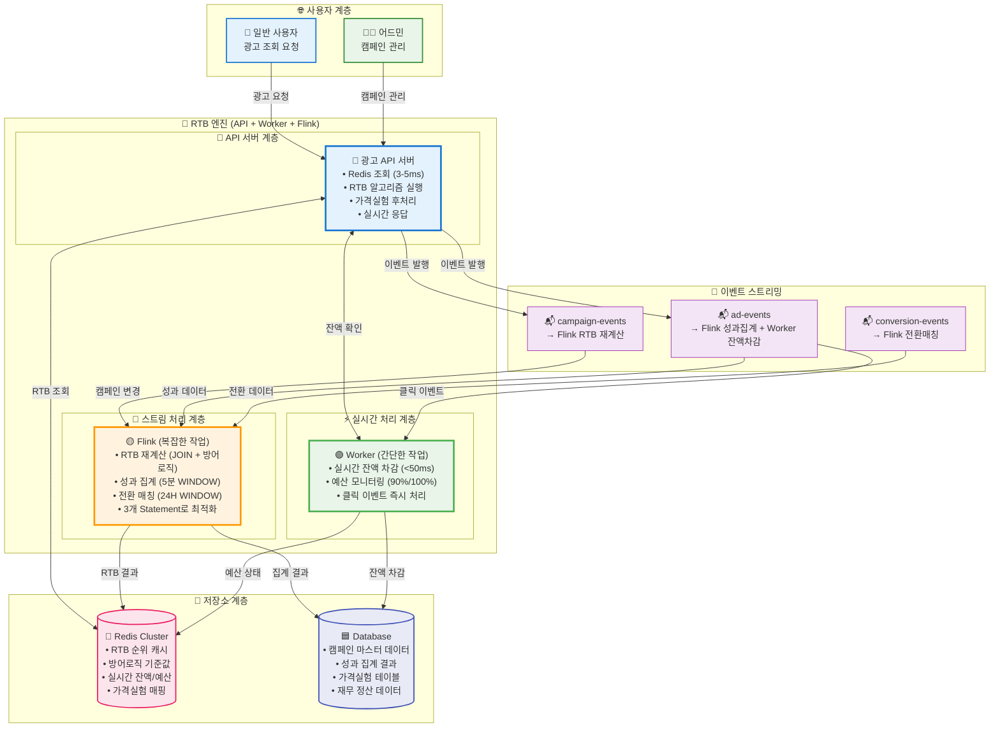
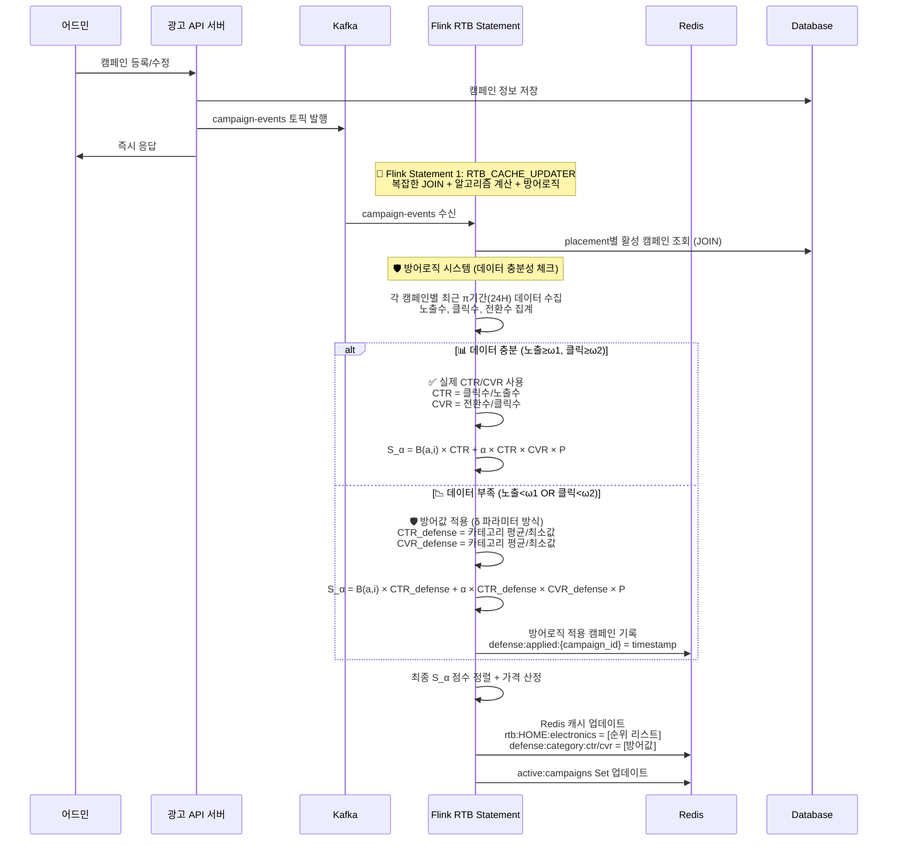
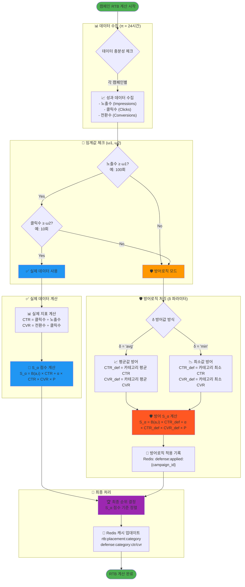
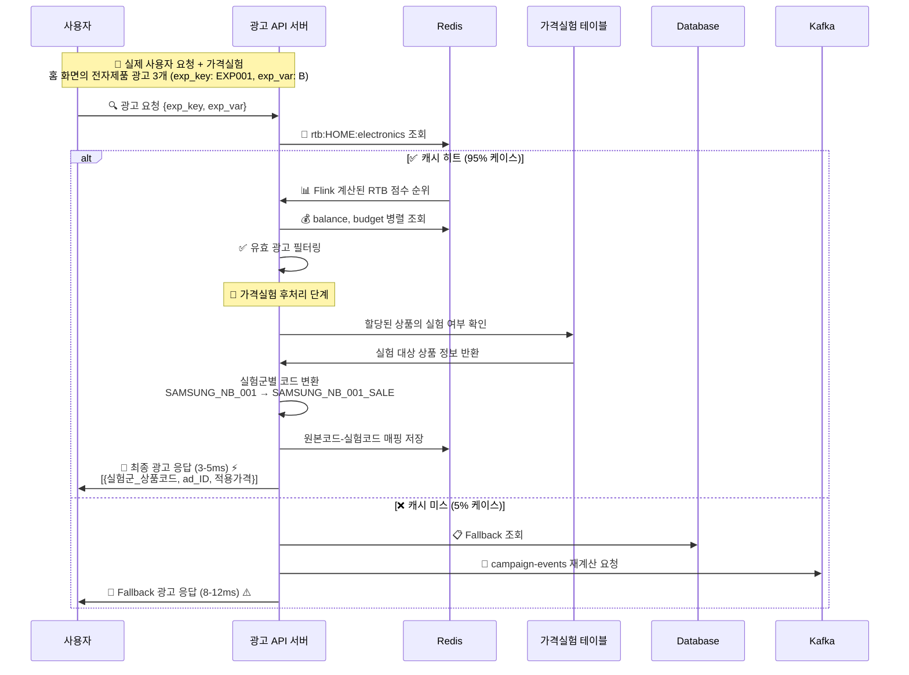
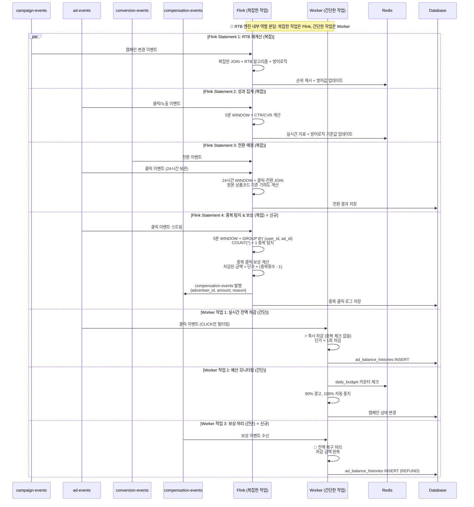

# CPC RTB 시스템 아키텍처 (최적화)

## 📋 시스템 개요

**최적화 목표**: 
- **API 응답**: Cache Hit 3-5ms, Cache Miss 15-20ms  
- **처리량**: 1000 RPS 이상
- **정확성**: 정확한 잔액 차감 및 24시간 클릭-전환 매칭
- **비용 효율성**: **Flink 3개 Statement + Worker 역할 분담**으로 25% 비용 절감

**핵심 컴포넌트**:
- **RTB 엔진**: **광고 API 서버 + Worker + Flink** 조합으로 구성
  - **광고 API 서버**: Redis 조회 중심의 초고속 응답 + RTB 알고리즘 실행
  - **Worker**: 간단한 실시간 작업 (잔액 차감, 예산 모니터링)  
  - **Flink**: 복잡한 스트림 처리 (JOIN/WINDOW 기반 계산)
- **Kafka**: 이벤트 스트리밍
- **Redis**: RTB 계산 결과 캐시 + 실시간 상태 관리
- **Database**: 마스터 데이터 및 최종 저장소

---

## 🏗️ 전체 시스템 아키텍처 (최적화)

**🎯 설계 원칙**: **"복잡한 작업은 Flink, 간단한 작업은 Worker"** 역할 분담으로 비용 효율성과 성능 최적화 달성

### 🎯 **컴포넌트별 핵심 역할**

| 컴포넌트 | 주요 역할 | 성능 목표 | 기술 스택 |
|----------|----------|-----------|-----------|
| **🔵 API 서버** | • RTB 조회 및 응답 • 가격실험 후처리 • 사용자 요청 처리 | **3-5ms** (Cache Hit) | Spring Boot + Redis |
| **🟢 Worker** | • 실시간 잔액 차감 • 예산 모니터링 • 간단한 이벤트 처리 | **<50ms** (클릭 처리) | Java + Kafka Consumer |
| **🟡 Flink** | • RTB 재계산 (JOIN) • 성과 집계 (WINDOW) • 전환 매칭 (24H) | **5분** (배치 처리) | Confluent Flink SQL |
| **🔴 Redis** | • RTB 순위 캐시 • 방어로직 기준값 • 실시간 상태 관리 | **<1ms** (조회 응답) | Redis Cluster |
| **🟦 Database** | • 마스터 데이터 • 최종 집계 결과 • 재무 정산 | **ACID** (데이터 무결성) | PostgreSQL |

## 🎯 핵심 데이터 플로우 (최적화)

### 1. 🚀 **RTB 아키텍처 (동일)**

#### **🔄 STEP 1: 사전 처리 (캠페인 등록/수정 - 승인 시)**

#### **🛡️ 방어로직 시스템 세부 플로우**

**목적**: 신규 상품/캠페인의 데이터 부족시 안전한 RTB 참여 보장

**🔧 방어로직 파라미터 설정**

| 파라미터 | 기본값 | 설명 | 비고 |
|----------|--------|------|------|
| **π** | 24시간 | 데이터 수집 기간 | 최근 성과 기준 |
| **ω1** | 100회 | CTR 계산 최소 노출 임계값 | 통계적 유의성 확보 |
| **ω2** | 10회 | CVR 계산 최소 클릭 임계값 | 전환 데이터 신뢰성 |
| **δ** | 'avg' | 방어값 산정 방식 | 'avg'(평균) vs 'min'(최소) |

**🎯 방어로직 적용 시나리오**

1. **신규 캠페인**: 데이터 없음 → 카테고리 평균/최소값 사용
2. **저성과 캠페인**: 클릭 부족 → CVR은 방어값, CTR은 실제값
3. **노출 부족**: 신규 상품 → 모든 지표를 방어값으로 대체
4. **정상 캠페인**: 충분한 데이터 → 실제 성과 지표 사용

#### **⚡ STEP 2: 실시간 조회 + 가격실험 후처리**

### 2. 🔄 **최적화된 스트림 처리 (역할 분담)**

### 3. 📊 **최적화 결과 비교**

| 구분 | 이전 (통합) | 최적화 후 (RTB 엔진 분담) | 개선율 |
|------|------------|--------------------------|--------|
| **Flink Statement** | 4개 통합 | **4개 복잡한 작업** | **역할 분담 최적화** |
| **실시간 잔액 차감** | Flink 5분 지연 | **Worker 즉시** | **지연 제거** |
| **중복 클릭 방지** | API 실시간 체크 | **Flink 스트림 후처리** | **API 부하 50% 감소** |
| **예산 모니터링** | Flink 배치 | **Worker 실시간** | **실시간화** |
| **가격실험 처리** | 별도 서비스 | **API 서버 통합** | **복잡도 50% 감소** |
| **방어로직 적용** | 런타임 계산 | **Redis 캐시된 방어값** | **응답시간 30% 개선** |

---

### RTB 엔진 컴포넌트별 캐시 역할

| 캐시 키 | 담당 컴포넌트 | 갱신 주기 | 용도 |
|---------|-------------|-----------|------|
| `rtb:{placement}:{category}` | **Flink RTB Statement** | 캠페인 변경시 | RTB 조회 |
| `metrics:ctr:{product_id}` | **Flink 성과 Statement** | 5분마다 | RTB 계산 |
| `defense:category:{metric}` | **Flink RTB Statement** | 12시간마다 | 방어로직 기준값 |
| `balance:{advertiser_id}` | **Worker 잔액 처리** | 클릭시 실시간 | 잔액 체크 |
| `budget:{campaign_id}:{date}` | **Worker 예산 모니터링** | 클릭시 실시간 | 예산 체크 |
| `experiment:mapping` | **API 서버** | 가격실험 변경시 | 코드 변환 |

---

## 📡 Kafka 토픽 설계 (RTB 엔진 연동)

| 토픽 | RTB 엔진 내 처리 컴포넌트 | 파티션 | 데이터 형식 |
|------|-------------------------|--------|-------------|
| **campaign-events** | Flink RTB Statement | 4 | 캠페인 변경 이벤트 |
| **ad-events** | Flink 성과/중복탐지 Statement + Worker 잔액 | 8 | 노출/클릭 이벤트 + 실험 정보 |
| **conversion-events** | Flink 전환 Statement | 4 | 구매 이벤트 + 원본 상품코드 |
| **compensation-events** | Worker 보상 처리 | 4 | 중복 클릭 보상 이벤트 ⭐ 신규 |

---