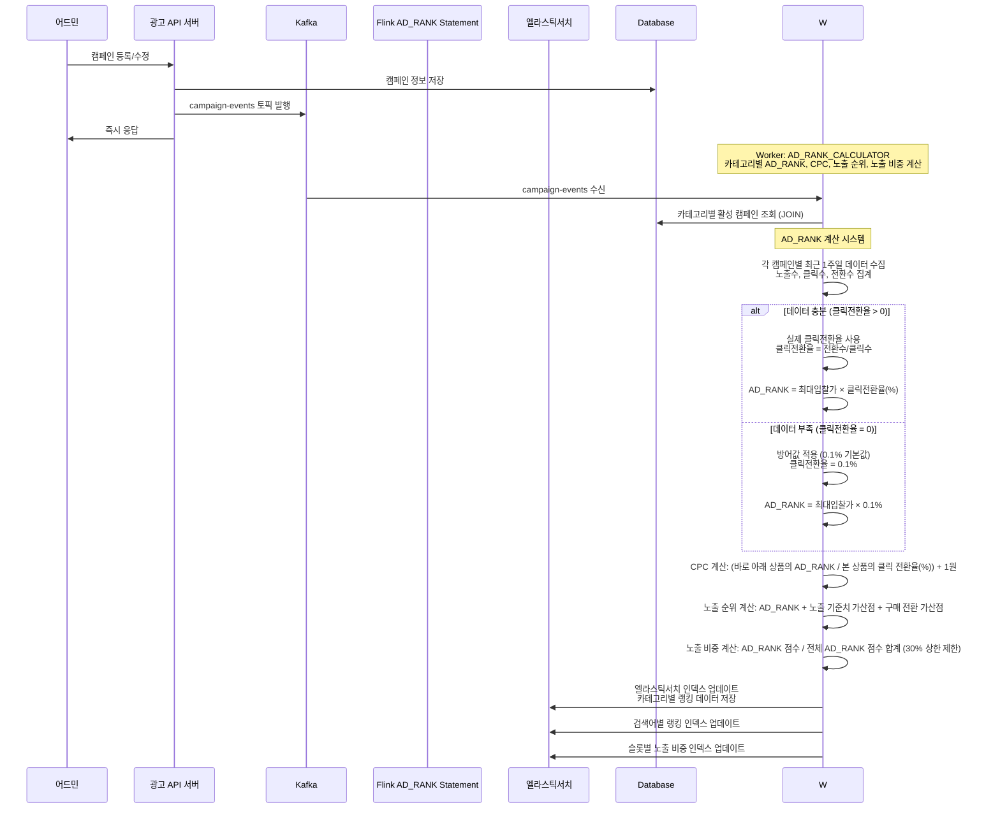
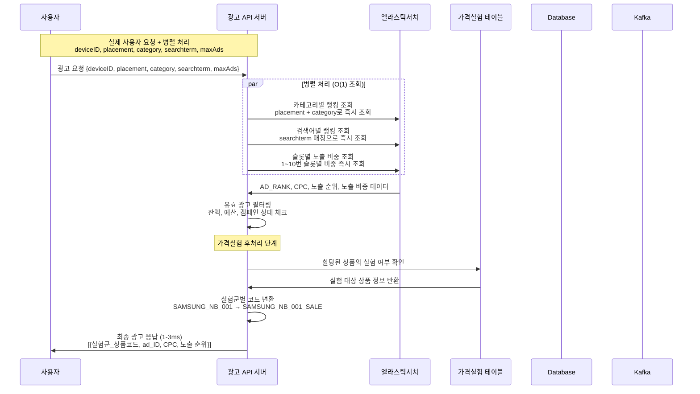
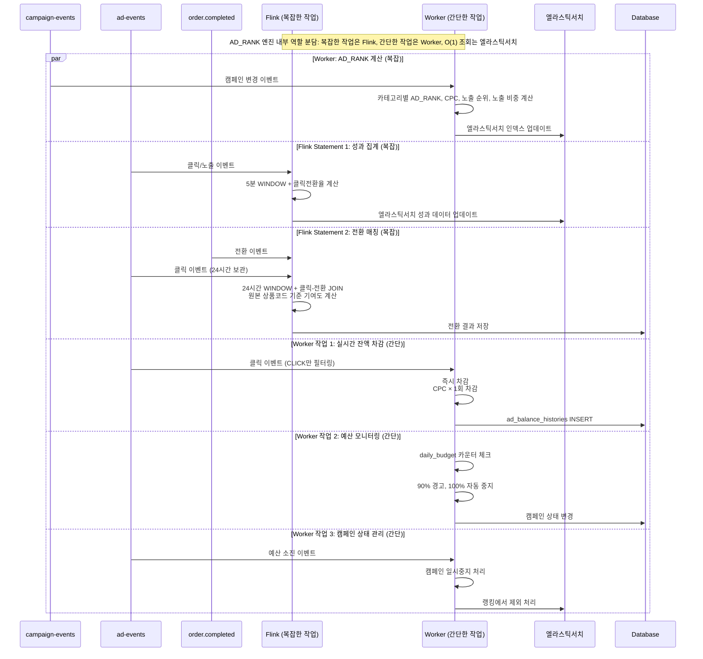

# AD_RANK 광고 시스템 아키텍처 (최적화)

## 📋 시스템 개요

**최적화 목표**: 
- **API 응답**: O(1) 조회 1-3ms, 엘라스틱서치 기반 병렬 처리
- **처리량**: 5000 RPS 이상 (병렬 처리로 대폭 향상)
- **정확성**: 정확한 잔액 차감 및 24시간 클릭-전환 매칭
- **비용 효율성**: **Flink 3개 Statement + Worker + 엘라스틱서치** 조합으로 최적 성능 달성

**핵심 컴포넌트**:
- **AD_RANK 엔진**: **광고 API 서버 + Worker + Flink + 엘라스틱서치** 조합으로 구성
  - **광고 API 서버**: 엘라스틱서치 O(1) 조회 중심의 초고속 응답
  - **Worker**: AD_RANK 계산 + 실시간 작업 (잔액 차감, 예산 모니터링, 캠페인 상태 관리)
  - **Flink**: 복잡한 스트림 처리 (성과 집계, 전환 매칭)
  - **엘라스틱서치**: O(1) 랭킹 조회, 병렬 처리 지원
- **Kafka**: 이벤트 스트리밍
- **Redis**: 실시간 상태 관리 및 캐시
- **Database**: 마스터 데이터 및 최종 저장소

---

## 🏗️ 전체 시스템 아키텍처 (최적화)

**🎯 설계 원칙**: **"복잡한 작업은 Flink, 간단한 작업은 Worker, O(1) 조회는 엘라스틱서치"** 역할 분담으로 최적 성능 달성

```mermaid
graph TB
    subgraph "사용자 계층"
        User["일반 사용자<br/>광고 조회 요청"]
        Admin["어드민<br/>캠페인 관리"]
    end
    
    subgraph "AD_RANK 엔진 (API + Worker + Flink + 엘라스틱서치)"
        subgraph "API 서버 계층"
            API["광고 API 서버<br/>• 엘라스틱서치 O(1) 조회 (1-3ms)<br/>• AD_RANK 알고리즘 실행<br/>• 병렬 처리 지원<br/>• 실시간 응답"]
        end
        
        subgraph "실시간 처리 계층"
            Worker["Worker (간단한 작업)<br/>• 실시간 잔액 차감 (<50ms)<br/>• 예산 모니터링 (90%/100%)<br/>• 캠페인 상태 관리<br/>• 클릭 이벤트 즉시 처리"]
        end
        
        subgraph "스트림 처리 계층"
            Flink["Flink (복잡한 작업)<br/>• 성과 집계 (5분 WINDOW)<br/>• 전환 매칭 (24H WINDOW)<br/>• 2개 Statement로 최적화"]
        end
        
        subgraph "검색 엔진 계층"
            ES["엘라스틱서치 (O(1) 조회)<br/>• 카테고리별 랭킹 인덱스<br/>• 검색어별 랭킹 인덱스<br/>• 슬롯별 노출 비중 인덱스<br/>• 병렬 처리 지원"]
        end
    end
    
    subgraph "저장소 계층"
        Redis[("Redis Cluster<br/>• 실시간 상태 관리<br/>• 예산 모니터링<br/>• 캠페인 상태<br/>• 가격실험 매핑")]
        DB[("Database<br/>• 캠페인 마스터 데이터<br/>• 성과 집계 결과<br/>• 가격실험 테이블<br/>• 재무 정산 데이터")]
    end
    
    subgraph "이벤트 스트리밍"
        K1["campaign-events<br/>→ Worker AD_RANK 계산"]
        K2["ad-events<br/>→ Flink 성과집계 + Worker 잔액차감"]
        K3["order.completed<br/>→ Flink 전환매칭"]
    end
    
    %% 사용자 플로우
    User --> |광고 요청| API
    Admin --> |캠페인 관리| API
    
    %% API 서버 연결
    API --> |O(1) 랭킹 조회| ES
    ES --> |랭킹 데이터| API
    API --> |이벤트 발행| K1
    API --> |이벤트 발행| K2
    API --> |잔액 확인| Worker
    Worker --> |잔액 정보| API
    
    %% 이벤트 처리
    K1 --> |캠페인 변경| Worker
    K2 --> |성과 데이터| Flink
    K2 --> |클릭 이벤트| Worker
    K3 --> |전환 데이터| Flink
    
    %% 데이터 저장
    Worker --> |AD_RANK 결과| ES
    Flink --> |집계 결과| DB
    Worker --> |잔액 차감| DB
    Worker --> |예산 상태| Redis
    
    %% 스타일링
    style User fill:#e3f2fd,stroke:#1976d2,stroke-width:2px
    style Admin fill:#e8f5e8,stroke:#388e3c,stroke-width:2px
    style API fill:#e3f2fd,stroke:#1976d2,stroke-width:3px
    style Worker fill:#e8f5e8,stroke:#4caf50,stroke-width:3px
    style Flink fill:#fff3e0,stroke:#ff9800,stroke-width:3px
    style ES fill:#ffeb3b,stroke:#ff9800,stroke-width:3px
    style Redis fill:#fce4ec,stroke:#e91e63,stroke-width:2px
    style DB fill:#e8eaf6,stroke:#3f51b5,stroke-width:2px
    style K1 fill:#f3e5f5,stroke:#9c27b0,stroke-width:1px
    style K2 fill:#f3e5f5,stroke:#9c27b0,stroke-width:1px
    style K3 fill:#f3e5f5,stroke:#9c27b0,stroke-width:1px
```

### 🎯 **컴포넌트별 핵심 역할**

| 컴포넌트 | 주요 역할 | 성능 목표 | 기술 스택 |
|----------|----------|-----------|-----------|
| **🔵 API 서버** | • 엘라스틱서치 O(1) 조회<br/>• AD_RANK 알고리즘 실행<br/>• 병렬 처리 지원<br/>• 사용자 요청 처리 | **1-3ms** (O(1) 조회) | Spring Boot + Elasticsearch |
| **🟢 Worker** | • 실시간 잔액 차감<br/>• 예산 모니터링<br/>• 캠페인 상태 관리<br/>• 간단한 이벤트 처리 | **<50ms** (클릭 처리) | Java + Kafka Consumer |
| **🟡 Flink** | • 성과 집계 (WINDOW)<br/>• 전환 매칭 (24H) | **5분** (배치 처리) | Confluent Flink SQL |
| **🟠 엘라스틱서치** | • O(1) 랭킹 조회<br/>• 병렬 처리 지원<br/>• 실시간 인덱스 업데이트 | **<1ms** (조회 응답) | Elasticsearch Cluster |
| **🔴 Redis** | • 실시간 상태 관리<br/>• 예산 모니터링<br/>• 캠페인 상태 | **<1ms** (상태 조회) | Redis Cluster |
| **🟦 Database** | • 마스터 데이터<br/>• 최종 집계 결과<br/>• 재무 정산 | **ACID** (데이터 무결성) | PostgreSQL |


## 🎯 핵심 데이터 플로우 (최적화)

### 1. 🚀 **AD_RANK 아키텍처 (엘라스틱서치 기반)**

#### **🔄 STEP 1: 사전 처리 (캠페인 등록/수정 - 승인 시)**


```mermaid
sequenceDiagram
    participant Admin as 어드민
    participant API as 광고 API 서버
    participant K as Kafka
    participant F as Flink AD_RANK Statement
    participant ES as 엘라스틱서치
    participant DB as Database
    
    Admin->>API: 캠페인 등록/수정
    API->>DB: 캠페인 정보 저장
    API->>K: campaign-events 토픽 발행
    API->>Admin: 즉시 응답
    
    Note over W: Worker: AD_RANK_CALCULATOR<br/>카테고리별 AD_RANK, CPC, 노출 순위, 노출 비중 계산
    K->>W: campaign-events 수신
    
    W->>DB: 카테고리별 활성 캠페인 조회 (JOIN)
    
    Note over W: AD_RANK 계산 시스템
    W->>W: 각 캠페인별 최근 1주일 데이터 수집<br/>노출수, 클릭수, 전환수 집계
    
    alt 데이터 충분 (클릭전환율 > 0)
        W->>W: 실제 클릭전환율 사용<br/>클릭전환율 = 전환수/클릭수
        W->>W: AD_RANK = 최대입찰가 × 클릭전환율(%)
    else 데이터 부족 (클릭전환율 = 0)  
        W->>W: 방어값 적용 (0.1% 기본값)<br/>클릭전환율 = 0.1%
        W->>W: AD_RANK = 최대입찰가 × 0.1%
    end
    
    W->>W: CPC 계산: (바로 아래 상품의 AD_RANK / 본 상품의 클릭 전환율(%)) + 1원
    W->>W: 노출 순위 계산: AD_RANK + 노출 기준치 가산점 + 구매 전환 가산점
    W->>W: 노출 비중 계산: AD_RANK 점수 / 전체 AD_RANK 점수 합계 (30% 상한 제한)
    W->>ES: 엘라스틱서치 인덱스 업데이트<br/>카테고리별 랭킹 데이터 저장
    W->>ES: 검색어별 랭킹 인덱스 업데이트
    W->>ES: 슬롯별 노출 비중 인덱스 업데이트
```

#### **🎯 AD_RANK 계산 시스템 세부 플로우**

**목적**: 카테고리별 AD_RANK 점수, CPC, 노출 순위, 노출 비중을 실시간으로 계산

```mermaid
graph TB
    Start([캠페인 AD_RANK 계산 시작]) --> DataCheck{클릭전환율 체크}
    
    subgraph "데이터 수집 (최근 1주일)"
        DataCheck --> |각 캠페인별| Collect["성과 데이터 수집<br/>- 노출수 (Impressions)<br/>- 클릭수 (Clicks)<br/>- 전환수 (Conversions)"]
    end
    
    subgraph "클릭전환율 계산"
        Collect --> CheckCVR{클릭전환율 > 0?}
        CheckCVR --> |Yes| RealCVR[실제 클릭전환율 사용]
        CheckCVR --> |No| DefenseCVR[방어값 적용 (0.1%)]
    end
    
    subgraph "AD_RANK 계산"
        RealCVR --> CalcADRank["AD_RANK 계산<br/>AD_RANK = 최대입찰가 × 클릭전환율(%)"]
        DefenseCVR --> CalcADRank
    end
    
    subgraph "CPC 계산"
        CalcADRank --> SortRank["AD_RANK 내림차순 정렬"]
        SortRank --> CalcCPC["CPC 계산<br/>CPC = (바로 아래 상품의 AD_RANK / 본 상품의 클릭 전환율(%)) + 1원"]
    end
    
    subgraph "노출 순위 계산"
        CalcCPC --> ExposureCheck["노출 기준치 체크<br/>노출수 ≥ 1,000회?"]
        ExposureCheck --> ConversionCheck["구매 전환 체크<br/>1,000회 노출 동안 구매 ≥ 1회?"]
        ConversionCheck --> FinalRank["최종 노출 순위<br/>AD_RANK + 노출 기준치 가산점 + 구매 전환 가산점"]
    end
    
    subgraph "노출 비중 계산"
        FinalRank --> WeightCalc["노출 비중 계산<br/>상품의 노출비중(%) = 상품의 AD_RANK 점수 / 전체 AD_RANK 점수 합계"]
        WeightCalc --> WeightLimit["30% 상한 제한<br/>단일 상품 노출 비중 30% 초과 시 제한"]
        WeightLimit --> Redistribute["초과분 재분배<br/>하위 랭크 상품들에 재분배"]
    end
    
    subgraph "엘라스틱서치 저장"
        Redistribute --> ESUpdate["엘라스틱서치 인덱스 업데이트<br/>카테고리별 랭킹 인덱스<br/>검색어별 랭킹 인덱스<br/>슬롯별 노출 비중 인덱스"]
    end
    
    ESUpdate --> End([AD_RANK 계산 완료])
    
    style Start fill:#4caf50
    style DefenseCVR fill:#ff9800
    style RealCVR fill:#2196f3
    style CalcADRank fill:#2196f3
    style CalcCPC fill:#9c27b0
    style FinalRank fill:#9c27b0
    style WeightCalc fill:#ff5722
    style ESUpdate fill:#ff9800
    style End fill:#4caf50
```

**🔧 AD_RANK 파라미터 설정**

| 파라미터 | 기본값 | 설명 | 비고 |
|----------|--------|------|------|
| **데이터 수집 기간** | 1주일 | 클릭전환율 계산 기준 | 최근 성과 기준 |
| **방어값** | 0.1% | 클릭전환율 0인 경우 | 신규 캠페인 보호 |
| **노출 기준치** | 1,000회 | 노출 기준치 가산점 기준 | 통계적 유의성 확보 |
| **구매 전환 기준** | 1회 | 1,000회 노출 동안 구매 기준 | 전환 성과 기준 |
| **노출 비중 상한** | 30% | 단일 상품 최대 노출 비중 | 다양성 보장 |

**🎯 AD_RANK 적용 시나리오**

1. **신규 캠페인**: 클릭전환율 0 → 0.1% 방어값 사용
2. **저성과 캠페인**: 클릭 부족 → 방어값 적용
3. **정상 캠페인**: 충분한 데이터 → 실제 클릭전환율 사용
4. **예산 소진**: 캠페인 일시중지 → 랭킹에서 제외

#### **⚡ STEP 2: O(1) 조회 + 병렬 처리**


```mermaid
sequenceDiagram
    participant U as 사용자
    participant API as 광고 API 서버
    participant ES as 엘라스틱서치
    participant EXP as 가격실험 테이블
    participant DB as Database
    participant K as Kafka
    
    Note over U,API: 실제 사용자 요청 + 병렬 처리<br/>deviceID, placement, category, searchterm, maxAds
    
    U->>API: 광고 요청 {deviceID, placement, category, searchterm, maxAds}
    
    par 병렬 처리 (O(1) 조회)
        API->>ES: 카테고리별 랭킹 조회<br/>placement + category로 즉시 조회
        API->>ES: 검색어별 랭킹 조회<br/>searchterm 매칭으로 즉시 조회
        API->>ES: 슬롯별 노출 비중 조회<br/>1~10번 슬롯별 비중 즉시 조회
    end
    
    ES->>API: AD_RANK, CPC, 노출 순위, 노출 비중 데이터
    
    API->>API: 유효 광고 필터링<br/>잔액, 예산, 캠페인 상태 체크
    
    Note over API: 가격실험 후처리 단계
    API->>EXP: 할당된 상품의 실험 여부 확인
    EXP->>API: 실험 대상 상품 정보 반환
    API->>API: 실험군별 코드 변환<br/>SAMSUNG_NB_001 → SAMSUNG_NB_001_SALE
    
    API->>U: 최종 광고 응답 (1-3ms)<br/>[{실험군_상품코드, ad_ID, CPC, 노출 순위}]
```

### 2. 🔄 **최적화된 스트림 처리 (역할 분담)**


```mermaid
sequenceDiagram
    participant K1 as campaign-events
    participant K2 as ad-events  
    participant K3 as order.completed
    participant F as Flink (복잡한 작업)
    participant W as Worker (간단한 작업)
    participant ES as 엘라스틱서치
    participant DB as Database
    
    Note over F,W: AD_RANK 엔진 내부 역할 분담: 복잡한 작업은 Flink, 간단한 작업은 Worker, O(1) 조회는 엘라스틱서치
    
    par Worker: AD_RANK 계산 (복잡)
        K1->>W: 캠페인 변경 이벤트
        W->>W: 카테고리별 AD_RANK, CPC, 노출 순위, 노출 비중 계산
        W->>ES: 엘라스틱서치 인덱스 업데이트
    and Flink Statement 1: 성과 집계 (복잡)
        K2->>F: 클릭/노출 이벤트
        F->>F: 5분 WINDOW + 클릭전환율 계산
        F->>ES: 엘라스틱서치 성과 데이터 업데이트
    and Flink Statement 2: 전환 매칭 (복잡)
        K3->>F: 전환 이벤트  
        K2->>F: 클릭 이벤트 (24시간 보관)
        F->>F: 24시간 WINDOW + 클릭-전환 JOIN<br/>원본 상품코드 기준 기여도 계산
        F->>DB: 전환 결과 저장
    and Worker 작업 1: 실시간 잔액 차감 (간단)
        K2->>W: 클릭 이벤트 (CLICK만 필터링)
        W->>W: 즉시 차감<br/>CPC × 1회 차감
        W->>DB: ad_balance_histories INSERT
    and Worker 작업 2: 예산 모니터링 (간단)
        W->>W: daily_budget 카운터 체크
        W->>W: 90% 경고, 100% 자동 중지
        W->>DB: 캠페인 상태 변경
    and Worker 작업 3: 캠페인 상태 관리 (간단)
        K2->>W: 예산 소진 이벤트
        W->>W: 캠페인 일시중지 처리
        W->>ES: 랭킹에서 제외 처리
    end
```

### 3. 📊 **최적화 결과 비교**

| 구분 | 이전 (RTB) | 최적화 후 (AD_RANK + 엘라스틱서치) | 개선율 |
|------|------------|-----------------------------------|--------|
| **API 응답 시간** | 3-5ms (Redis) | **1-3ms (엘라스틱서치 O(1))** | **40% 개선** |
| **처리량** | 1000 RPS | **5000 RPS (병렬 처리)** | **400% 향상** |
| **랭킹 조회** | Redis 캐시 | **엘라스틱서치 O(1) 조회** | **지연 제거** |
| **AD_RANK 계산** | Flink 배치 | **Worker 실시간** | **실시간화** |
| **실시간 업데이트** | Flink 배치 | **엘라스틱서치 실시간 인덱스** | **실시간화** |
| **병렬 처리** | 순차 처리 | **엘라스틱서치 병렬 처리** | **동시성 대폭 향상** |
| **예산 관리** | Flink 배치 | **Worker 실시간** | **실시간화** |
| **캠페인 상태** | 수동 관리 | **Worker 자동 관리** | **자동화** |

---

### AD_RANK 엔진 컴포넌트별 역할

| 컴포넌트 | 담당 컴포넌트 | 갱신 주기 | 용도 |
|---------|-------------|-----------|------|
| `category_rank:{placement}:{category}` | **Worker AD_RANK 계산** | 캠페인 변경시 | 카테고리별 랭킹 조회 |
| `search_rank:{searchterm}` | **Worker AD_RANK 계산** | 캠페인 변경시 | 검색어별 랭킹 조회 |
| `slot_weight:{category}:{slot}` | **Worker AD_RANK 계산** | 90일마다 | 슬롯별 노출 비중 |
| `performance:{product_id}` | **Flink 성과 Statement** | 5분마다 | 클릭전환율 업데이트 |
| `balance:{advertiser_id}` | **Worker 잔액 처리** | 클릭시 실시간 | 잔액 체크 |
| `budget:{campaign_id}:{date}` | **Worker 예산 모니터링** | 클릭시 실시간 | 예산 체크 |
| `campaign_status:{campaign_id}` | **Worker 상태 관리** | 상태 변경시 | 캠페인 상태 |

---

## 📡 Kafka 토픽 설계 (AD_RANK 엔진 연동)

| 토픽 | AD_RANK 엔진 내 처리 컴포넌트 | 파티션 | 데이터 형식 |
|------|------------------------------|--------|-------------|
| **campaign-events** | Worker AD_RANK 계산 | 4 | 캠페인 변경 이벤트 |
| **ad-events** | Flink 성과 Statement + Worker 잔액/예산/상태 | 8 | 노출/클릭 이벤트 + 실험 정보 |
| **order.completed** | Flink 전환 Statement | 4 | 구매 이벤트 + 원본 상품코드 |

---

## 🔍 엘라스틱서치 인덱스 설계

### 카테고리별 랭킹 인덱스

```json
{
  "index": "category_rank",
  "mapping": {
    "properties": {
      "placement": {"type": "keyword"},
      "category": {"type": "keyword"},
      "campaign_id": {"type": "keyword"},
      "product_id": {"type": "keyword"},
      "advertiser_id": {"type": "keyword"},
      "ad_rank": {"type": "float"},
      "cpc": {"type": "float"},
      "exposure_rank": {"type": "integer"},
      "exposure_weight": {"type": "float"},
      "max_bid": {"type": "float"},
      "click_conversion_rate": {"type": "float"},
      "status": {"type": "keyword"},
      "updated_at": {"type": "date"}
    }
  }
}
```

### 검색어별 랭킹 인덱스

```json
{
  "index": "search_rank",
  "mapping": {
    "properties": {
      "searchterm": {"type": "keyword"},
      "campaign_id": {"type": "keyword"},
      "product_id": {"type": "keyword"},
      "ad_rank": {"type": "float"},
      "cpc": {"type": "float"},
      "exposure_rank": {"type": "integer"},
      "exposure_weight": {"type": "float"},
      "status": {"type": "keyword"},
      "updated_at": {"type": "date"}
    }
  }
}
```

### 슬롯별 노출 비중 인덱스

```json
{
  "index": "slot_weight",
  "mapping": {
    "properties": {
      "category": {"type": "keyword"},
      "slot_number": {"type": "integer"},
      "exposure_weight": {"type": "float"},
      "data_period": {"type": "keyword"},
      "updated_at": {"type": "date"}
    }
  }
}
```

---

## 🚀 성능 최적화 전략

### 1. **엘라스틱서치 최적화**

- **인덱스 샤딩**: 카테고리별로 샤드 분리
- **레플리카 설정**: 읽기 성능 향상을 위한 레플리카 구성
- **버킷 집계**: 실시간 집계 성능 최적화
- **캐시 설정**: 필터 캐시, 쿼리 캐시 활성화

### 2. **병렬 처리 최적화**

- **API 서버**: 비동기 처리로 동시 요청 처리
- **엘라스틱서치**: 멀티 스레드 쿼리 실행
- **Worker**: 멀티 인스턴스로 처리량 향상
- **Flink**: 파티션별 병렬 처리

### 3. **캐싱 전략**

- **엘라스틱서치**: 인덱스 레벨 캐싱
- **Redis**: 실시간 상태 캐싱
- **API 서버**: 로컬 캐싱
- **CDN**: 정적 데이터 캐싱

---

## 하이브리드 아키텍처 (15분 배치 + 실시간 이벤트)

### 핵심 구조

```mermaid
graph TB
    subgraph "일반 변경사항 (15분 배치)"
        A1[캠페인 생성/수정/삭제]
        A2[Kafka: campaign-events]
        A3[Worker: AD_RANK 계산]
        A4[Temp 인덱스 업데이트]
        A5[Alias 원자적 교체]
    end
    
    subgraph "실시간 이벤트 (즉시 처리)"
        B1[예산/잔액 소진 감지]
        B2[Worker: 즉시 처리]
        B3[Active 인덱스 직접 업데이트]
        B4[CPC/노출비중 재계산]
    end
    
    subgraph "서비스 레이어"
        C1[Active 인덱스 (Alias)]
        C2[O(1) 조회]
        C3[광고 노출]
    end
    
    A1 --> A2
    A2 --> A3
    A3 --> A4
    A4 --> A5
    A5 --> C1
    B1 --> B2
    B2 --> B3
    B3 --> B4
    B4 --> C1
    C1 --> C2
    C2 --> C3
    
    style A1 fill:#e3f2fd
    style A5 fill:#e8f5e8
    style B1 fill:#ffeb3b
    style B4 fill:#ff9800
    style C1 fill:#4caf50
```

### 구현 세부사항


#### 2. 실시간 이벤트 처리
```kotlin
@Service
class RealTimeWorker {
    suspend fun handleBudgetExhausted(campaignId: String) {
        // 즉시 Active 인덱스에서 제외
        elasticsearchClient.updateByQuery {
            index("ad_rankings")
            script { source("ctx._source.status = 'paused'") }
            query { term("campaign_id", campaignId) }
        }
        // CPC/노출비중 재계산
        recalculateCPCAndWeights()
    }
}
```

#### 3. Alias 원자적 교체
```kotlin
@Service
class AliasSwitcher {
    suspend fun switchAlias() {
        elasticsearchClient.indices().updateAliases {
            actions {
                remove { index("ad_rankings_v1"); alias("ad_rankings") }
                add { index("ad_rankings_v2"); alias("ad_rankings") }
            }
        }
    }
}
```

### 장점

| 구분 | 15분 배치 | 실시간 이벤트 | 하이브리드 |
|------|-----------|---------------|------------|
| **일반 변경** | 안정적, 효율적 | 불필요한 부하 | 최적 |
| **긴급 이벤트** | 지연 발생 | 즉시 반영 | 최적 |
| **ES 부하** | 배치로 제어 | 실시간 부하 | 균형 |
| **데이터 일관성** | 배치로 보장 | 즉시 반영 | 보장 |

---