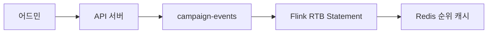
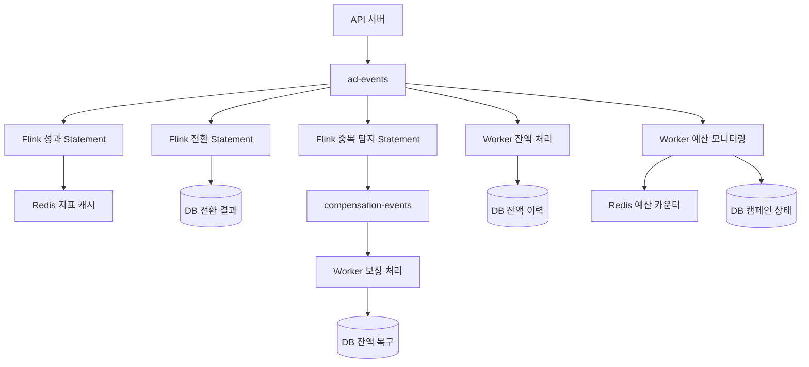
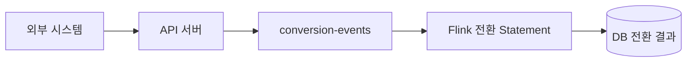
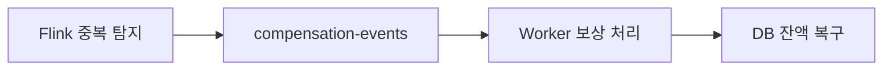

# CPC RTB 시스템 Kafka 토픽 설계 (최적화)

## 📋 목차
1. [아키텍처 기반 토픽 분석](#-아키텍처-기반-토픽-분석)
2. [핵심 토픽 설계 (3개)](#-핵심-토픽-설계-3개)
3. [토픽별 역할 분담](#-토픽별-역할-분담)
4. [최적화된 데이터 플로우](#-최적화된-데이터-플로우)

---

## 📋 아키텍처 기반 토픽 분석

### 🎯 핵심 데이터 플로우 분석 (최적화된 역할 분담)

업데이트된 아키텍처를 바탕으로 **역할 분담 최적화**:

#### **1. Flink (복잡한 작업) - 4개 Statement**
```
campaign-events → Flink RTB Statement → Redis 순위 캐시
ad-events → Flink 성과 Statement → Redis 지표 캐시  
conversion-events + ad-events → Flink 전환 Statement → DB 전환 결과
ad-events → Flink 중복 탐지 Statement → compensation-events ⭐ 신규
```

#### **2. Worker (간단한 작업) - 3개 실시간 처리**
```
ad-events (CLICK) → Worker 잔액 차감 → DB 즉시 INSERT
ad-events → Worker 예산 모니터링 → Redis/DB 실시간 체크
compensation-events → Worker 보상 처리 → DB 잔액 복구 ⭐ 신규
```

#### **3. 핵심 설계 원칙**
- **중간 토픽 제거**: Flink → 중간토픽 → Worker 대신 **직접 처리**
- **이중 소비**: ad-events를 Flink와 Worker가 각각 다른 목적으로 소비
- **실시간성 극대화**: Worker가 간단한 작업을 즉시 처리

---

## 🎯 핵심 토픽 설계 (4개)

### **1. `campaign-events` (P0 - 캠페인 변경 이벤트)**

**목적**: 캠페인 등록/수정 시 RTB 순위 재계산 트리거

**이벤트 타입**: 
- `CAMPAIGN_CREATED`: 새 캠페인 등록
- `CAMPAIGN_UPDATED`: 캠페인 정보 수정 (입찰가, 예산, 타겟팅 등)
- `CAMPAIGN_APPROVED`: 캠페인 승인 (RTB 경쟁 참여 시작)
- `CAMPAIGN_STATUS_CHANGED`: 캠페인 일시정지/재개/삭제

**스키마**:
```json
{
  "event_type": "CAMPAIGN_CREATED|CAMPAIGN_UPDATED|CAMPAIGN_APPROVED|CAMPAIGN_STATUS_CHANGED",
  "timestamp": "2024-01-15T10:30:00Z",
  "campaign_id": "campaign_100",
  "advertiser_id": "advertiser_50",
  "product_id": "product_200",
  "placement": "HOME|CATEGORY|PRODUCT_DETAIL|SEARCH",
  "category": "전자제품/컴퓨터",
  "bid_price": 1500,
  "daily_budget": 100000,
  "status": "PENDING|ACTIVE|PAUSED|DELETED",
  "approval_status": "PENDING|APPROVED|REJECTED",
  "targeting": {
    "device_types": ["MOBILE", "DESKTOP"],
    "age_groups": ["20-29", "30-39"]
  },
  "effective_from": "2024-01-15T11:00:00Z",
  "rtb_impact": "HIGH|MEDIUM|LOW"
}
```

**파티셔닝**: `placement` + `category` 기준 (RTB 캐시 키 일치)

**소비자**:
- **Flink RTB Statement**: 복잡한 JOIN + RTB 알고리즘 계산 → Redis 순위 캐시 업데이트

**🎯 캠페인 승인의 RTB 임팩트**:
- **CAMPAIGN_APPROVED**: 새 경쟁자 등장으로 전체 순위 재계산 필요
- **rtb_impact = HIGH**: 인기 카테고리 고액 입찰 → 전체 순위 변동
- **rtb_impact = MEDIUM**: 일반 카테고리 중간 입찰 → 부분 순위 변동  
- **rtb_impact = LOW**: 틈새 카테고리 저액 입찰 → 최소 순위 변동

---

### **2. `ad-events` (P0 - 통합 광고 이벤트)**

**목적**: 모든 광고 이벤트 통합 처리 (Flink + Worker 이중 소비)

**이벤트 타입**: 
- `IMPRESSION`: 광고 노출
- `CLICK`: 광고 클릭  
- `CONVERSION`: 구매 전환

**스키마**:
```json
{
  "event_type": "IMPRESSION|CLICK|CONVERSION",
  "timestamp": "2024-01-15T10:30:00Z",
  "device_id": "device_12345",
  "session_id": "session_67890",
  "ad_id": "ad_001",
  "campaign_id": "campaign_100",
  "advertiser_id": "advertiser_50",
  "product_id": "product_200",
  "placement": "HOME|CATEGORY|PRODUCT_DETAIL|SEARCH",
  "bid_price": 1500,
  "actual_price": 1200,
  "search_term": "노트북",
  "category": "전자제품/컴퓨터",
  "revenue_amount": 50000,
  "order_id": "order_789"
}
```

**파티셔닝**: `device_id` 기준 (24시간 클릭-전환 매칭 최적화)

**소비자**:
- **Flink 성과 Statement**: 5분 WINDOW + CTR/CVR 계산 → Redis 지표 캐시 업데이트
- **Flink 전환 Statement**: 24시간 WINDOW + 클릭-전환 JOIN → DB 전환 결과 저장
- **Flink 중복 탐지 Statement**: 5분 WINDOW + 중복 클릭 탐지 → compensation-events 발행 ⭐ 신규
- **Worker 잔액 처리**: CLICK 이벤트만 필터링 → 즉시 잔액 차감 (중복 체크 없음)
- **Worker 예산 모니터링**: 실시간 예산 체크 → 임계값 알림/캠페인 중지

---

### **3. `conversion-events` (P1 - 전환 이벤트)**

**목적**: 24시간 클릭-전환 매칭을 위한 전환 데이터

**스키마**:
```json
{
  "timestamp": "2024-01-15T14:30:00Z",
  "device_id": "device_12345",
  "session_id": "session_67890",
  "order_id": "order_789",
  "product_id": "product_200",
  "revenue_amount": 50000,
  "conversion_type": "PURCHASE|ADD_TO_CART|SIGNUP",
  "attribution_window": 24,
  "referrer_url": "https://example.com/product/200"
}
```

**파티셔닝**: `device_id` 기준 (ad-events와 동일)

**소비자**:
- **Flink 전환 Statement**: ad-events와 JOIN하여 24시간 내 클릭-전환 매칭

---

### **4. `compensation-events` (P1 - 중복 클릭 보상 이벤트) ⭐ 신규**

**목적**: 중복 클릭 탐지 후 잔액 보상 처리

**스키마**:
```json
{
  "timestamp": "2024-01-15T10:35:00Z",
  "advertiser_id": "advertiser_50",
  "campaign_id": "campaign_100",
  "ad_id": "ad_001",
  "device_id": "device_12345",
  "duplicate_click_count": 3,
  "refund_amount": 2400,
  "original_click_timestamps": [
    "2024-01-15T10:30:15Z",
    "2024-01-15T10:30:18Z", 
    "2024-01-15T10:30:22Z"
  ],
  "detection_window": "5_MINUTES",
  "reason": "DUPLICATE_CLICK_DETECTED",
  "compensation_type": "BALANCE_REFUND"
}
```

**파티셔닝**: `advertiser_id` 기준 (잔액 처리 최적화)

**소비자**:
- **Worker 보상 처리**: 중복 클릭 보상 이벤트 수신 → 즉시 잔액 복구

---

## 🔄 토픽별 역할 분담

### **📊 토픽 소비 매핑**

| 토픽 | Flink 처리 | Worker 처리 | 직접 출력 |
|------|------------|-------------|----------|
| `campaign-events` | ✅ RTB 재계산 Statement | - | Redis 순위 캐시 |
| `ad-events` | ✅ 성과 집계 Statement<br/>✅ 전환 매칭 Statement<br/>✅ 중복 탐지 Statement ⭐ | ✅ 잔액 차감<br/>✅ 예산 모니터링 | Redis 지표 캐시<br/>DB 전환 결과<br/>DB 잔액 이력<br/>compensation-events 발행 ⭐ |
| `conversion-events` | ✅ 전환 매칭 Statement | - | DB 전환 결과 |
| `compensation-events` ⭐ | - | ✅ 보상 처리 ⭐ | DB 잔액 복구 |

### **🎯 핵심 흐름**

**✅ 최적화**:
```
Flink → Redis/DB 직접 업데이트
Worker → DB 직접 업데이트
```
---

## 🚀 최적화된 데이터 플로우

### **1. Campaign Events 플로우**


### **2. Ad Events 플로우 (다중 소비 + 중복 처리)**


### **3. Conversion Events 플로우**


### **4. Compensation Events 플로우 ⭐ 신규**


---

## 📊 최종 토픽 구성

| 토픽명 | 우선순위 | TPS 예상 | 보관기간 | 파티션 수 | Consumer Group |
|--------|----------|----------|----------|-----------|----------------|
| `campaign-events` | **P0** | 50 | 7일 | 4 | `flink-rtb-processor` |
| `ad-events` | **P0** | 1000 | 7일 | 8 | `flink-performance-aggregator`<br/>`flink-duplicate-detector` ⭐<br/>`worker-balance-processor` |
| `conversion-events` | **P1** | 100 | 3일 | 4 | `flink-conversion-matcher` |
| `compensation-events` | **P1** | 20 | 3일 | 4 | `worker-compensation-processor` ⭐ |

### **발행 주체별 매핑**

| 발행 주체 | 토픽 | 발행 시점 | 배치 크기 |
|-----------|------|-----------|-----------|
| **API 서버** | `campaign-events` | 캠페인 등록/수정/승인 시 | 단일 이벤트 |
| **API 서버** | `ad-events` | 실시간 사용자 행동 | 단일 이벤트 |
| **API 서버** | `conversion-events` | 전환 발생 시 | 단일 이벤트 |
| **Flink Statement 4** | `compensation-events` | 중복 클릭 탐지 시 | 단일 이벤트 ⭐ |

**📋 캠페인 승인 플로우**:
```
1. 어드민 승인 → API 서버
2. campaign-events 토픽 CAMPAIGN_APPROVED 발행
3. Flink RTB Statement 즉시 처리
4. placement별 캐시 업데이트 (rtb:HOME:electronics 등)
5. 경쟁 캠페인들 순위 자동 재조정
```

---
