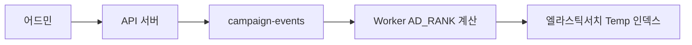
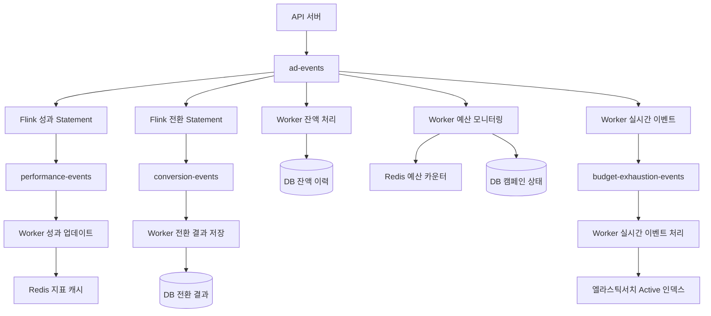
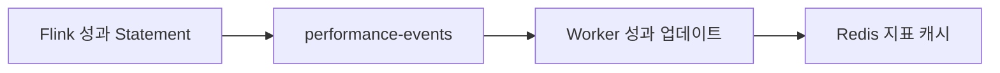
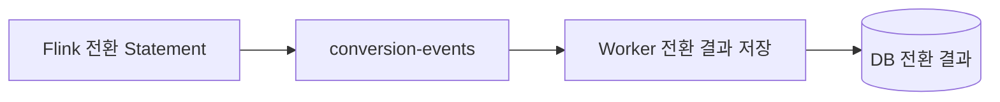
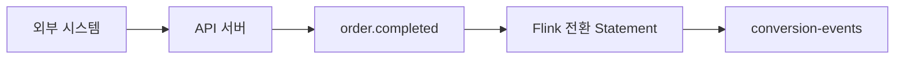
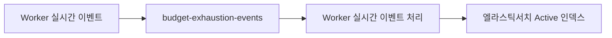

# AD_RANK 광고 시스템 Kafka 토픽 설계 (최적화)

## 📋 목차
1. [아키텍처 기반 토픽 분석](#-아키텍처-기반-토픽-분석)
2. [핵심 토픽 설계 (3개)](#-핵심-토픽-설계-3개)
3. [토픽별 역할 분담](#-토픽별-역할-분담)
4. [최적화된 데이터 플로우](#-최적화된-데이터-플로우)

---

## 📋 아키텍처 기반 토픽 분석

### 🎯 핵심 데이터 플로우 분석 (최적화된 역할 분담)

업데이트된 아키텍처를 바탕으로 **역할 분담 최적화**:

#### **1. Flink (성과 집계) - 2개 Statement**
```
ad-events → Flink 성과 Statement → performance-events 토픽 발행
order.completed + ad-events → Flink 전환 Statement → conversion-events 토픽 발행
```

#### **2. Worker (AD_RANK 계산 + 실시간 처리) - 7개 처리**
```
campaign-events → Worker AD_RANK 계산 → 엘라스틱서치 Temp 인덱스
ad-events (CLICK) → Worker 잔액 차감 → DB 즉시 INSERT
ad-events → Worker 예산 모니터링 → Redis/DB 실시간 체크
budget-exhaustion-events → Worker 실시간 이벤트 처리 → 엘라스틱서치 Active 인덱스
performance-events → Worker 성과 업데이트 → Redis 지표 캐시
conversion-events → Worker 전환 결과 저장 → DB 전환 결과
15분 배치 → Worker alias 교체 → 엘라스틱서치 Active/Temp 교체
```

#### **3. 핵심 설계 원칙**
- **AD_RANK 계산**: Worker가 복잡한 AD_RANK 계산을 담당
- **하이브리드 처리**: 일반 변경은 15분 배치, 긴급 이벤트는 실시간 처리
- **엘라스틱서치 동기화**: Active + Temp 인덱스로 안전한 데이터 교체
- **실시간성 극대화**: 예산/잔액 소진 시 즉시 처리

---

## 🎯 핵심 토픽 설계 (6개)

### **1. `campaign-events` (P0 - 캠페인 변경 이벤트)**

**목적**: 캠페인 등록/수정 시 AD_RANK 계산 트리거

**이벤트 타입**: 
- `CAMPAIGN_CREATED`: 새 캠페인 등록
- `CAMPAIGN_UPDATED`: 캠페인 정보 수정 (입찰가, 예산, 타겟팅 등)
- `CAMPAIGN_APPROVED`: 캠페인 승인 (RTB 경쟁 참여 시작)
- `CAMPAIGN_STATUS_CHANGED`: 캠페인 일시정지/재개/삭제

**스키마**:
```json
{
  "event_type": "CAMPAIGN_CREATED|CAMPAIGN_UPDATED|CAMPAIGN_APPROVED|CAMPAIGN_STATUS_CHANGED",
  "timestamp": "2024-01-15T10:30:00Z",
  "campaign_id": "campaign_100",
  "advertiser_id": "advertiser_50",
  "product_id": "product_200",
  "placement": "HOME|CATEGORY|PRODUCT_DETAIL|SEARCH",
  "category": "전자제품/컴퓨터",
  "bid_price": 1500,
  "daily_budget": 100000,
  "status": "PENDING|ACTIVE|PAUSED|DELETED",
  "approval_status": "PENDING|APPROVED|REJECTED",
  "targeting": {
    "device_types": ["MOBILE", "DESKTOP"],
    "age_groups": ["20-29", "30-39"]
  },
  "effective_from": "2024-01-15T11:00:00Z",
  "ad_rank_impact": "HIGH|MEDIUM|LOW"
}
```

**파티셔닝**: `placement` + `category` 기준 (AD_RANK 계산 키 일치)

**소비자**:
- **Worker AD_RANK 계산**: 복잡한 JOIN + AD_RANK 알고리즘 계산 → 엘라스틱서치 Temp 인덱스 업데이트

**🎯 캠페인 승인의 AD_RANK 임팩트**:
- **CAMPAIGN_APPROVED**: 새 경쟁자 등장으로 전체 AD_RANK 재계산 필요
- **ad_rank_impact = HIGH**: 인기 카테고리 고액 입찰 → 전체 순위 변동
- **ad_rank_impact = MEDIUM**: 일반 카테고리 중간 입찰 → 부분 순위 변동  
- **ad_rank_impact = LOW**: 틈새 카테고리 저액 입찰 → 최소 순위 변동

---

### **2. `ad-events` (P0 - 통합 광고 이벤트)**

**목적**: 모든 광고 이벤트 통합 처리 (Flink + Worker 이중 소비)

**이벤트 타입**: 
- `IMPRESSION`: 광고 노출
- `CLICK`: 광고 클릭  
- `CONVERSION`: 구매 전환

**스키마**:
```json
{
  "event_type": "IMPRESSION|CLICK|CONVERSION",
  "timestamp": "2024-01-15T10:30:00Z",
  "device_id": "device_12345",
  "session_id": "session_67890",
  "ad_id": "ad_001",
  "campaign_id": "campaign_100",
  "advertiser_id": "advertiser_50",
  "product_id": "product_200",
  "placement": "HOME|CATEGORY|PRODUCT_DETAIL|SEARCH",
  "bid_price": 1500,
  "actual_price": 1200,
  "search_term": "노트북",
  "category": "전자제품/컴퓨터",
  "revenue_amount": 50000,
  "order_id": "order_789"
}
```

**파티셔닝**: `device_id` 기준 (24시간 클릭-전환 매칭 최적화)

**소비자**:
- **Flink 성과 Statement**: 5분 WINDOW + CTR/CVR 계산 → performance-events 토픽 발행
- **Flink 전환 Statement**: 24시간 WINDOW + 클릭-전환 JOIN → conversion-events 토픽 발행
- **Worker 잔액 처리**: CLICK 이벤트만 필터링 → 즉시 잔액 차감 (중복 체크 없음)
- **Worker 예산 모니터링**: 실시간 예산 체크 → 임계값 알림/캠페인 중지
- **Worker 실시간 이벤트**: 예산/잔액 소진 감지 → budget-exhaustion-events 발행

---

### **3. `order.completed` (P1 - 주문 완료 이벤트)**

**목적**: 24시간 클릭-전환 매칭을 위한 주문 완료 데이터

**스키마**:
```json
{
  "user_id": 278999,
  "mobile_device_id": "59DDB603-B11F-44E2-9B66-B618E9CAFEEF",
  "order_id": 13595154
}
```

**파티셔닝**: `mobile_device_id` 기준 (ad-events와 매칭)

**소비자**:
- **Flink 전환 Statement**: ad-events와 JOIN하여 24시간 내 클릭-전환 매칭 → conversion-events 토픽 발행

---

### **4. `performance-events` (P1 - 성과 집계 이벤트) ⭐ 신규**

**목적**: Flink에서 계산된 성과 지표를 Worker가 Redis에 업데이트

**스키마**:
```json
{
  "timestamp": "2024-01-15T10:35:00Z",
  "window_start": "2024-01-15T10:30:00Z",
  "window_end": "2024-01-15T10:35:00Z",
  "campaign_id": "campaign_100",
  "advertiser_id": "advertiser_50",
  "product_id": "product_200",
  "placement": "HOME|CATEGORY|PRODUCT_DETAIL|SEARCH",
  "category": "전자제품/컴퓨터",
  "impression_count": 1500,
  "click_count": 75,
  "conversion_count": 15,
  "ctr": 0.05,
  "cvr": 0.20,
  "total_revenue": 750000,
  "avg_cpc": 1200,
  "performance_score": 0.85
}
```

**파티셔닝**: `campaign_id` 기준 (성과 데이터 처리 최적화)

**소비자**:
- **Worker 성과 업데이트**: 성과 집계 이벤트 수신 → Redis 지표 캐시 업데이트

---

### **5. `conversion-events` (P1 - 전환 매칭 이벤트) ⭐ 신규**

**목적**: Flink에서 매칭된 클릭-전환 결과를 Worker가 DB에 저장

**스키마**:
```json
{
  "timestamp": "2024-01-15T10:35:00Z",
  "click_timestamp": "2024-01-15T09:30:00Z",
  "conversion_timestamp": "2024-01-15T10:25:00Z",
  "device_id": "device_12345",
  "session_id": "session_67890",
  "ad_id": "ad_001",
  "campaign_id": "campaign_100",
  "advertiser_id": "advertiser_50",
  "product_id": "product_200",
  "order_id": "order_789",
  "revenue_amount": 50000,
  "conversion_delay_hours": 0.92,
  "attribution_model": "LAST_CLICK"
}
```

**파티셔닝**: `device_id` 기준 (전환 데이터 처리 최적화)

**소비자**:
- **Worker 전환 결과 저장**: 전환 매칭 이벤트 수신 → DB 전환 결과 저장

---

### **6. `budget-exhaustion-events` (P0 - 예산/잔액 소진 이벤트) ⭐ 신규**

**목적**: 예산/잔액 소진 시 즉시 AD_RANK에서 제외 처리

**스키마**:
```json
{
  "timestamp": "2024-01-15T10:35:00Z",
  "event_type": "BUDGET_EXHAUSTED|WALLET_EXHAUSTED|BUDGET_RECHARGED|WALLET_RECHARGED",
  "advertiser_id": "advertiser_50",
  "campaign_id": "campaign_100",
  "placement": "HOME|CATEGORY|PRODUCT_DETAIL|SEARCH",
  "category": "전자제품/컴퓨터",
  "exhaustion_type": "DAILY_BUDGET|TOTAL_BUDGET|WALLET_BALANCE",
  "current_amount": 0,
  "threshold_amount": 100000,
  "affected_products": ["product_200", "product_201"],
  "action_required": "PAUSE_CAMPAIGN|RESUME_CAMPAIGN|UPDATE_RANKING",
  "priority": "HIGH|MEDIUM|LOW"
}
```

**파티셔닝**: `placement` + `category` 기준 (AD_RANK 계산 키 일치)

**소비자**:
- **Worker 실시간 이벤트 처리**: 예산/잔액 소진 이벤트 수신 → 즉시 엘라스틱서치 Active 인덱스 업데이트

---

## 🔄 토픽별 역할 분담

### **📊 토픽 소비 매핑**

| 토픽 | Flink 처리 | Worker 처리 | 직접 출력 |
|------|------------|-------------|----------|
| `campaign-events` | - | ✅ AD_RANK 계산 | 엘라스틱서치 Temp 인덱스 |
| `ad-events` | ✅ 성과 집계 Statement<br/>✅ 전환 매칭 Statement | ✅ 잔액 차감<br/>✅ 예산 모니터링<br/>✅ 실시간 이벤트 | performance-events 발행<br/>conversion-events 발행<br/>DB 잔액 이력<br/>budget-exhaustion-events 발행 |
| `order.completed` | ✅ 전환 매칭 Statement | - | conversion-events 발행 |
| `performance-events` | - | ✅ 성과 업데이트 | Redis 지표 캐시 |
| `conversion-events` | - | ✅ 전환 결과 저장 | DB 전환 결과 |
| `budget-exhaustion-events` | - | ✅ 실시간 이벤트 처리 | 엘라스틱서치 Active 인덱스 |

### **🎯 핵심 흐름**

**✅ 최적화**:
```
Flink → 중간 토픽 발행
Worker → Redis/DB/엘라스틱서치 직접 업데이트
```
---

## 🚀 최적화된 데이터 플로우

### **1. Campaign Events 플로우**

```mermaid
graph LR
    Admin[어드민] --> API[API 서버]
    API --> K1[campaign-events]
    K1 --> W1[Worker AD_RANK 계산]
    W1 --> ES1[엘라스틱서치 Temp 인덱스]
```

### **2. Ad Events 플로우 (다중 소비 + 실시간 처리)**

```mermaid
graph TB
    API[API 서버] --> K2[ad-events]
    
    K2 --> F2[Flink 성과 Statement]
    K2 --> F3[Flink 전환 Statement]
    K2 --> W1[Worker 잔액 처리]
    K2 --> W2[Worker 예산 모니터링]
    K2 --> W3[Worker 실시간 이벤트]
    
    F2 --> K5[performance-events]
    F3 --> K6[conversion-events]
    W1 --> DB2[(DB 잔액 이력)]
    W2 --> R3[Redis 예산 카운터]
    W2 --> DB3[(DB 캠페인 상태)]
    W3 --> K4[budget-exhaustion-events]
    
    K5 --> W5[Worker 성과 업데이트]
    K6 --> W6[Worker 전환 결과 저장]
    K4 --> W4[Worker 실시간 이벤트 처리]
    
    W5 --> R2[Redis 지표 캐시]
    W6 --> DB1[(DB 전환 결과)]
    W4 --> ES1[엘라스틱서치 Active 인덱스]
```

### **3. Performance Events 플로우 ⭐ 신규**

```mermaid
graph LR
    F2[Flink 성과 Statement] --> K5[performance-events]
    K5 --> W5[Worker 성과 업데이트]
    W5 --> R2[Redis 지표 캐시]
```

### **4. Conversion Events 플로우 ⭐ 신규**

```mermaid
graph LR
    F3[Flink 전환 Statement] --> K6[conversion-events]
    K6 --> W6[Worker 전환 결과 저장]
    W6 --> DB[(DB 전환 결과)]
```

### **5. Order Completed 플로우**

```mermaid
graph LR
    EXT[외부 시스템] --> API[API 서버]
    API --> K3[order.completed]
    K3 --> F3[Flink 전환 Statement]
    F3 --> K6[conversion-events]
```

### **6. Budget Exhaustion Events 플로우 ⭐

```mermaid
graph LR
    W3[Worker 실시간 이벤트] --> K4[budget-exhaustion-events]
    K4 --> W4[Worker 실시간 이벤트 처리]
    W4 --> ES[엘라스틱서치 Active 인덱스]
```

---

## 📊 최종 토픽 구성

| 토픽명 | 우선순위 | TPS 예상 | 보관기간 | 파티션 수 | Consumer Group |
|--------|----------|----------|----------|-----------|----------------|
| `campaign-events` | **P0** | 50 | 7일 | 4 | `worker-ad-rank-calculator` |
| `ad-events` | **P0** | 1000 | 7일 | 8 | `flink-performance-aggregator`<br/>`flink-conversion-matcher`<br/>`worker-balance-processor`<br/>`worker-budget-monitor` |
| `order.completed` | **P1** | 100 | 3일 | 4 | `flink-conversion-matcher` |
| `performance-events` | **P1** | 200 | 3일 | 4 | `worker-performance-updater` ⭐ |
| `conversion-events` | **P1** | 50 | 3일 | 4 | `worker-conversion-saver` ⭐ |
| `budget-exhaustion-events` | **P0** | 20 | 3일 | 4 | `worker-realtime-event-processor` ⭐ |

### **발행 주체별 매핑**

| 발행 주체 | 토픽 | 발행 시점 | 배치 크기 |
|-----------|------|-----------|-----------|
| **API 서버** | `campaign-events` | 캠페인 등록/수정/승인 시 | 단일 이벤트 |
| **API 서버** | `ad-events` | 실시간 사용자 행동 | 단일 이벤트 |
| **API 서버** | `order.completed` | 주문 완료 시 | 단일 이벤트 |
| **Flink 성과 Statement** | `performance-events` | 5분 WINDOW 집계 완료 시 | 배치 이벤트 ⭐ |
| **Flink 전환 Statement** | `conversion-events` | 24시간 WINDOW 매칭 완료 시 | 배치 이벤트 ⭐ |
| **Worker** | `budget-exhaustion-events` | 예산/잔액 소진 감지 시 | 단일 이벤트 ⭐ |

**📋 캠페인 승인 플로우**:
```
1. 어드민 승인 → API 서버
2. campaign-events 토픽 CAMPAIGN_APPROVED 발행
3. Worker AD_RANK 계산 즉시 처리
4. 엘라스틱서치 Temp 인덱스 업데이트
5. 15분 배치로 Active 인덱스 교체
6. 경쟁 캠페인들 AD_RANK 순위 자동 재조정
```

---
