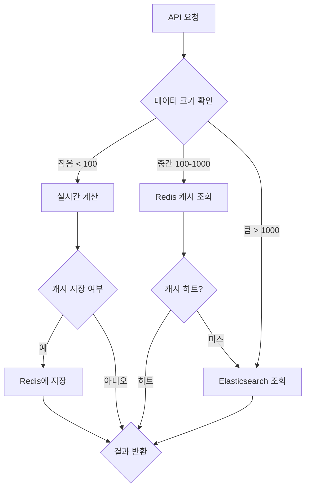

# AD_RANK 광고 시스템 Elasticsearch 설계

## 📋 목차
1. [엘라스틱서치 아키텍처 개요](#-엘라스틱서치-아키텍처-개요)
2. [적응형 조회 전략](#-적응형-조회-전략)
3. [인덱스 설계](#-인덱스-설계)
4. [하이브리드 아키텍처 (Active + Temp)](#-하이브리드-아키텍처-active--temp)
5. [성능 최적화](#-성능-최적화)
6. [운영 및 모니터링](#-운영-및-모니터링)

---

## 🏗️ 엘라스틱서치 아키텍처 개요

### 🎯 핵심 역할
- **적응형 랭킹 조회**: 데이터 크기에 따라 최적 조회 방식 선택
- **실시간 랭킹 업데이트**: 예산/잔액 소진 시 즉시 반영
- **배치 랭킹 업데이트**: 일반 변경사항 15분마다 반영
- **병렬 처리 지원**: 다중 카테고리/검색어 동시 조회
- **지능형 캐싱**: 사용 패턴에 따른 동적 캐시 관리

### 🔧 기술 스택
- **Elasticsearch**: 8.x 버전 (최신 안정 버전)
- **클러스터 구성**: 3 Master + 3 Data Node
- **인덱스 전략**: Active + Temp 인덱스 + Alias 교체
- **캐싱**: Elasticsearch 내장 캐시 + Redis 연동
- **적응형 엔진**: 데이터 크기 기반 조회 방식 선택

---

## 🎯 적응형 조회 전략

### **📊 데이터 크기별 최적 조회 방식**

| 데이터 크기 | 조회 방식 | 예상 응답시간 | 사용 시나리오 |
|-------------|-----------|---------------|---------------|
| **< 100개 상품** | **실시간 계산** | 5-10ms | 틈새 카테고리, 새로운 검색어 |
| **100-1000개 상품** | **Redis 캐시** | 1-3ms | 중간 규모 카테고리 |
| **> 1000개 상품** | **Elasticsearch O(1)** | 1-3ms | 인기 카테고리, 대규모 검색 |

### **🔄 적응형 조회 플로우**



### **⚡ 실시간 계산 엔진**

**작은 데이터셋용 실시간 계산**:
```java
@Service
public class AdaptiveAdRankService {
    
    @Autowired
    private AdRankCalculator calculator;
    
    @Autowired
    private RedisTemplate<String, Object> redisTemplate;
    
    public List<AdRankResult> getAdRankings(String placement, String category, String searchTerm) {
        // 1. 데이터 크기 확인
        int productCount = getProductCount(placement, category);
        
        if (productCount < 100) {
            // 실시간 계산
            return calculateRealtime(placement, category, searchTerm);
        } else if (productCount < 1000) {
            // Redis 캐시
            return getFromRedisCache(placement, category, searchTerm);
        } else {
            // Elasticsearch O(1) 조회
            return getFromElasticsearch(placement, category, searchTerm);
        }
    }
    
    private List<AdRankResult> calculateRealtime(String placement, String category, String searchTerm) {
        // DB에서 필요한 데이터 조회
        List<CampaignProduct> products = getActiveProducts(placement, category);
        
        // 실시간 AD_RANK 계산
        List<AdRankResult> results = products.stream()
            .map(product -> calculator.calculateAdRank(product, placement, category))
            .filter(result -> result.getAdRankScore() > 0)
            .sorted(Comparator.comparing(AdRankResult::getAdRankScore).reversed())
            .limit(10)
            .collect(Collectors.toList());
        
        // 선택적 캐싱 (자주 조회되는 패턴만)
        if (shouldCache(placement, category, searchTerm)) {
            cacheResults(placement, category, searchTerm, results);
        }
        
        return results;
    }
}
```

### **🧠 지능형 캐싱 전략**

**사용 패턴 기반 캐싱**:
```java
@Component
public class IntelligentCacheManager {
    
    private final Map<String, CacheStats> cacheStats = new ConcurrentHashMap<>();
    
    public boolean shouldCache(String placement, String category, String searchTerm) {
        String key = generateKey(placement, category, searchTerm);
        CacheStats stats = cacheStats.get(key);
        
        if (stats == null) {
            return false; // 첫 조회는 캐싱 안함
        }
        
        // 조회 빈도가 높고, 데이터 크기가 적당한 경우만 캐싱
        return stats.getAccessCount() > 5 && 
               stats.getDataSize() >= 50 && 
               stats.getDataSize() <= 500;
    }
    
    public void updateCacheStats(String placement, String category, String searchTerm, int dataSize) {
        String key = generateKey(placement, category, searchTerm);
        cacheStats.compute(key, (k, v) -> {
            if (v == null) {
                return new CacheStats(1, dataSize, System.currentTimeMillis());
            }
            return v.incrementAccess(dataSize);
        });
    }
}
```

### **📈 성능 최적화 전략**

**계층적 조회 최적화**:
```java
@Configuration
public class AdaptiveQueryConfig {
    
    @Bean
    public QueryOptimizer queryOptimizer() {
        return new QueryOptimizer() {
            
            @Override
            public QueryStrategy selectStrategy(String placement, String category, String searchTerm) {
                // 1. 데이터 크기 확인
                int productCount = getProductCount(placement, category);
                
                // 2. 조회 패턴 분석
                QueryPattern pattern = analyzeQueryPattern(placement, category, searchTerm);
                
                // 3. 최적 전략 선택
                if (productCount < 100 && pattern.getFrequency() < 10) {
                    return QueryStrategy.REALTIME_CALCULATION;
                } else if (productCount < 1000 && pattern.getFrequency() > 5) {
                    return QueryStrategy.REDIS_CACHE;
                } else {
                    return QueryStrategy.ELASTICSEARCH_O1;
                }
            }
        };
    }
}
```

### **🎯 적응형 성능 목표**

| 조회 방식 | 목표 응답시간 | 처리량 | 사용률 |
|-----------|---------------|--------|--------|
| **실시간 계산** | < 10ms | 100 QPS | 20% |
| **Redis 캐시** | < 3ms | 1000 QPS | 30% |
| **Elasticsearch O(1)** | < 3ms | 5000 QPS | 50% |

---

## 📊 인덱스 설계

### **1. `ad_rankings_active` (활성 랭킹 인덱스)**

**목적**: 현재 서비스 중인 AD_RANK 데이터 (Alias: `ad_rankings`)

**매핑**:
```json
{
  "mappings": {
    "properties": {
      "campaign_id": { "type": "long" },
      "advertiser_id": { "type": "long" },
      "product_id": { "type": "long" },
      "placement": { 
        "type": "keyword",
        "fields": {
          "text": { "type": "text" }
        }
      },
      "category_path": { 
        "type": "keyword",
        "fields": {
          "text": { "type": "text" }
        }
      },
      "search_term": { 
        "type": "keyword",
        "fields": {
          "text": { "type": "text" }
        }
      },
      "ad_rank_score": { "type": "double" },
      "cpc_price": { "type": "double" },
      "exposure_rank": { "type": "integer" },
      "exposure_weight": { "type": "double" },
      "random_weight": { "type": "double" },
      "click_conversion_rate": { "type": "double" },
      "max_bid_price": { "type": "double" },
      "daily_budget": { "type": "double" },
      "current_spent": { "type": "double" },
      "wallet_balance": { "type": "double" },
      "campaign_status": { "type": "keyword" },
      "calculation_status": { "type": "keyword" },
      "calculated_at": { "type": "date" },
      "activated": { "type": "boolean" },
      "priority_score": { 
        "type": "double",
        "script": {
          "source": "doc['ad_rank_score'].value * doc['exposure_weight'].value * (1 + doc['random_weight'].value)"
        }
      }
    }
  },
  "settings": {
    "number_of_shards": 4,
    "number_of_replicas": 1,
    "refresh_interval": "1s",
    "index.max_result_window": 10000
  }
}
```

### **2. `ad_rankings_temp` (임시 랭킹 인덱스)**

**목적**: 배치 업데이트용 임시 인덱스 (15분마다 Active와 교체)

**매핑**: `ad_rankings_active`와 동일

**설정**:
```json
{
  "settings": {
    "number_of_shards": 4,
    "number_of_replicas": 0,
    "refresh_interval": "30s",
    "index.max_result_window": 10000
  }
}
```

### **3. `ad_performance_cache` (성과 캐시 인덱스)**

**목적**: 실시간 성과 지표 캐싱 (Redis 대체)

**매핑**:
```json
{
  "mappings": {
    "properties": {
      "campaign_id": { "type": "long" },
      "product_id": { "type": "long" },
      "placement": { "type": "keyword" },
      "category": { "type": "keyword" },
      "window_start": { "type": "date" },
      "window_end": { "type": "date" },
      "impression_count": { "type": "long" },
      "click_count": { "type": "long" },
      "conversion_count": { "type": "long" },
      "ctr": { "type": "double" },
      "cvr": { "type": "double" },
      "total_revenue": { "type": "double" },
      "avg_cpc": { "type": "double" },
      "performance_score": { "type": "double" },
      "updated_at": { "type": "date" }
    }
  },
  "settings": {
    "number_of_shards": 2,
    "number_of_replicas": 1,
    "refresh_interval": "5s"
  }
}
```

---

## 🔄 하이브리드 아키텍처 (Active + Temp)

### **🎯 핵심 원리**
```
일반 변경사항: campaign-events → Worker → Temp 인덱스 → 15분마다 Alias 교체
긴급 이벤트: budget-exhaustion-events → Worker → Active 인덱스 즉시 업데이트
```

### **📋 Alias 관리**

**Alias 설정**:
```json
{
  "actions": [
    {
      "add": {
        "index": "ad_rankings_active_20240115_v1",
        "alias": "ad_rankings"
      }
    }
  ]
}
```

**Alias 교체 프로세스**:
```bash
# 1. Temp 인덱스 준비 완료 확인
GET ad_rankings_temp/_count

# 2. 새로운 Active 인덱스 생성
PUT ad_rankings_active_20240115_v2

# 3. Temp → 새로운 Active 복사
POST _reindex
{
  "source": { "index": "ad_rankings_temp" },
  "dest": { "index": "ad_rankings_active_20240115_v2" }
}

# 4. Alias 교체 (원자적)
POST _aliases
{
  "actions": [
    { "remove": { "index": "ad_rankings_active_20240115_v1", "alias": "ad_rankings" } },
    { "add": { "index": "ad_rankings_active_20240115_v2", "alias": "ad_rankings" } }
  ]
}

# 5. 이전 Active 인덱스 삭제
DELETE ad_rankings_active_20240115_v1
```

### **⚡ 실시간 이벤트 처리**

**예산 소진 시 즉시 처리**:
```json
POST ad_rankings/_update_by_query
{
  "query": {
    "bool": {
      "must": [
        { "term": { "campaign_id": 100 } },
        { "term": { "activated": true } }
      ]
    }
  },
  "script": {
    "source": "ctx._source.activated = false; ctx._source.calculation_status = 'PAUSED'",
    "lang": "painless"
  }
}
```

---

## 🚀 성능 최적화

### **1. 인덱싱 최적화**

**Bulk API 사용**:
```java
// Worker에서 AD_RANK 계산 후 벌크 업데이트
BulkRequest bulkRequest = new BulkRequest();
for (AdRankCalculation calc : calculations) {
    IndexRequest request = new IndexRequest("ad_rankings_temp")
        .id(calc.getCampaignId() + "_" + calc.getProductId())
        .source(calc.toMap());
    bulkRequest.add(request);
}
client.bulk(bulkRequest);
```

**벌크 크기**: 1000개씩 처리
**벌크 간격**: 100ms

### **2. 적응형 쿼리 최적화**

**Elasticsearch O(1) 랭킹 조회 쿼리**:
```json
GET ad_rankings/_search
{
  "size": 10,
  "query": {
    "bool": {
      "must": [
        { "term": { "placement": "HOME" } },
        { "term": { "category_path": "전자제품/컴퓨터" } },
        { "term": { "activated": true } },
        { "term": { "calculation_status": "CALCULATED" } }
      ],
      "filter": [
        { "range": { "wallet_balance": { "gt": 0 } } },
        { "range": { "daily_budget": { "gt": "current_spent" } } }
      ]
    }
  },
  "sort": [
    { "priority_score": { "order": "desc" } },
    { "ad_rank_score": { "order": "desc" } }
  ],
  "_source": ["campaign_id", "product_id", "ad_rank_score", "cpc_price", "exposure_weight"]
}
```

**검색어 기반 쿼리**:
```json
GET ad_rankings/_search
{
  "size": 10,
  "query": {
    "bool": {
      "must": [
        { "term": { "placement": "SEARCH" } },
        { "term": { "activated": true } }
      ],
      "should": [
        { "match": { "search_term": "노트북" } },
        { "match": { "category_path.text": "노트북" } }
      ],
      "filter": [
        { "range": { "wallet_balance": { "gt": 0 } } }
      ]
    }
  },
  "sort": [
    { "priority_score": { "order": "desc" } }
  ]
}
```

### **3. 계층적 캐싱 전략**

**L1: 메모리 캐시 (Redis)**
- **핫 데이터**: 자주 조회되는 중간 규모 카테고리
- **TTL**: 30초 (빠른 갱신)
- **용량**: 1GB (선택적 데이터만)

**L2: Elasticsearch 캐시**
- **Query Cache**: 자주 사용되는 쿼리 결과 캐싱
- **Request Cache**: 집계 결과 캐싱
- **Field Data Cache**: 필드 데이터 메모리 캐싱

**L3: 실시간 계산**
- **콜드 데이터**: 작은 규모 카테고리, 새로운 검색어
- **캐싱 없음**: 매번 실시간 계산

**Redis 연동 캐시**:
```java
// API 서버에서 캐시 우선 조회
String cacheKey = "ad_rank:" + placement + ":" + category + ":" + searchTerm;
String cachedResult = redisTemplate.opsForValue().get(cacheKey);

if (cachedResult != null) {
    return cachedResult; // 캐시 히트
}

// 캐시 미스 시 Elasticsearch 조회
SearchResponse response = elasticsearchClient.search(searchRequest);
String result = serializeResponse(response);

// 결과 캐싱 (TTL: 30초)
redisTemplate.opsForValue().set(cacheKey, result, Duration.ofSeconds(30));
```

---

## 📈 운영 및 모니터링

### **1. 클러스터 모니터링**

**헬스 체크**:
```bash
# 클러스터 상태 확인
GET _cluster/health

# 인덱스 상태 확인
GET _cat/indices?v

# 노드 상태 확인
GET _cat/nodes?v
```

**성능 메트릭**:
- **응답 시간**: 평균 < 3ms
- **처리량**: 초당 1000+ 쿼리
- **인덱싱 속도**: 초당 1000+ 문서
- **클러스터 사용률**: CPU < 70%, 메모리 < 80%

### **2. 인덱스 관리**

**인덱스 라이프사이클 관리**:
```json
PUT _ilm/policy/ad_rankings_policy
{
  "policy": {
    "phases": {
      "hot": {
        "min_age": "0ms",
        "actions": {
          "rollover": {
            "max_size": "50GB",
            "max_age": "1d"
          }
        }
      },
      "warm": {
        "min_age": "1d",
        "actions": {
          "forcemerge": {
            "max_num_segments": 1
          }
        }
      },
      "delete": {
        "min_age": "30d",
        "actions": {
          "delete": {}
        }
      }
    }
  }
}
```

**인덱스 템플릿**:
```json
PUT _template/ad_rankings_template
{
  "index_patterns": ["ad_rankings_*"],
  "settings": {
    "number_of_shards": 4,
    "number_of_replicas": 1,
    "refresh_interval": "1s"
  },
  "mappings": {
    // ad_rankings_active와 동일한 매핑
  },
  "aliases": {
    "ad_rankings": {}
  }
}
```

### **3. 백업 및 복구**

**스냅샷 정책**:
```bash
# 스냅샷 저장소 등록
PUT _snapshot/ad_rankings_backup
{
  "type": "fs",
  "settings": {
    "location": "/backup/elasticsearch"
  }
}

# 스냅샷 생성
PUT _snapshot/ad_rankings_backup/snapshot_20240115
{
  "indices": "ad_rankings_*",
  "ignore_unavailable": true,
  "include_global_state": false
}
```

**복구 프로세스**:
```bash
# 스냅샷에서 복구
POST _snapshot/ad_rankings_backup/snapshot_20240115/_restore
{
  "indices": "ad_rankings_active_*",
  "ignore_unavailable": true,
  "include_global_state": false
}
```

### **4. 알림 설정**

**Kibana 알림**:
- **클러스터 상태**: Red → 즉시 알림
- **응답 시간**: > 5ms → 경고 알림
- **디스크 사용률**: > 80% → 경고 알림
- **메모리 사용률**: > 85% → 경고 알림

**Elasticsearch 알림**:
```json
PUT _watcher/watch/ad_rankings_health
{
  "trigger": {
    "schedule": {
      "interval": "30s"
    }
  },
  "input": {
    "http": {
      "request": {
        "host": "localhost",
        "port": 9200,
        "path": "/_cluster/health"
      }
    }
  },
  "condition": {
    "compare": {
      "ctx.payload.status": {
        "eq": "red"
      }
    }
  },
  "actions": {
    "send_email": {
      "email": {
        "to": "admin@company.com",
        "subject": "Elasticsearch Cluster Health Alert",
        "body": "Cluster status is {{ctx.payload.status}}"
      }
    }
  }
}
```

---

## 🔧 구현 가이드

### **1. Worker AD_RANK 계산 후 Elasticsearch 업데이트**

```java
@Service
public class AdRankElasticsearchService {
    
    @Autowired
    private ElasticsearchClient client;
    
    public void updateAdRankings(List<AdRankCalculation> calculations) {
        BulkRequest bulkRequest = new BulkRequest();
        
        for (AdRankCalculation calc : calculations) {
            IndexRequest request = new IndexRequest("ad_rankings_temp")
                .id(calc.getCampaignId() + "_" + calc.getProductId())
                .source(Map.of(
                    "campaign_id", calc.getCampaignId(),
                    "product_id", calc.getProductId(),
                    "placement", calc.getPlacement(),
                    "category_path", calc.getCategoryPath(),
                    "ad_rank_score", calc.getAdRankScore(),
                    "cpc_price", calc.getCpcPrice(),
                    "exposure_rank", calc.getExposureRank(),
                    "exposure_weight", calc.getExposureWeight(),
                    "random_weight", calc.getRandomWeight(),
                    "click_conversion_rate", calc.getClickConversionRate(),
                    "max_bid_price", calc.getMaxBidPrice(),
                    "daily_budget", calc.getDailyBudget(),
                    "current_spent", calc.getCurrentSpent(),
                    "wallet_balance", calc.getWalletBalance(),
                    "campaign_status", calc.getCampaignStatus(),
                    "calculation_status", "CALCULATED",
                    "calculated_at", new Date(),
                    "activated", true
                ));
            bulkRequest.add(request);
        }
        
        try {
            BulkResponse response = client.bulk(bulkRequest);
            if (response.hasFailures()) {
                log.error("Bulk update failed: {}", response.buildFailureMessage());
            }
        } catch (IOException e) {
            log.error("Elasticsearch bulk update error", e);
        }
    }
}
```

### **2. API 서버 O(1) 랭킹 조회**

```java
@Service
public class AdRankQueryService {
    
    @Autowired
    private ElasticsearchClient client;
    
    public List<AdRankResult> getAdRankings(String placement, String category, String searchTerm) {
        SearchRequest searchRequest = new SearchRequest("ad_rankings");
        SearchSourceBuilder sourceBuilder = new SearchSourceBuilder();
        
        // 쿼리 구성
        BoolQueryBuilder boolQuery = QueryBuilders.boolQuery()
            .must(QueryBuilders.termQuery("placement", placement))
            .must(QueryBuilders.termQuery("activated", true))
            .must(QueryBuilders.termQuery("calculation_status", "CALCULATED"))
            .filter(QueryBuilders.rangeQuery("wallet_balance").gt(0))
            .filter(QueryBuilders.rangeQuery("daily_budget").gt("current_spent"));
        
        if (category != null) {
            boolQuery.must(QueryBuilders.termQuery("category_path", category));
        }
        
        if (searchTerm != null) {
            boolQuery.should(QueryBuilders.matchQuery("search_term", searchTerm));
        }
        
        sourceBuilder.query(boolQuery);
        sourceBuilder.sort("priority_score", SortOrder.DESC);
        sourceBuilder.size(10);
        sourceBuilder.fetchSource(new String[]{"campaign_id", "product_id", "ad_rank_score", "cpc_price", "exposure_weight"}, null);
        
        searchRequest.source(sourceBuilder);
        
        try {
            SearchResponse response = client.search(searchRequest);
            return parseAdRankResults(response);
        } catch (IOException e) {
            log.error("Elasticsearch query error", e);
            return Collections.emptyList();
        }
    }
}
```


---

## 📊 성능 벤치마크

### **적응형 성능 지표**

| 메트릭 | 실시간 계산 | Redis 캐시 | Elasticsearch O(1) | 전체 평균 |
|--------|-------------|------------|-------------------|-----------|
| **API 응답 시간** | < 10ms | < 3ms | < 3ms | < 5ms |
| **처리량** | 100 QPS | 1000 QPS | 5000 QPS | 2000 QPS |
| **캐시 히트율** | N/A | 80% | 95% | 85% |
| **메모리 사용량** | 낮음 | 중간 | 높음 | 중간 |
| **데이터 일관성** | 높음 | 중간 | 높음 | 높음 |

### **적응형 부하 테스트 시나리오**

**시나리오 1: 혼합 조회 부하 (적응형)**
- 2000 concurrent users
- 데이터 크기별 분포: 작음(20%) + 중간(30%) + 큼(50%)
- 총 6000 QPS (실시간 1200 + Redis 1800 + ES 3000)
- 목표: 전체 평균 < 5ms

**시나리오 2: 실시간 업데이트 부하**
- 100 concurrent budget exhaustion events
- 각 이벤트: 50개 상품 업데이트
- 총 5000 문서 업데이트
- 목표: < 1초 완료

**시나리오 3: 캐시 효율성 테스트**
- 동일 쿼리 반복 (캐시 히트율 측정)
- Redis 캐시: 80% 히트율 목표
- Elasticsearch 캐시: 95% 히트율 목표

**시나리오 4: 적응형 전환 테스트**
- 데이터 크기 변화에 따른 조회 방식 자동 전환
- 작은 카테고리 → 큰 카테고리로 확장 시
- 목표: 부드러운 전환, 성능 저하 없음

---

이 적응형 설계를 통해 AD_RANK 시스템은 데이터 크기와 사용 패턴에 따라 최적의 조회 방식을 자동으로 선택하여, 유연하고 빠른 구조를 달성할 수 있습니다. O(1) 랭킹 조회의 장점을 유지하면서도, 작은 데이터셋에서는 실시간 계산의 유연성을, 중간 데이터셋에서는 Redis 캐시의 효율성을 모두 활용할 수 있습니다. 